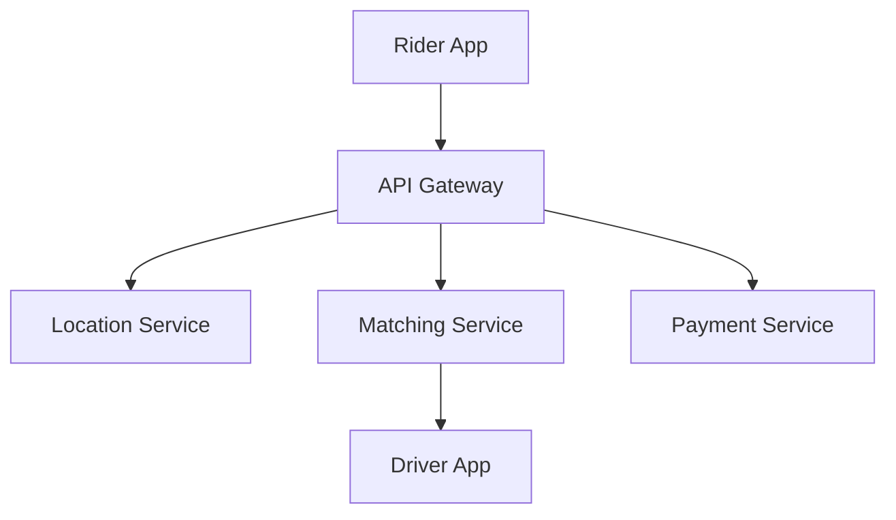

# Uber Ride Sharing System Design

## Overview

Uber connects riders with drivers in real-time, handling location tracking, matching, payments, and surge pricing. The system processes millions of requests daily with low latency.

## Detailed Explanation

### Requirements
- **Functional**: Ride booking, driver matching, tracking, payments.
- **Non-Functional**: Real-time, high availability.

### Architecture
- **Location Service**: Track drivers/riders.
- **Matching Service**: Assign rides.
- **Payment Service**: Process transactions.



## Real-world Examples & Use Cases
- Surge pricing during peak times.
- Real-time ETAs.

## Code Examples

### Ride Matching
```java
public Driver matchRide(RideRequest req) {
    List<Driver> nearby = locationService.findNearby(req.location);
    return matchingAlgo.selectBest(nearby);
}
```

## References
- [Uber Engineering Blog](https://eng.uber.com/)

## Github-README Links & Related Topics
- [Load Balancing and Strategies](../load-balancing-and-strategies/README.md)
- [Microservices Architecture](../microservices-architecture/README.md)