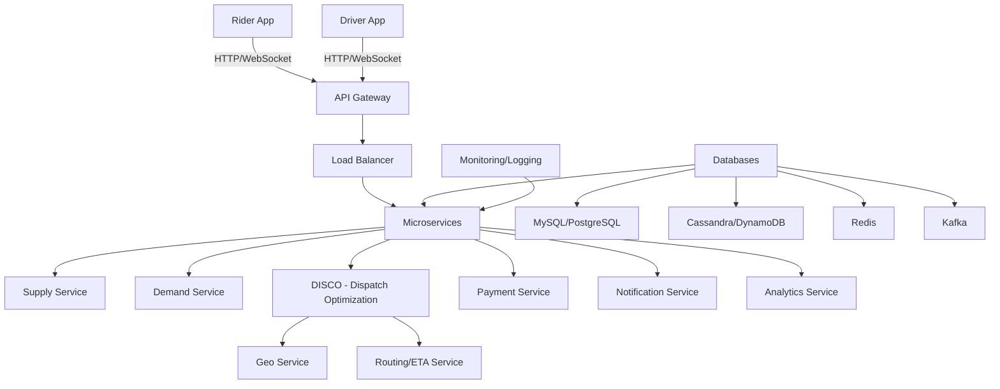
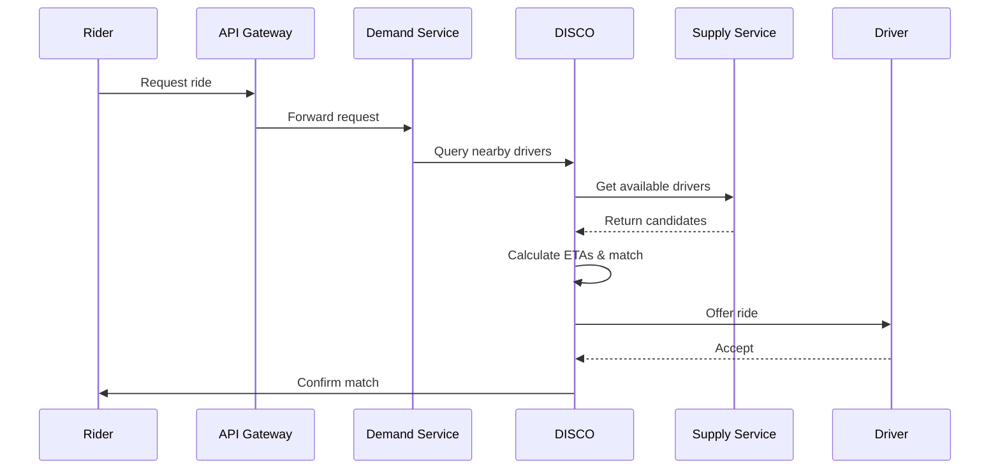

## Overview

Uber's system design is a quintessential example of a large-scale, real-time ride-sharing platform that handles millions of concurrent users globally. It evolved from a monolithic architecture to a microservices-based system capable of processing billions of location updates and ride requests daily. Key challenges include real-time matching of supply (drivers) and demand (riders), dynamic pricing (surge), geolocation tracking, payment processing, and ensuring high availability across regions. The system leverages cloud infrastructure (primarily AWS), event-driven architecture, and advanced algorithms for optimization.

## Detailed Explanation

Uber's backend architecture supports multiple services: ride-hailing, food delivery (Uber Eats), and freight (Uber Freight). The core is a dispatch system that matches riders to drivers in real-time.

### High-Level Architecture



### Key Components

- **Supply Service**: Tracks active drivers' locations, vehicle attributes (seats, type, accessibility), and availability. Uses geolocation data sent every 4-5 seconds.
- **Demand Service**: Manages rider requests, including pickup/dropoff locations, preferences (e.g., car type, pool rides), and real-time status.
- **DISCO (Dispatch Optimization)**: Core matching engine using algorithms to minimize wait times, extra driving, and ETA. Employs Google S2 library for geospatial indexing, dividing Earth into cells for efficient querying.
- **Geo Service**: Handles map data, routing, and ETA calculations. Uses historical data, real-time traffic from driver GPS, and algorithms like Dijkstra or contraction hierarchies.
- **Routing/ETA Service**: Computes optimal routes and ETAs, factoring in traffic, one-way streets, and turn restrictions.
- **Payment Service**: Integrates with third-party processors (e.g., Stripe, Braintree) for fare calculation, surge pricing, and settlements.
- **Notification Service**: Sends push notifications via FCM/APNs for ride updates.
- **Analytics Service**: Processes logs and events for insights, fraud detection, and optimizations.

### Scalability and Performance

- **Geospatial Indexing**: Uses S2 cells as shard keys for location data. Queries nearby drivers by covering rider location with a circle of cells.
- **Sharding**: Databases sharded by region or user ID. Trip data stored in Schemaless (Uber's MySQL-based key-value store) for schema flexibility.
- **Caching**: Redis for hot data like driver locations and surge multipliers.
- **Event Streaming**: Kafka for decoupling services, handling GPS updates, and analytics.
- **Fault Tolerance**: Multi-region deployments, circuit breakers, and state digests on driver phones for datacenter failover recovery.

### Evolution

Started as monolithic (Python, SQLAlchemy, PostgreSQL). Post-2014, shifted to microservices (100+ services) using Node.js for dispatch (with Ringpop for scaling via consistent hashing and SWIM gossip protocol).

## STAR Summary

**Situation**: Uber needed to scale from a city-based service to global operations, handling variable supply/demand and real-time matching.

**Task**: Design a system for real-time ride matching, pricing, and tracking with 99.9% uptime and sub-second latency.

**Action**: Implemented microservices architecture with geospatial indexing (S2), event-driven dispatch (DISCO), and hybrid databases. Used Kafka for messaging, Redis for caching, and AWS for elasticity.

**Result**: Processes 15 million trips daily, with matching in <1 second, and revenue growth to $11.3B in 2020.

## Journey / Sequence

1. **Ride Request**: Rider app sends request via API Gateway to Demand Service.
2. **Location Query**: Geo Service fetches nearby drivers using S2 cells.
3. **ETA Calculation**: Routing Service computes ETAs for candidates.
4. **Matching**: DISCO selects optimal driver based on ETA, surge, and constraints.
5. **Assignment**: Notification sent to driver; rider notified of match.
6. **Trip Execution**: Track locations via GPS updates; update status in real-time.
7. **Completion**: Calculate fare, process payment, collect ratings.
8. **Post-Trip**: Analytics processes data for improvements.



## Data Models / Message Formats

### Key Data Models

| Model | Fields | Storage |
|-------|--------|---------|
| User | id (UUID), name, email, phone, role (rider/driver), rating, location | MySQL (relational) |
| Trip | id, rider_id, driver_id, start/end locations, status, fare, timestamps | Schemaless (key-value) |
| Location | user_id, lat, lng, timestamp, speed | Cassandra (time-series) |
| Vehicle | driver_id, type, seats, features (e.g., wheelchair) | DynamoDB (NoSQL) |
| Event | type (e.g., ride_request), data (JSON), timestamp | Kafka (streaming) |

### Message Formats (JSON Examples)

**Ride Request**:
```json
{
  "rider_id": "uuid-123",
  "pickup": {"lat": 37.7749, "lng": -122.4194},
  "dropoff": {"lat": 37.7849, "lng": -122.4094},
  "preferences": {"car_type": "uberx", "pool": false}
}
```

**Location Update**:
```json
{
  "driver_id": "uuid-456",
  "location": {"lat": 37.7749, "lng": -122.4194},
  "timestamp": 1638360000,
  "bearing": 90
}
```

**Trip Status**:
```json
{
  "trip_id": "trip-789",
  "status": "ongoing",
  "current_location": {"lat": 37.7799, "lng": -122.4144}
}
```

## Real-world Examples & Use Cases

- **Surge Pricing**: During events like Super Bowl, prices surge 2-10x based on demand/supply ratio, incentivizing more drivers.
- **Pool Rides**: Matches multiple riders with similar routes to share costs, optimizing for efficiency.
- **Global Scaling**: Handles 70+ countries with region-specific regulations (e.g., EU data privacy).
- **Incident Response**: 2016 app outage used cached data and manual overrides; 2021 data breach highlighted security needs.
- **Uber Eats Integration**: Extends matching to restaurants/drivers for food delivery.

## Code Examples

### Simplified Ride Matching in Python

```python
import heapq

def match_ride(rider_loc, available_drivers, routing_service):
    candidates = []
    for driver in available_drivers:
        eta = routing_service.calculate_eta(driver.loc, rider_loc)
        heapq.heappush(candidates, (eta, driver))
    
    best_driver = heapq.heappop(candidates)[1]
    return best_driver

# Usage
rider = {"lat": 40.7128, "lng": -74.0060}
drivers = [{"id": 1, "loc": {"lat": 40.7130, "lng": -74.0050}}]
matched = match_ride(rider, drivers, mock_routing)
```

### Kafka Producer for Location Updates (Java)

```java
import org.apache.kafka.clients.producer.KafkaProducer;
import org.apache.kafka.clients.producer.ProducerRecord;

Properties props = new Properties();
props.put("bootstrap.servers", "localhost:9092");
props.put("key.serializer", "org.apache.kafka.common.serialization.StringSerializer");
props.put("value.serializer", "org.apache.kafka.common.serialization.StringSerializer");

KafkaProducer<String, String> producer = new KafkaProducer<>(props);
String locationJson = "{\"driver_id\":\"123\",\"lat\":37.7749,\"lng\":-122.4194}";
producer.send(new ProducerRecord<String, String>("location-updates", "123", locationJson));
producer.close();
```

### API Gateway Handler (Node.js)

```javascript
const express = require('express');
const app = express();
app.use(express.json());

app.post('/rides/request', (req, res) => {
  const { riderId, pickup, dropoff } = req.body;
  // Authenticate, validate
  // Publish to Kafka
  kafka.send('ride-requests', { riderId, pickup, dropoff });
  res.json({ status: 'requested' });
});

app.listen(3000);
```

## Common Pitfalls & Edge Cases

- **Location Accuracy**: GPS drift or urban canyons; mitigated by fusing with WiFi/cell data.
- **Surge Abuse**: Bots gaming surge; detected via anomaly detection.
- **Datacenter Failover**: Incomplete trip data; recovered via encrypted state digests on phones.
- **High Load**: Spikes during events; autoscaling and queues prevent overload.
- **Fraud**: Fake accounts or payments; ML models flag suspicious activity.
- **Regulatory**: Varying laws (e.g., background checks); region-specific services.

## Tools & Libraries

- **Geospatial**: Google S2, GeoHash for indexing.
- **Messaging**: Apache Kafka for events.
- **Databases**: MySQL (transactions), Cassandra (locations), Redis (cache), Schemaless (flexible storage).
- **Routing**: OSRM, contraction hierarchies.
- **Scaling**: Ringpop (consistent hashing), SWIM (gossip).
- **Cloud**: AWS (EC2, S3, Lambda), Kubernetes for orchestration.
- **Monitoring**: ELK Stack (Elasticsearch, Logstash, Kibana), Prometheus.

## References

- [Uber System Design - Medium](https://medium.com/system-designing-interviews/uber-system-design-8b2bc95e2cfe)
- [How Uber Scales Their Real-Time Market Platform - High Scalability](https://highscalability.com/blog/2016/10/12/how-uber-scales-their-real-time-market-platform.html)
- [Uber's Architecture - InfoQ](https://www.infoq.com/articles/uber-system-architecture/)
- [System Design of Uber App - GeeksforGeeks](https://www.geeksforgeeks.org/system-design-of-uber-app/)
- [Uber System Design - Educative](https://www.educative.io/courses/grokking-the-system-design-interview/7n1JB8L3V8l)

## Github-README Links & Related Topics

- [Twitter System Design](../twitter-system-design/README.md)
- [YouTube System Design](../youtube-system-design/README.md)
- [Facebook System Design](../facebook-system-design/README.md)
- [Airbnb System Design](../airbnb-system-design/README.md)
- [Popular System Designs LLD and HLD](../popular-systems-design-lld-and-hld/README.md)
- [Distributed Systems](../distributed-consensus/README.md)
- [Microservices Communication Patterns](../microservices-communication-patterns/README.md)