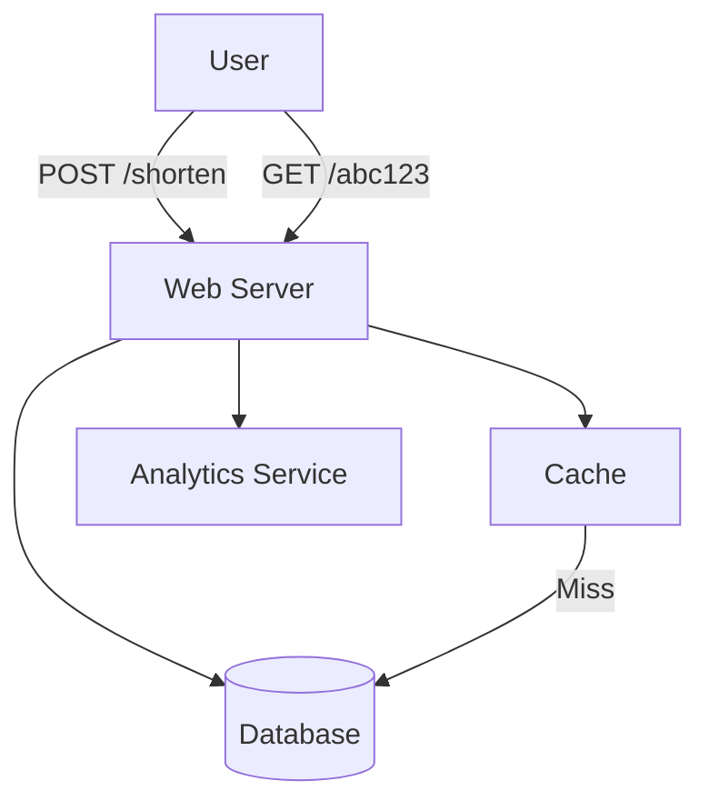

# URL Shortener System Design

## Overview

A URL shortener service transforms long URLs into short, manageable links that redirect to the original URL. It handles high read/write ratios, requires unique short codes, and ensures fast redirects. Key challenges include collision avoidance, scalability for billions of URLs, and analytics tracking.

Key features:
- Short URL generation using hashing or counters.
- Redirection with HTTP 301/302.
- Custom aliases and expiration.
- Analytics on clicks and geolocation.

## Detailed Explanation

### Architecture Overview

The system uses a simple yet scalable architecture:

- **Web Server**: Handles incoming requests for shortening and redirection.
- **Database**: Stores URL mappings (short code to long URL).
- **Cache**: Speeds up frequent redirects.
- **Analytics Service**: Tracks usage metrics.



### URL Shortening Process

1. User submits long URL.
2. Generate unique short code (e.g., base62 encoding of ID).
3. Store mapping in DB.
4. Return short URL.

### Redirection Process

1. User accesses short URL.
2. Lookup in cache/DB.
3. Redirect to original URL.
4. Log analytics.

### Scalability

- **Database Sharding**: Partition by short code hash.
- **Caching**: Redis for hot URLs.
- **CDN**: For global distribution.

## Real-world Examples & Use Cases

- **Bitly**: Tracks clicks, provides analytics for marketing.
- **TinyURL**: Simple shortening without tracking.
- **Google URL Shortener (goo.gl)**: Integrated with Google services.
- **Use Cases**:
  - Social media links.
  - Email campaigns.
  - QR codes for mobile.

## Code Examples

### Base62 Encoding for Short Codes (Python)

```python
import string

ALPHABET = string.ascii_letters + string.digits

def encode(num):
    if num == 0:
        return ALPHABET[0]
    arr = []
    while num:
        arr.append(ALPHABET[num % 62])
        num //= 62
    return ''.join(reversed(arr))

def decode(s):
    num = 0
    for char in s:
        num = num * 62 + ALPHABET.index(char)
    return num

# Example
short = encode(12345)  # 'dnh'
print(short)
```

### Simple Flask App for Shortener

```python
from flask import Flask, redirect, request, jsonify
import sqlite3

app = Flask(__name__)

def get_db():
    return sqlite3.connect('urls.db')

@app.route('/shorten', methods=['POST'])
def shorten():
    long_url = request.json['url']
    conn = get_db()
    c = conn.cursor()
    c.execute('INSERT INTO urls (long_url) VALUES (?)', (long_url,))
    id = c.lastrowid
    short_code = encode(id)
    c.execute('UPDATE urls SET short_code = ? WHERE id = ?', (short_code, id))
    conn.commit()
    conn.close()
    return jsonify({'short_url': f'http://short.ly/{short_code}'})

@app.route('/<short_code>')
def redirect_url(short_code):
    conn = get_db()
    c = conn.cursor()
    c.execute('SELECT long_url FROM urls WHERE short_code = ?', (short_code,))
    result = c.fetchone()
    conn.close()
    if result:
        return redirect(result[0])
    return 'Not found', 404

if __name__ == '__main__':
    app.run()
```

## Common Pitfalls & Edge Cases

- **Collisions**: Use large key space (62^7 ~ 3.5 trillion).
- **Hot Keys**: Cache popular URLs.
- **Malicious URLs**: Validate and blacklist.
- **Expiration**: Implement TTL for temporary links.
- **Edge Cases**: Invalid URLs, loops, high traffic spikes.

| Pitfall | Mitigation |
|---------|------------|
| DDoS on redirects | Rate limiting |
| DB overload | Read replicas |
| Analytics lag | Async processing |

## Tools & Libraries

- **Web Framework**: Flask/Django for API.
- **Database**: PostgreSQL/MySQL for persistence.
- **Cache**: Redis/Memcached.
- **Encoding**: Custom base62.
- **Analytics**: Google Analytics or custom.

## References

- [System Design Primer - URL Shortener](https://github.com/donnemartin/system-design-primer/blob/master/solutions/system_design/url_shortener.md)
- [How Bitly Scales](https://blog.bitly.com/post/127464933838/how-bitly-scales)
- [Base62 Encoding](https://en.wikipedia.org/wiki/Base62)

## Github-README Links & Related Topics

- [Caching Patterns](../caching-patterns/README.md)
- [Database Sharding Strategies](../database-sharding-strategies/README.md)
- [Load Balancing and Routing](../load-balancing-and-routing/README.md)
- [API Design REST GRPC OpenAPI](../api-design-rest-grpc-openapi/README.md)
- [Rate Limiting](../rate-limiting/README.md)