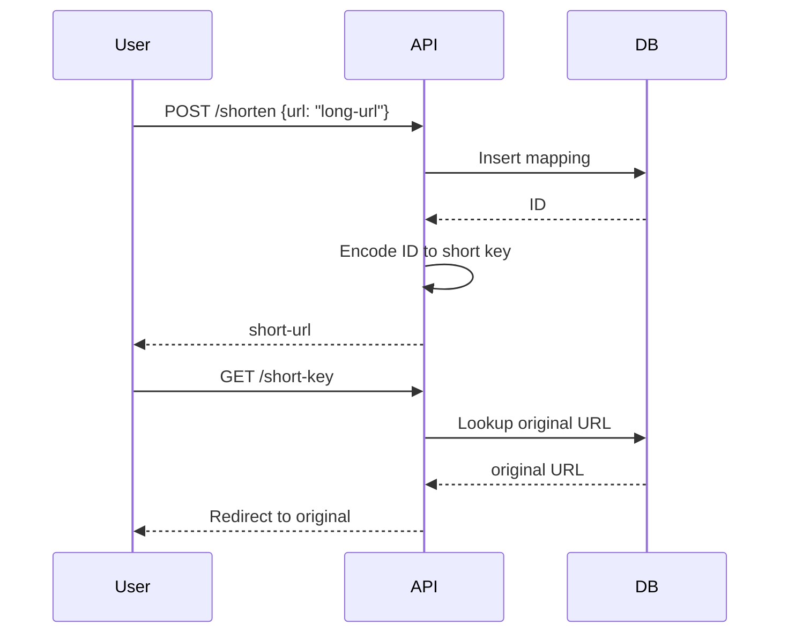

## Overview
A URL shortener is a service that takes a long URL and generates a short, unique alias that redirects to the original URL. It's essential for sharing links on social media, tracking clicks, and analytics.

## Detailed Explanation
### How it Works
1. User submits a long URL.
2. Service generates a short key (e.g., using base62 encoding of an ID).
3. Stores mapping in database.
4. When short URL is accessed, redirects to original.

### Key Components
- **Database:** Stores URL mappings, with indexes for fast lookup.
- **Encoding:** Base62 for short keys.
- **Caching:** Redis for popular URLs.
- **Analytics:** Track clicks, referrers.

### Scalability
- Sharding by hash of short key.
- CDN for global access.
- Rate limiting to prevent abuse.

## Real-world Examples & Use Cases
- Bitly, TinyURL for link sharing.
- Social media platforms for shortened links.
- Marketing campaigns for tracking.
- SMS messages where long URLs don't fit.

## Code Examples
### Simple Java Implementation
```java
import java.util.HashMap;
import java.util.Map;

public class URLShortener {
    private Map<String, String> urlMap = new HashMap<>();
    private Map<String, String> shortMap = new HashMap<>();
    private static final String BASE_URL = "http://short.ly/";
    private long counter = 0;

    public String shorten(String longUrl) {
        if (shortMap.containsKey(longUrl)) {
            return shortMap.get(longUrl);
        }
        String shortKey = encode(counter++);
        String shortUrl = BASE_URL + shortKey;
        urlMap.put(shortKey, longUrl);
        shortMap.put(longUrl, shortUrl);
        return shortUrl;
    }

    public String expand(String shortUrl) {
        String key = shortUrl.replace(BASE_URL, "");
        return urlMap.get(key);
    }

    private String encode(long num) {
        String chars = "0123456789abcdefghijklmnopqrstuvwxyzABCDEFGHIJKLMNOPQRSTUVWXYZ";
        StringBuilder sb = new StringBuilder();
        while (num > 0) {
            sb.append(chars.charAt((int) (num % 62)));
            num /= 62;
        }
        return sb.reverse().toString();
    }
}
```

### Usage
```java
URLShortener shortener = new URLShortener();
String shortUrl = shortener.shorten("https://www.example.com/very/long/url");
System.out.println(shortUrl); // http://short.ly/1
String original = shortener.expand(shortUrl);
System.out.println(original); // https://www.example.com/very/long/url
```

## Journey / Sequence


## Data Models / Message Formats
### URL Mapping Table
| Field | Type | Description |
|-------|------|-------------|
| id | BIGINT | Auto-increment ID |
| short_key | VARCHAR | Base62 encoded key |
| original_url | TEXT | The long URL |
| created_at | TIMESTAMP | Creation time |
| expires_at | TIMESTAMP | Optional expiration |

### API Request/Response
POST /shorten  
Request: {"url": "https://example.com"}  
Response: {"short_url": "http://short.ly/abc123"}

## Common Pitfalls & Edge Cases
- **Collisions:** Ensure unique keys.
- **Expiration:** Handle expired links.
- **Abuse:** Rate limit, block malicious URLs.
- **Edge Case:** Very long URLs, international characters.

## Tools & Libraries
- Base62 encoding libraries.
- Redis for caching.
- Nginx for redirects.
- Analytics tools like Google Analytics.

## Github-README Links & Related Topics
- [system-design-basics](../system-design-basics/)
- [caching](../caching/)
- [load-balancing-and-strategies](../load-balancing-and-strategies/)

## References
- Bitly API: https://dev.bitly.com/
- URL Shortening Algorithms: https://en.wikipedia.org/wiki/URL_shortening
- System Design Interview: URL Shortener - https://www.youtube.com/watch?v=JQDHz72OA3c