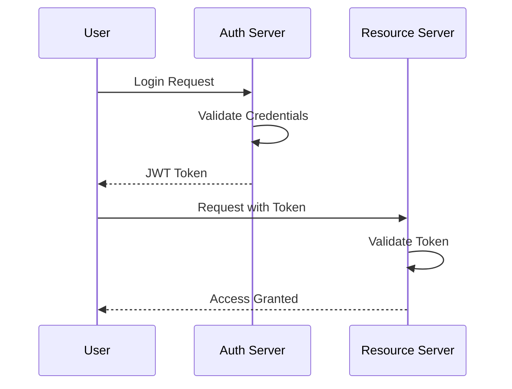

# User Authentication

## Overview

User authentication systems verify the identity of users, ensuring secure access to applications and protecting sensitive data.

## Detailed Explanation

### Methods

- **Password-Based**: Username and password.
- **Token-Based**: JWT, OAuth for stateless auth.
- **Multi-Factor Authentication (MFA)**: Adds layers like SMS codes.
- **Biometric**: Fingerprints, facial recognition.

### Components

- **Identity Providers**: Systems managing user credentials.
- **Authentication Servers**: Validate credentials.
- **Session Management**: Handling user sessions.
- **Authorization**: Controlling access to resources.

### Security Best Practices

- Password hashing (bcrypt).
- Rate limiting on login attempts.
- Secure token storage.

## Real-world Examples & Use Cases

- **Web Apps**: Google login with OAuth.
- **Mobile Apps**: Biometric unlock.
- **Enterprise**: SSO with Active Directory.
- **APIs**: JWT for stateless authentication.

## Code Examples

### Java: JWT Authentication

```java
import io.jsonwebtoken.Jwts;
import io.jsonwebtoken.SignatureAlgorithm;

public class JwtUtil {
    private static final String SECRET = "secret";

    public static String generateToken(String username) {
        return Jwts.builder()
                .setSubject(username)
                .signWith(SignatureAlgorithm.HS256, SECRET)
                .compact();
    }

    public static String validateToken(String token) {
        return Jwts.parser()
                .setSigningKey(SECRET)
                .parseClaimsJws(token)
                .getBody()
                .getSubject();
    }
}
```

### Mermaid Diagram: Authentication Flow



## Common Pitfalls & Edge Cases

- **Session Hijacking**: Protecting against token theft.
- **Password Reset**: Secure mechanisms.
- **Scalability**: Distributed auth services.

## Tools & Libraries

- Spring Security
- Auth0
- JWT Libraries

## References

- [OAuth 2.0](https://oauth.net/2/)
- [JWT.io](https://jwt.io/)
- [Authentication Best Practices](https://owasp.org/www-project-top-ten/)

## Github-README Links & Related Topics

- [Security in Distributed Systems](system-design/security-in-distributed-systems/README.md)
- [API Design REST gRPC OpenAPI](system-design/api-design-rest-grpc-openapi/README.md)
- [Rate Limiting](system-design/rate-limiting/README.md)