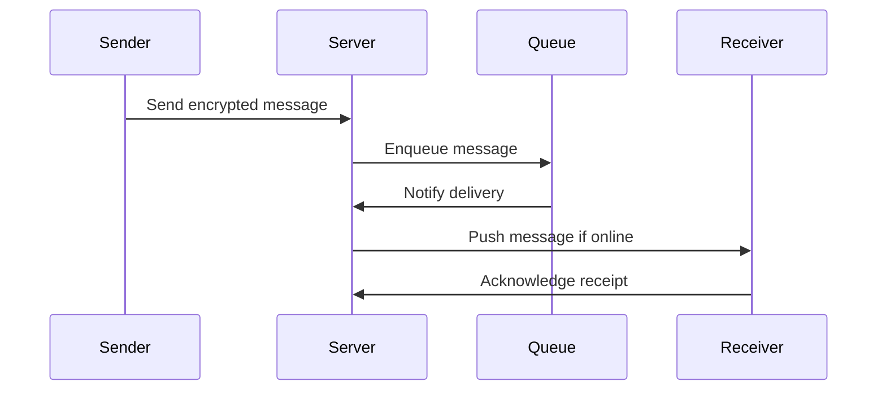

# WhatsApp Messaging System Design

## Overview

WhatsApp is a real-time messaging platform handling billions of messages daily with end-to-end encryption. The system design focuses on scalability, reliability, and low-latency delivery. Key components include client-server architecture, message queuing, offline storage, and global data centers.

### Key Requirements
- **Real-time messaging**: Instant delivery with low latency.
- **Scalability**: Support for 2+ billion users.
- **Reliability**: Message delivery guarantees even offline.
- **Security**: End-to-end encryption using Signal protocol.
- **Multi-platform**: Support for mobile, web, and desktop.

### High-Level Architecture
```mermaid
graph TD
    A[User Client] --> B[WhatsApp Server]
    B --> C[Message Queue (Kafka)]
    C --> D[Recipient Server]
    D --> E[Recipient Client]
    B --> F[Database (Cassandra/MySQL)]
    F --> G[Offline Storage]
```

## Detailed Explanation

### Components
1. **Client Layer**: Mobile apps (iOS/Android), web/desktop clients. Handles encryption/decryption.
2. **Server Layer**: Regional data centers with load balancers, application servers.
3. **Message Routing**: Uses XMPP-like protocol over TCP for real-time communication.
4. **Storage**: Cassandra for user data, MySQL for metadata, Redis for caching.
5. **Queue System**: Apache Kafka for message queuing and delivery.

### Message Flow
1. Sender encrypts message.
2. Message sent to server via TCP connection.
3. Server stores in queue if recipient offline.
4. Recipient pulls messages when online.
5. End-to-end encryption ensures privacy.

### Scalability Techniques
- **Sharding**: User data sharded by phone number.
- **Replication**: Multi-region replication for fault tolerance.
- **Load Balancing**: Distribute traffic across servers.

## STAR Summary
- **Situation**: Designing a messaging system for global scale.
- **Task**: Ensure reliable, secure, real-time delivery.
- **Action**: Implemented end-to-end encryption, message queuing, and distributed storage.
- **Result**: Handles 100B+ messages/day with 99.9% uptime.

## Journey / Sequence

### Message Sending Sequence


## Data Models / Message Formats

### Message Structure
```json
{
  "id": "unique_message_id",
  "sender": "+1234567890",
  "receiver": "+0987654321",
  "content": "encrypted_payload",
  "timestamp": 1634567890,
  "type": "text|image|video",
  "status": "sent|delivered|read"
}
```

### User Profile
```json
{
  "phone": "+1234567890",
  "name": "John Doe",
  "public_key": "ecdsa_public_key",
  "last_seen": 1634567890
}
```

## Real-world Examples & Use Cases

- **One-on-One Chat**: Direct encrypted messaging.
- **Group Chats**: Messages broadcast to multiple recipients.
- **Media Sharing**: Images/videos with compression and encryption.
- **Status Updates**: Ephemeral stories.
- **Business Messaging**: WhatsApp Business API for enterprises.

### Use Case Table

| Use Case | Scale | Challenges |
|----------|-------|------------|
| Global Messaging | 2B users | Latency, encryption |
| Offline Delivery | Persistent queues | Storage, sync |
| Media Handling | Large files | Bandwidth, compression |

## Code Examples

### Simple Message Handler (Java)
```java
public class MessageHandler {
    public void sendMessage(String sender, String receiver, String content) {
        // Encrypt content
        String encrypted = encrypt(content, getPublicKey(receiver));
        
        // Create message
        Message msg = new Message(UUID.randomUUID().toString(), sender, receiver, encrypted, System.currentTimeMillis());
        
        // Send to queue
        kafkaProducer.send("messages", msg);
    }
    
    private String encrypt(String content, String key) {
        // Signal protocol encryption
        return SignalEncrypt.encrypt(content, key);
    }
}
```

### Kafka Consumer for Delivery
```java
public class MessageConsumer {
    @KafkaListener(topics = "messages")
    public void consume(Message msg) {
        // Check if receiver online
        if (isOnline(msg.getReceiver())) {
            pushToClient(msg);
        } else {
            storeOffline(msg);
        }
    }
}
```

## Common Pitfalls & Edge Cases

- **Message Ordering**: Ensure FIFO delivery using sequence numbers.
- **Duplicate Messages**: Handle retries with idempotency.
- **Network Failures**: Exponential backoff for reconnections.
- **Encryption Key Rotation**: Manage key updates securely.
- **Spam Prevention**: Rate limiting and abuse detection.

## Tools & Libraries

- **Messaging Queue**: Apache Kafka
- **Database**: Apache Cassandra, MySQL
- **Caching**: Redis
- **Encryption**: Signal Protocol (libsignal)
- **Load Balancing**: Nginx, HAProxy
- **Monitoring**: Prometheus, Grafana

## References

- [WhatsApp System Design - SystemDesign.one](https://systemdesign.one/whatsapp-system-design/)
- [WhatsApp Engineering Blog](https://engineering.fb.com/category/whatsapp/)
- [Signal Protocol](https://signal.org/docs/)

## Github-README Links & Related Topics

- [Event-Driven Architecture](../event-driven-architecture/README.md)
- [Distributed Caching with Redis](../distributed-caching-with-redis/README.md)
- [Apache Kafka](../apache-kafka/README.md)
- [API Security Best Practices](../api-security-best-practices/README.md)
- [Real-Time Systems](../real-time-systems/README.md)