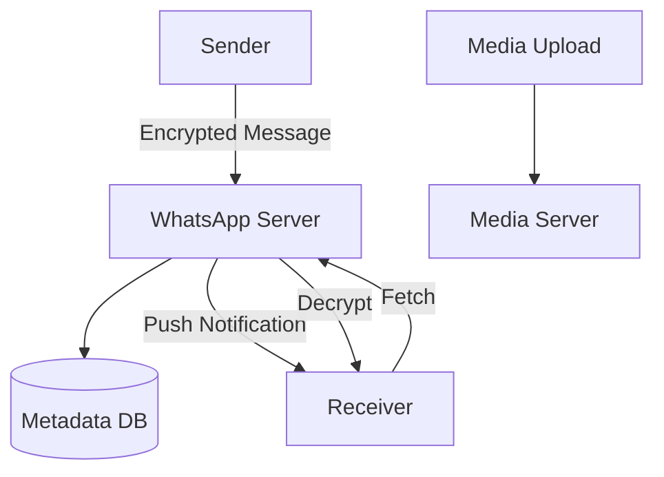

# WhatsApp Messaging System

## Overview

WhatsApp provides end-to-end encrypted messaging for 2 billion users. It handles text, media, and calls with minimal metadata storage. Key challenges include encryption, offline delivery, and global scale without content storage.

Key features:
- E2E encryption with Signal protocol.
- Offline message queuing.
- Group chats and broadcasts.
- Cross-platform sync.

## Detailed Explanation

### Architecture Overview

WhatsApp uses a centralized server for routing, with clients handling encryption:

- **Client Apps**: Encrypt/decrypt messages.
- **Server**: Relays messages, stores metadata.
- **Database**: User info, chat metadata.
- **Media Server**: Temporary storage for media.
- **Notification Service**: Push for offline users.



### Message Flow

1. Sender encrypts message with receiver's public key.
2. Sends to server.
3. Server stores encrypted message.
4. Notifies receiver.
5. Receiver fetches and decrypts.

### Offline Delivery

- Messages queued on server.
- Delivered when online.

### Scalability

- **Sharding**: By phone number.
- **Erlang**: For concurrent connections.
- **No Content Storage**: Reduces data volume.

## Real-world Examples & Use Cases

- **WhatsApp**: 100 billion messages daily.
- **Signal**: Privacy-focused messaging.
- **Telegram**: Similar with bots.
- **Use Cases**:
  - Personal communication.
  - Business messaging.
  - Emergency alerts.

## Code Examples

### E2E Encryption (Python with cryptography)

```python
from cryptography.hazmat.primitives import hashes
from cryptography.hazmat.primitives.asymmetric import rsa, padding

# Generate keys
private_key = rsa.generate_private_key(public_exponent=65537, key_size=2048)
public_key = private_key.public_key()

# Encrypt
message = b"Hello"
encrypted = public_key.encrypt(message, padding.OAEP(mgf=padding.MGF1(algorithm=hashes.SHA256()), algorithm=hashes.SHA256(), label=None))

# Decrypt
decrypted = private_key.decrypt(encrypted, padding.OAEP(mgf=padding.MGF1(algorithm=hashes.SHA256()), algorithm=hashes.SHA256(), label=None))
```

### Message Sending (Pseudocode)

```python
def send_message(sender, receiver, content):
    encrypted = encrypt(content, receiver.public_key)
    server.store_message(sender, receiver, encrypted)
    server.notify(receiver)

def receive_message(user):
    messages = server.fetch_messages(user)
    for msg in messages:
        decrypted = decrypt(msg.content, user.private_key)
        display(decrypted)
```

### Group Chat (Java)

```java
public class GroupChat {
    private List<User> members;
    
    public void sendMessage(User sender, String message) {
        for (User member : members) {
            if (!member.equals(sender)) {
                encryptedMsg = encrypt(message, member.getPublicKey());
                server.send(member, encryptedMsg);
            }
        }
    }
}
```

## Common Pitfalls & Edge Cases

- **Key Management**: Secure key exchange.
- **Metadata Leakage**: Minimize stored data.
- **Spam**: Detection algorithms.
- **Network Issues**: Reliable delivery.
- **Edge Cases**: Large groups, media files, international roaming.

| Pitfall | Mitigation |
|---------|------------|
| Encryption overhead | Optimized protocols |
| Server load | Horizontal scaling |
| Privacy breaches | Zero-knowledge proofs |

## Tools & Libraries

- **Encryption**: Signal Protocol.
- **Server**: Erlang/OTP.
- **Database**: MySQL, Cassandra.
- **Push**: Firebase/APNs.
- **Media**: Temporary S3-like.

## References

- [WhatsApp Security](https://faq.whatsapp.com/28030015)
- [Signal Protocol](https://signal.org/docs/)
- [WhatsApp at Scale](https://engineering.fb.com/2014/01/14/security/whatsapp-at-facebook/)

## Github-README Links & Related Topics

- [Security in Distributed Systems](../security-in-distributed-systems/README.md)
- [Message Queues and Kafka](../message-queues-and-kafka/README.md)
- [Database Design and Indexing](../database-design-and-indexing/README.md)
- [API Gateway Patterns](../api-gateway-patterns/README.md)
- [Fault Tolerance Patterns](../fault-tolerance-patterns/README.md)