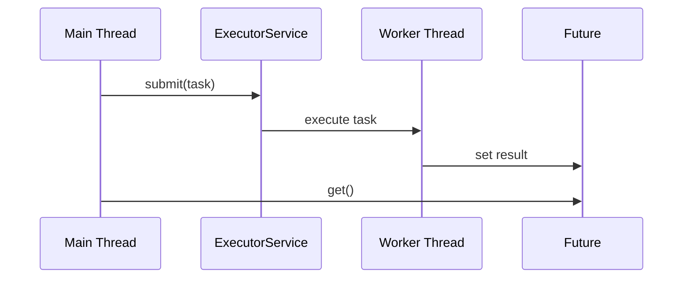

## Overview
Threads, Executors, and Futures form the foundation of concurrent programming in Java. Executors manage thread pools, while Futures represent asynchronous computations, enabling efficient task execution without blocking.

## STAR Summary
**Situation:** A web scraper needed to fetch multiple pages concurrently to reduce latency.  
**Task:** Implement asynchronous fetching with proper resource management.  
**Action:** Used ExecutorService with fixed thread pool and CompletableFuture for chaining operations.  
**Result:** Reduced total fetch time by 70% with controlled parallelism.

## Detailed Explanation
- **Threads:** Basic units of execution; use Thread class or Runnable/Callable interfaces.
- **Executors:** Manage thread pools via ExecutorService (e.g., FixedThreadPool, CachedThreadPool).
- **Futures:** Represent pending results; Future for blocking, CompletableFuture for non-blocking with callbacks.

Key concepts: thread lifecycle, pool sizing, exception handling in async tasks.

## Real-world Examples & Use Cases
- **Web servers:** Handling multiple client requests.
- **Batch processing:** Parallel data transformation.
- **I/O operations:** Non-blocking file or network I/O.

## Code Examples
```java
import java.util.concurrent.*;

public class ThreadExample {
    public static void main(String[] args) throws Exception {
        ExecutorService executor = Executors.newFixedThreadPool(4);
        
        Callable<Integer> task = () -> {
            Thread.sleep(1000);
            return 42;
        };
        
        Future<Integer> future = executor.submit(task);
        System.out.println("Result: " + future.get());
        
        executor.shutdown();
    }
}

class CompletableFutureExample {
    public static void main(String[] args) {
        CompletableFuture.supplyAsync(() -> "Hello")
            .thenApply(s -> s + " World")
            .thenAccept(System.out::println);
    }
}
```

Compile and run:
```bash
javac ThreadExample.java && java ThreadExample
javac CompletableFutureExample.java && java CompletableFutureExample
```

## Data Models / Message Formats
| Component | Purpose | Example |
|-----------|---------|---------|
| ExecutorService | Thread pool management | Executors.newFixedThreadPool(10) |
| Future | Result holder | future.get() |
| CompletableFuture | Composable async | thenApply, thenCombine |

## Journey / Sequence


## Common Pitfalls & Edge Cases
- **Thread leaks:** Always shutdown executors.
- **Blocking calls:** Avoid future.get() in main threads.
- **Pool sizing:** Too many threads cause overhead; use formulas like CPU cores + 1.

## Tools & Libraries
- **Java Util Concurrent:** Built-in.
- **RxJava:** Reactive extensions for complex async flows.
- **JMH:** For benchmarking thread performance.

## Github-README Links & Related Topics
- [[java-memory-model-and-concurrency]]
- [[concurrent-data-structures]]
- [[performance-tuning-and-profiling]]

## References
- https://docs.oracle.com/javase/8/docs/api/java/util/concurrent/package-summary.html
- https://www.baeldung.com/java-executor-service-tutorial