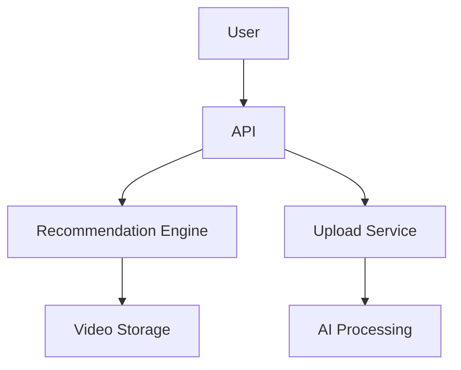

# TikTok System Design

## Overview

TikTok is a short-form video platform known for its AI-driven content discovery. This design covers video recommendation, real-time processing, and global scalability.

## Detailed Explanation

### Architecture



### Components

- **Recommendation Algorithm**: Uses ML for "For You" page.
- **Video Compression**: Efficient storage.
- **Global CDN**.

## Real-world Examples & Use Cases

- Viral content discovery.
- Duet and stitch features.

## Code Examples

### Python for Recommendation

```python
def recommend_videos(user_id):
    embedding = get_user_embedding(user_id)
    videos = vector_search(embedding)
    return videos
```

## References

- [TikTok's Recommendation System](https://example.com/tiktok-rec)

## Github-README Links & Related Topics

- [System Design Basics](system-design-basics/README.md)
- [YouTube System Design](youtube-system-design/README.md)