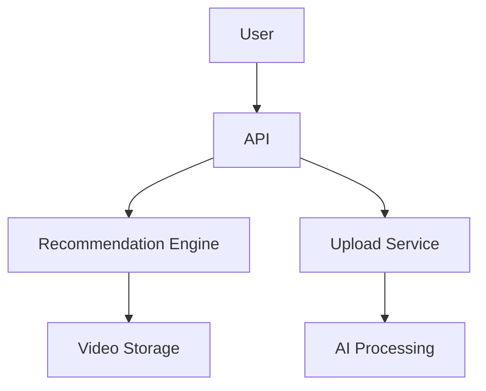
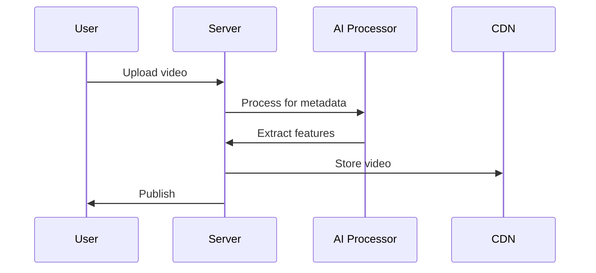

# TikTok System Design

## Overview

TikTok is a short-form video platform known for its AI-driven content discovery. This design covers video recommendation, real-time processing, and global scalability.

## Detailed Explanation

### Architecture



### Components

- **Recommendation Algorithm**: Uses ML for "For You" page.
- **Video Compression**: Efficient storage.
- **Global CDN**.

## Real-world Examples & Use Cases

- Viral content discovery.
- Duet and stitch features.

## Code Examples

### Python for Recommendation

```python
def recommend_videos(user_id):
    embedding = get_user_embedding(user_id)
    videos = vector_search(embedding)
    return videos
```

## STAR Summary

**Situation**: TikTok needed to create a platform for short-form videos with viral potential.

**Task**: Build a recommendation system that keeps users engaged for hours.

**Action**: Implemented AI-driven feed using collaborative filtering and deep learning.

**Result**: Billions of daily views, high user retention.

## Journey / Sequence

### Video Upload and Processing



## Data Models / Message Formats

### Video Metadata

```json
{
  "video_id": "vid123",
  "user_id": "user456",
  "title": "Dance Challenge",
  "hashtags": ["#dance", "#viral"],
  "duration": 15,
  "views": 1000000,
  "likes": 50000
}
```

## Common Pitfalls & Edge Cases

- Algorithm bias in recommendations.
- Copyright detection for music.
- Handling sudden viral spikes.

## Tools & Libraries

- TensorFlow for ML.
- Kafka for event streaming.
- Redis for caching.

## References

- [TikTok's Recommendation System](https://example.com/tiktok-rec)

## Github-README Links & Related Topics

- [System Design Basics](system-design-basics/README.md)
- [YouTube System Design](youtube-system-design/README.md)