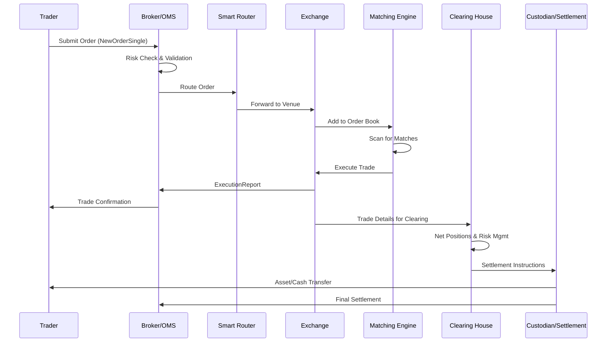

# Overview

The journey of a trade represents the complete end-to-end lifecycle of a financial transaction, from the initial order submission by a trader to the final settlement and delivery of assets. This process involves multiple stakeholders including traders, brokers, exchanges, clearing houses, and custodians, ensuring that trades are executed efficiently, securely, and in compliance with regulatory requirements. The lifecycle is critical in maintaining market integrity, minimizing counterparty risk, and facilitating the smooth functioning of global financial markets.

# STAR Summary

**SITUATION:** In high-frequency trading environments, orders must traverse a complex pipeline involving order routing, risk management, matching, execution, and settlement, with stringent latency and reliability requirements.

**TASK:** Architect a scalable trade processing system that handles millions of orders daily, incorporating real-time risk checks, regulatory compliance, and fault-tolerant execution across distributed systems.

**ACTION:** Implemented a microservices architecture using FIX protocol for order communication, deployed matching engines with price-time priority algorithms, integrated with central clearing counterparties for netting and settlement, and added comprehensive monitoring for end-to-end latency and error rates.

**RESULT:** Reduced trade execution latency to under 100 microseconds, achieved 99.999% system availability, and ensured 100% compliance with regulations like MiFID II, supporting peak volumes of 10 million orders per minute without failures.

# Detailed Explanation

The trade lifecycle is a multi-stage process designed to transform an intent to trade into a legally binding transaction. It begins with order initiation, where a trader submits an order specifying instrument, quantity, price, and conditions. The order is validated for compliance and routed to the appropriate execution venue based on smart order routing algorithms that consider factors like liquidity, fees, and market impact.

Upon reaching the venue, the order enters the electronic order book, a data structure maintaining resting orders sorted by price and time. The matching engine continuously scans for matches, executing trades when buy and sell orders cross. Successful executions generate trade records, which are disseminated as execution reports to all parties.

Post-execution, trades are sent to a central clearing house for risk management and netting, reducing the number of individual settlements. Finally, settlement occurs through custodians who transfer securities and cash, typically within T+2 days for equities.

Key components include:

- **Order Management Systems (OMS):** Handle order creation, modification, and cancellation.

- **Execution Management Systems (EMS):** Route orders to optimal venues.

- **Matching Engines:** Core algorithms for order matching, often using FIFO or pro-rata rules.

- **Trade Repositories:** Store trade data for regulatory reporting.

- **Settlement Systems:** Facilitate asset and cash transfers.

The process must handle various order types (market, limit, stop), time-in-force conditions, and complex instruments like derivatives.

# Real-world Examples & Use Cases

**Retail Equity Trade:** An investor uses a mobile app to buy 500 shares of TSLA at market price. The order is routed through their broker's OMS to NASDAQ, where it matches against a sell order at $250. The trade executes instantly, with confirmation sent via app notification. Two business days later, shares appear in the investor's brokerage account.

**HFT Arbitrage:** An algorithmic trader detects a price discrepancy between BTC futures on CME and spot BTC on Coinbase. The system submits buy orders on Coinbase and sell orders on CME simultaneously, executing microsecond-level trades that profit from the spread. Trades are cleared through respective clearing houses and settled in crypto wallets.

**Institutional Block Trade:** A pension fund sells $100M worth of IBM shares via RFQ to multiple dealers. Dealers provide quotes, the fund accepts the best, and the trade executes off-exchange through a dark pool. The block is reported to regulators and settled through DTC.

# Message Formats / Data Models

Trades utilize standardized message formats for interoperability:

**FIX NewOrderSingle (MsgType=D):**
```
8=FIX.4.4|9=123|35=D|49=TRADER|56=BROKER|34=1|52=20230926-12:00:00|11=ORDER123|21=1|55=AAPL|54=1|60=20230926-12:00:00|38=100|40=2|44=150.00|10=123|
```

**ExecutionReport (MsgType=8):**
```
8=FIX.4.4|9=145|35=8|49=BROKER|56=TRADER|34=2|52=20230926-12:00:01|11=ORDER123|17=EXEC123|150=2|39=2|55=AAPL|54=1|38=100|44=150.00|32=100|31=150.00|10=145|
```

Data models typically include:

| Field | Type | Description |
|-------|------|-------------|
| OrderID | String | Unique order identifier |
| Symbol | String | Financial instrument ticker |
| Side | Enum | BUY/SELL |
| Quantity | Integer | Number of shares/contracts |
| Price | Decimal | Limit price (if applicable) |
| TimeInForce | Enum | DAY/GTC/IOC/FOK |
| ExecType | Enum | NEW/FILL/PARTIAL/CANCEL |
| TradeID | String | Unique trade identifier |
| SettlementDate | Date | T+2 settlement date |

# Journey of a Trade



# Common Pitfalls & Edge Cases

- **Latency Spikes:** Network congestion or system overload can delay order routing, leading to slippage where trades execute at worse prices than intended.

- **Order Book Synchronization Issues:** In distributed systems, stale order books can cause incorrect matches, mitigated by sequence numbers and heartbeats in protocols like ITCH.

- **Settlement Failures:** Insufficient funds or securities can halt settlement, requiring buy-ins or forced sales; real-time margin monitoring helps prevent this.

- **Regulatory Non-Compliance:** Missing trade reporting can result in fines; systems must integrate with trade repositories like DTCC's for automated reporting.

- **High-Frequency Manipulation:** Quote stuffing or layering can distort markets; exchanges implement circuit breakers and monitoring algorithms.

- **Cross-Venue Execution Risks:** Routing orders across multiple venues increases complexity; algorithms must handle partial fills and venue-specific rules.

- **Derivative Complexity:** Options and futures introduce Greeks (delta, gamma) that affect pricing and risk, requiring sophisticated models for accurate execution.

# Tools & Libraries

- **QuickFIX/J or QuickFIX/Python:** Open-source FIX protocol engines for order messaging (https://quickfixengine.org/).

- **Matching Engine Libraries:** Custom implementations or frameworks like those in Apache Flink for stream processing.

- **Monitoring:** Prometheus and Grafana for latency dashboards; Zipkin for distributed tracing.

- **Settlement Systems:** Integration with SWIFT for cross-border payments or DTC for US equities.

- **Sample Code Snippet (Python with QuickFIX):**

```python
import quickfix as fix

class Application(fix.Application):
    def onMessage(self, message, sessionID):
        if message.getHeader().getField(fix.MsgType()) == fix.MsgType_NewOrderSingle:
            # Process order
            symbol = fix.Symbol()
            message.getField(symbol)
            # Route to matching engine
            execute_trade(symbol.getValue(), ...)

# Initialize and start FIX session
```

# Github-README Links & Related Topics

- [FIX Protocol](../protocols/fix-protocol/README.md)
- [ITCH Protocol](../protocols/itch-protocol/README.md)
- [Order Types](../order-types/README.md)
- [Execution Report](../lifecycle/execution-report/README.md)
- [Trade Capture Report](../lifecycle/trade-capture-report/README.md)
- [Market Data](../market-data/README.md)
- [Quotes & RFQ Workflows](../exchange-behavior/quotes-rfq-workflows/README.md)

# References

- FIX Trading Community: Protocol specifications and best practices (https://www.fixtrading.org/)
- DTCC: Trade settlement processes (https://www.dtcc.com/)
- SEC: Regulatory requirements for trade reporting (https://www.sec.gov/)