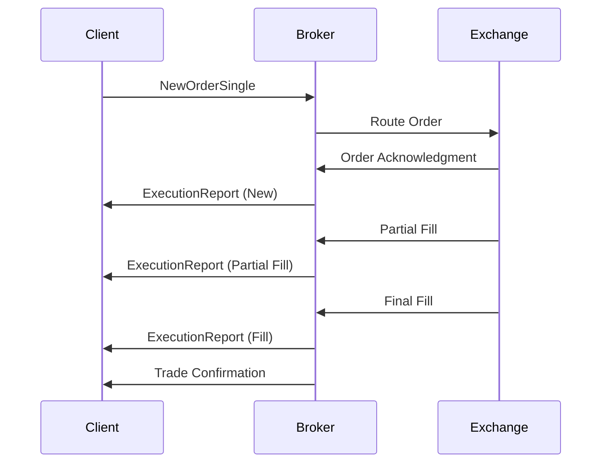

## Overview

Execution Reports provide detailed information about the status and outcome of trade orders, including fills, partial executions, rejections, and cancellations. They are critical for order management, position tracking, and regulatory compliance in trading systems.

## STAR Summary

**SITUATION:** Trading systems need to communicate order execution details to clients and maintain accurate position records.

**TASK:** Implement comprehensive execution reporting that captures all order lifecycle events.

**ACTION:** Utilized FIX ExecutionReport messages to convey fill details, remaining quantities, and execution timestamps.

**RESULT:** Enabled real-time order tracking, improved client transparency, and ensured regulatory reporting compliance.

## Detailed Explanation

Execution Reports are sent by brokers or exchanges to notify counterparties about order status changes. Key components include:

- **Order Identification:** Links the report to the original order via ClOrdID, OrderID, and ExecID.
- **Execution Details:** Quantity filled, price, timestamp, and execution venue.
- **Order Status:** Current state (New, Partially Filled, Filled, Canceled, Rejected, etc.).
- **Remaining Quantity:** Unfilled portion of the order.
- **Rejection Reasons:** For failed orders, specific codes explaining the issue.

Reports are sent incrementally for partial fills and as final confirmations for complete executions.

## Real-world Examples & Use Cases

**Partial Fill Report:** A limit order for 10,000 shares executes 3,000 at $50.25, generating an ExecutionReport with LastQty=3000, CumQty=3000, LeavesQty=7000.

**Order Rejection:** An order violates exchange rules, resulting in an ExecType=8 (Rejected) with Text field explaining the violation.

**Cancel Confirmation:** Upon order cancellation, an ExecutionReport with ExecType=4 (Canceled) is sent.

**Trade Confirmation:** Final fill sends ExecType=2 (Trade) with all execution details.

## Message Formats / Data Models

**FIX ExecutionReport (MsgType=8):**
```
8=FIX.4.4|35=8|49=BROKER|56=CLIENT|34=1|52=20230926-14:30:00|11=ORD123|17=EXEC456|150=2|39=2|55=AAPL|54=1|38=10000|32=5000|31=150.25|14=5000|151=5000|...
```

| Field | Tag | Description |
|-------|-----|-------------|
| ClOrdID | 11 | Client order ID |
| OrderID | 37 | Broker order ID |
| ExecID | 17 | Unique execution ID |
| ExecType | 150 | Type of execution (0=New, 1=Partial, 2=Fill, 4=Cancel, 8=Reject) |
| OrdStatus | 39 | Current order status |
| Symbol | 55 | Instrument |
| Side | 54 | Buy/Sell |
| OrderQty | 38 | Original quantity |
| LastQty | 32 | Last executed quantity |
| LastPx | 31 | Last executed price |
| CumQty | 14 | Total executed quantity |
| LeavesQty | 151 | Remaining quantity |
| Text | 58 | Free text (rejection reasons, etc.) |

## Journey of a Trade



## Common Pitfalls & Edge Cases

- **Out-of-Order Reports:** Network delays can cause reports to arrive out of sequence; use ExecID for ordering.
- **Duplicate Reports:** Implement idempotency checks using ExecID to handle retransmissions.
- **Partial Fill Aggregation:** Ensure CumQty accurately reflects total filled quantity across multiple reports.
- **Rejection Handling:** Different exchanges have varying rejection codes; map to standard FIX values.
- **Regulatory Timestamps:** Use accurate timestamps for trade reporting requirements.
- **Multi-Venue Executions:** For smart-routed orders, reports may come from different venues.

## Tools & Libraries

- **FIX Libraries:** QuickFIX for parsing and generating ExecutionReports.
- **Order Management Systems:** Implement custom reporting logic.
- **Monitoring Tools:** Log aggregation for execution tracking.

```java
// Example: Processing ExecutionReport in Java
public void onExecutionReport(ExecutionReport report) {
    String execType = report.getExecType().getValue();
    double lastQty = report.getLastQty().getValue();
    double lastPx = report.getLastPx().getValue();
    double cumQty = report.getCumQty().getValue();
    double leavesQty = report.getLeavesQty().getValue();
    
    switch (execType) {
        case "0": // New
            System.out.println("Order acknowledged");
            break;
        case "1": // Partial Fill
            System.out.println("Partial fill: " + lastQty + " @ " + lastPx);
            break;
        case "2": // Fill
            System.out.println("Order filled: " + cumQty + " total");
            break;
        case "4": // Canceled
            System.out.println("Order canceled, remaining: " + leavesQty);
            break;
        case "8": // Rejected
            System.out.println("Order rejected: " + report.getText().getValue());
            break;
    }
}
```

## Github-README Links & Related Topics

- [FIX Protocol](../fix-protocol/README.md)
- [Trade Capture Report](../trade-capture-report/README.md)
- [Order Types](../order-types/README.md)
- [Journey of a Trade](../journey-of-a-trade/README.md)

## References

- [FIX Protocol - ExecutionReport](https://www.fixtrading.org/documents/fix-protocol-specification/)
- [Trade Reporting - SEC Requirements](https://www.sec.gov/investor/pubs/tradereporting.htm)
- [Order Lifecycle - Investopedia](https://www.investopedia.com/terms/o/orderlifecycle.asp)