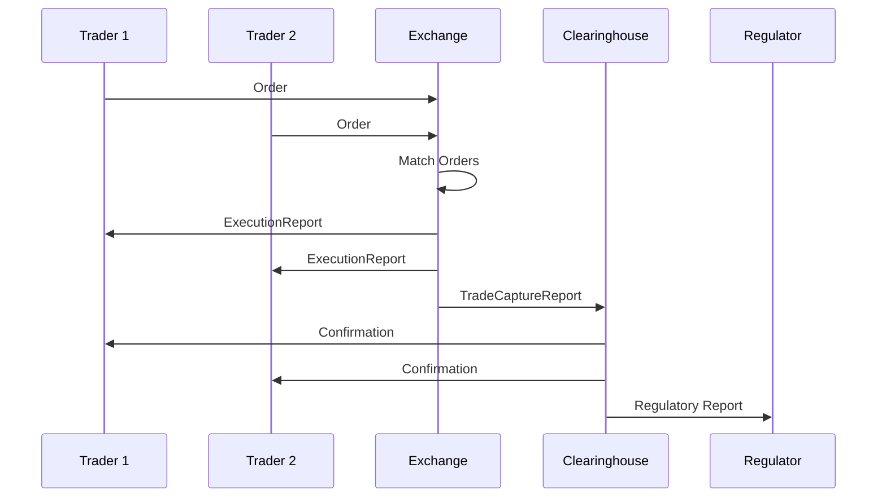

## Overview

Trade Capture Reports (TCR) document completed trades for regulatory compliance, clearing, and settlement purposes. They provide comprehensive details about executed trades, including counterparties, instruments, quantities, prices, and timestamps, ensuring accurate record-keeping and audit trails.

## STAR Summary

**SITUATION:** Financial institutions must maintain complete and accurate records of all trades for regulatory reporting and reconciliation.

**TASK:** Implement trade capture and reporting system that generates standardized reports for all executed trades.

**ACTION:** Developed system using FIX TradeCaptureReport messages to capture trade details immediately after execution.

**RESULT:** Achieved 100% trade capture rate, improved regulatory compliance, and enabled efficient post-trade processing.

## Detailed Explanation

Trade Capture Reports are generated post-execution to record trade details for multiple purposes:

- **Regulatory Reporting:** Required submissions to authorities like SEC, FCA, or ESMA.
- **Clearing and Settlement:** Information needed for trade processing through clearinghouses.
- **Reconciliation:** Matching trades between counterparties and internal systems.
- **Audit Trails:** Complete history for compliance and dispute resolution.

Key elements include trade identifiers, instrument details, execution venue, settlement terms, and regulatory flags.

## Real-world Examples & Use Cases

**Equity Trade Capture:** After executing a buy order for 1000 shares of MSFT at $300, a TradeCaptureReport is generated with all trade details for SEC reporting.

**Derivatives Reporting:** Swap trades require detailed TCRs including notional amounts, payment schedules, and collateral terms for regulatory submissions.

**Cross-Border Trades:** TCRs must include currency conversion details and applicable tax treatments.

**Block Trade Reporting:** Large trades may require special reporting flags for transparency requirements.

## Message Formats / Data Models

**FIX TradeCaptureReport (MsgType=AE):**
```
8=FIX.4.4|35=AE|49=BROKER|56=CLIENT|34=1|52=20230926-14:30:00|571=TRADE123|487=1|856=0|828=0|55=AAPL|54=1|32=1000|31=150.25|75=20230926|60=20230926-14:30:00|...
```

| Field | Tag | Description |
|-------|-----|-------------|
| TradeReportID | 571 | Unique trade report identifier |
| TradeReportTransType | 487 | New (0), Cancel (1), Replace (2) |
| TradeReportType | 856 | Submit (0), Alleged (1), Accept (2) |
| TrdType | 828 | Regular trade (0), Block trade (1), etc. |
| Symbol | 55 | Instrument identifier |
| Side | 54 | Buy/Sell |
| LastQty | 32 | Executed quantity |
| LastPx | 31 | Execution price |
| TradeDate | 75 | Date of trade |
| TransactTime | 60 | Time of execution |
| SettlType | 63 | Settlement type (Cash, etc.) |
| SettlDate | 64 | Settlement date |

## Journey of a Trade



## Common Pitfalls & Edge Cases

- **Trade ID Uniqueness:** Ensure globally unique identifiers across all systems.
- **Timestamps Accuracy:** Use synchronized clocks for precise trade timing.
- **Amendment Handling:** Properly handle trade corrections and cancellations.
- **Regulatory Deadlines:** Meet strict reporting timelines (e.g., T+1 for equities).
- **Data Quality:** Validate all required fields to avoid reporting rejections.
- **Cross-System Reconciliation:** Handle discrepancies between trading, clearing, and settlement systems.

## Tools & Libraries

- **FIX Engines:** For generating and parsing TradeCaptureReport messages.
- **Trade Repositories:** DTCC, Euroclear for centralized trade reporting.
- **Regulatory Systems:** Implement custom reporting pipelines.

```python
# Example: Generating TradeCaptureReport
import quickfix as fix

def create_trade_capture_report(trade_id, symbol, side, qty, price, trade_date, transact_time):
    report = fix.Message()
    report.getHeader().setField(fix.MsgType(fix.MsgType_TradeCaptureReport))
    report.setField(fix.TradeReportID(trade_id))
    report.setField(fix.TradeReportTransType(0))  # New
    report.setField(fix.Symbol(symbol))
    report.setField(fix.Side(side))
    report.setField(fix.LastQty(qty))
    report.setField(fix.LastPx(price))
    report.setField(fix.TradeDate(trade_date))
    report.setField(fix.TransactTime(transact_time))
    return report
```

## Github-README Links & Related Topics

- [FIX Protocol](../fix-protocol/README.md)
- [Execution Report](../execution-report/README.md)
- [Regulatory Reports](../regulatory-reports/README.md)
- [Clearing and Settlement](../clearing-and-settlement/README.md)

## References

- [FIX Protocol - TradeCaptureReport](https://www.fixtrading.org/documents/fix-protocol-specification/)
- [SEC Trade Reporting](https://www.sec.gov/divisions/marketreg/mr-noaction/2018/nyse-argo-080318-19d.pdf)
- [EMIR Reporting Requirements](https://www.esma.europa.eu/sites/default/files/library/esma70-151-176_emir_reporting.pdf)