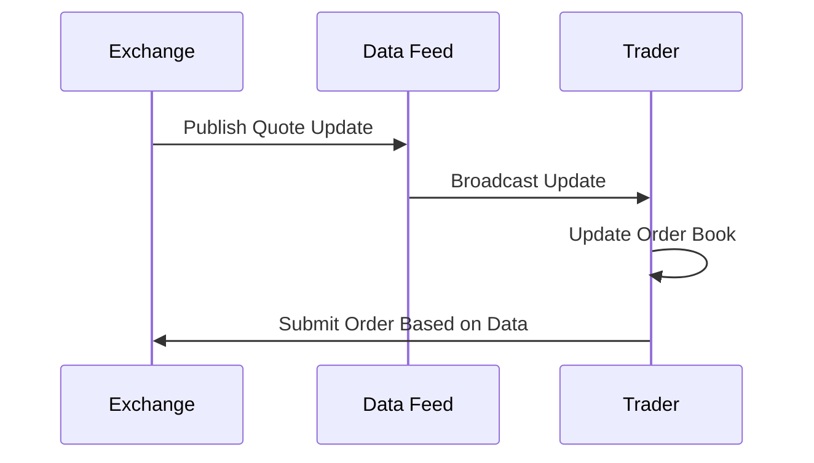

# Market Data

## Overview

Market data refers to the information about financial instruments traded in markets, including prices, volumes, and order book details. It is disseminated by exchanges and data providers to enable informed trading decisions. Market data includes quotes (bid/ask), trades, order book depth, and analytics. Protocols like ITCH, FIX, and proprietary feeds are used for real-time dissemination.

Market data is categorized into Level 1 (basic quotes), Level 2 (order book), and Level 3 (full order details). Dissemination can be snapshot-based or incremental updates.

## STAR Summary

**S: Situation** - Traders need real-time information on prices and liquidity to make decisions, but historical manual processes were slow and incomplete.

**T: Task** - Create systems for real-time collection, processing, and distribution of market data.

**A: Action** - Exchanges developed protocols like ITCH for broadcasting data, with vendors providing consolidation and analytics.

**R: Result** - Market data enables efficient markets, with trillions in daily volume supported by real-time feeds.

## Detailed Explanation

Market data sources: Exchanges (primary), aggregators (consolidated).

Types:
- Quotes: Best bid/ask.
- Trades: Executed prices and volumes.
- Order Book: Full depth of buy/sell orders.
- Time & Sales: Historical trades.

Dissemination: Multicast for efficiency, with snapshots for initialization and increments for updates.

Consolidation: Combining feeds from multiple venues for unified view.

## Real-world Examples & Use Cases

1. **Retail Trading**: Apps show real-time quotes for stocks.

2. **HFT**: Algorithms react to microsecond changes.

3. **Arbitrage**: Exploiting price differences across venues.

## Message Formats / Data Models

Example quote message:

| Symbol | Bid Price | Bid Size | Ask Price | Ask Size | Timestamp |
|--------|-----------|----------|-----------|----------|-----------|
| AAPL | 149.50 | 1000 | 149.55 | 800 | 2023-09-26T10:00:00Z |

## Journey of a Trade



## Common Pitfalls & Edge Cases

1. **Latency**: Delays can lead to stale data.

2. **Data Quality**: Errors in feeds require validation.

3. **Regulatory**: Access controls for sensitive data.

4. **High Volume**: Processing millions of updates.

## Tools & Libraries

- Bloomberg Terminal: Professional data platform.
- Yahoo Finance API: Free data access.
- Pandas for analysis.

Sample code (Python):

```python
import yfinance as yf
data = yf.Ticker("AAPL").history(period="1d")
print(data)
```

## Github-README Links & Related Topics

[[FIX Protocol]]
[[ITCH Protocol]]
[[Order Entry Protocols]]
[[Quotes & RFQ workflows]]

## References

- [Nasdaq Market Data](https://www.nasdaq.com/solutions/market-data)
- [FIX Market Data](https://www.fixtrading.org/standards/)