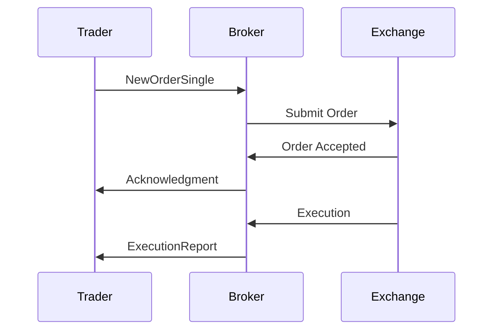

# Overview

Order entry protocols enable the submission, modification, and cancellation of orders to exchanges or brokers. Protocols like OUCH, FIX, and proprietary systems ensure reliable, low-latency order management for electronic trading.

# STAR Summary

**SITUATION**: Traders need efficient ways to enter orders electronically to replace manual processes and support high-volume trading.

**TASK**: Develop protocols for order lifecycle management with guarantees of delivery and confirmation.

**ACTION**: Created binary and text-based protocols with session management, sequence numbers, and message types for order operations.

**RESULT**: Enabled algorithmic and HFT trading with sub-millisecond execution, reducing errors and improving market efficiency.

# Detailed Explanation

Order entry involves:

- **Order Types**: Market, limit, stop, etc.
- **Lifecycle**: Submit, modify, cancel, confirm.
- **Protocols**: FIX for versatile messaging, OUCH for binary speed, proprietary for exchange-specific.

Key features: Authentication, rate limiting, order validation, and real-time acknowledgments.

# Real-world Examples & Use Cases

Used by brokers for client orders, HFT for rapid execution, and algos for strategy implementation.

Example: Submit limit order via FIX, receive acknowledgment, then cancel if not filled.

# Message Formats / Data Models

FIX NewOrderSingle:

| Tag | Name | Description |
|-----|------|-------------|
| 35 | MsgType | D |
| 11 | ClOrdID | Client order ID |
| 55 | Symbol | Security |
| 54 | Side | 1=Buy, 2=Sell |
| 38 | OrderQty | Quantity |
| 40 | OrdType | 1=Market, 2=Limit |
| 44 | Price | Limit price |

# Journey of a Trade

# Common Pitfalls & Edge Cases

- **Duplicate Orders**: Use unique IDs.
- **Rejection Handling**: Invalid orders cause rejects.
- **Session Breaks**: Reconnect and resend.
- **Rate Limits**: Exceed limits cause throttling.

# Tools & Libraries

- QuickFIX for FIX.
- NASDAQ OUCH SDK.

# Github-README Links & Related Topics

[[fix-protocol]]
[[ouch-protocol]]
[[order-types]]
[[execution-report]]