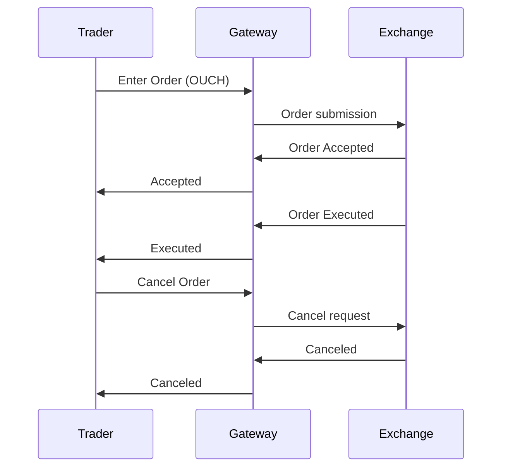

# Overview

The OUCH protocol is a binary message protocol developed by NASDAQ for order entry and management. OUCH stands for "Order Update and Confirmation Handler" and is used for submitting, modifying, and canceling orders on NASDAQ markets with low latency.

# STAR Summary

**SITUATION**: NASDAQ required a high-performance protocol for order entry to support increasing electronic trading volumes and algorithmic strategies.

**TASK**: Design a binary protocol optimized for fast order submission and confirmation with minimal overhead.

**ACTION**: Created OUCH with compact binary messages, TCP transport for reliability, and message types for order lifecycle management.

**RESULT**: OUCH enables sub-millisecond order entry, supporting HFT and institutional trading with guaranteed delivery and real-time confirmations.

# Detailed Explanation

OUCH uses binary encoding with fixed message lengths for efficiency. Key features:

- **Message Types**: Enter Order, Replace Order, Cancel Order, and various confirmations.
- **Transport**: TCP for reliable, sequenced delivery.
- **Authentication**: Session-based with login/logout.
- **Order Types**: Supports limit orders, market orders, and advanced types.

OUCH integrates with ITCH for market data, providing a complete trading interface.

# Real-world Examples & Use Cases

OUCH is used by:

- Broker-dealers for order routing
- HFT firms for rapid order placement
- Institutional traders for large orders
- Algorithmic trading systems

Example: An algo sends Enter Order message, receives Accepted confirmation, then monitors execution via ITCH feed.

# Message Formats / Data Models

OUCH messages start with a 1-byte type. Sample Enter Order (type 'O'):

| Field | Size | Description |
|-------|------|-------------|
| Message Type | 1 byte | 'O' |
| Order Token | 14 bytes | Unique order ID |
| Buy/Sell | 1 byte | 'B' or 'S' |
| Shares | 4 bytes | Quantity |
| Stock | 8 bytes | Symbol |
| Price | 4 bytes | Price in cents |
| Time-in-Force | 1 byte | '0'=Day, etc. |
| Firm | 4 bytes | Firm ID |
| Display | 1 byte | Display instruction |
| Capacity | 1 byte | Trading capacity |
| Intermarket Sweep | 1 byte | ISO flag |
| Min Qty | 4 bytes | Minimum quantity |
| Cross Type | 1 byte | Cross type |
| Customer Type | 1 byte | Customer type |

# Journey of a Trade



# Common Pitfalls & Edge Cases

- **Token Conflicts**: Ensure unique order tokens.
- **Capacity Limits**: Respect rate limits to avoid throttling.
- **Session Management**: Handle reconnections gracefully.
- **Order Validation**: Check for invalid prices or quantities.
- **Cross-Trade Handling**: Manage intermarket sweep orders correctly.

# Tools & Libraries

- **OUCH Libraries**: Commercial and open-source implementations.
- **NASDAQ OUCH Simulator**: For testing.
- **Sample Code (C++)**:

```cpp
struct EnterOrder {
    char type = 'O';
    char order_token[14];
    char buy_sell;
    uint32_t shares;
    char stock[8];
    uint32_t price;
    // ... other fields
};

// Serialize and send over TCP
```

# Github-README Links & Related Topics

[[fix-protocol]]
[[itch-protocol]]
[[order-types]]
[[order-entry-protocols]]
[[latency-measurement]]