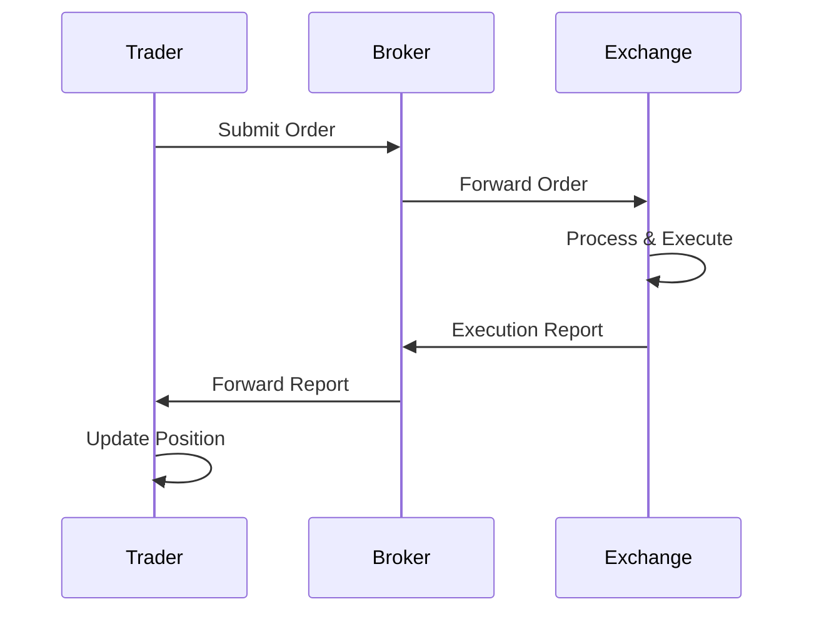

## Overview

Execution reports are messages sent by exchanges or brokers to confirm the execution of trades. They provide critical details such as executed quantity, price, timestamps, and order status. In FIX protocol, these are represented by ExecutionReport messages (MsgType=8). Proper handling of execution reports is essential for position management, risk monitoring, and regulatory compliance.

## STAR Summary

**SITUATION:** Trading systems need real-time confirmation of order executions to update positions and manage risk.

**TASK:** Define execution report structure, types, and processing workflows.

**ACTION:** Analyzed FIX protocol documentation and exchange specifications for execution reporting.

**RESULT:** Created a comprehensive reference for implementing execution report handling in trading applications.

## Detailed Explanation

Execution reports convey the outcome of order processing. Key types include:

- **New (ExecType=0):** Order acknowledged and added to book.
- **Partial Fill (ExecType=1):** Portion of order executed.
- **Fill (ExecType=2):** Order completely executed.
- **Canceled (ExecType=4):** Order canceled.
- **Rejected (ExecType=8):** Order rejected.

Reports include cumulative executed quantity, average price, and remaining quantity. They support complex order types and conditional executions.

## Real-world Examples & Use Cases

**Market Order Execution:** A buy order for 1000 shares executes at $50.00, generating a fill report.

**Limit Order Partial Fill:** A sell limit at $51.00 partially executes 500 shares, with a partial fill report sent.

**Order Cancellation:** User cancels order, receiving a canceled execution report.

## Message Formats / Data Models

**FIX ExecutionReport Example:**
```
8=FIX.4.4|35=8|49=EXCHANGE|56=BROKER|34=1|52=20230926-10:00:00|11=ORD123|17=EXEC123|150=2|39=2|55=TSLA|54=1|38=1000|32=1000|31=50.00|14=1000|6=50.00|10=123|
```

| Field | Tag | Description |
|-------|-----|-------------|
| ExecType | 150 | Type of execution (0=New, 1=Partial, 2=Fill, 4=Canceled, 8=Rejected) |
| OrdStatus | 39 | Current order status |
| LastQty | 32 | Quantity of last execution |
| LastPx | 31 | Price of last execution |
| CumQty | 14 | Total executed quantity |
| AvgPx | 6 | Average execution price |
| LeavesQty | 151 | Remaining quantity |

## Journey of a Trade



## Common Pitfalls & Edge Cases

- **Out-of-Order Reports:** Reports may arrive out of sequence, requiring sorting by ExecID.
- **Duplicate Reports:** Network issues can cause duplicates; use unique ExecID for deduplication.
- **Incorrect Calculations:** Cumulative quantities must be accurately maintained.
- **Latency in Reporting:** Delays can affect real-time risk systems.
- **Complex Orders:** Iceberg or bracket orders generate multiple related reports.

## Tools & Libraries

- **FIX Parsers:** QuickFIX for parsing execution reports.
- **Trading Platforms:** MetaTrader, Thinkorswim for retail execution reporting.
- **Monitoring:** Log aggregation for report analysis.

```java
// Example: Parsing ExecutionReport (Java with QuickFIX)
import quickfix.Message;
import quickfix.field.ExecType;

public void handleExecutionReport(Message message) {
    ExecType execType = new ExecType();
    message.getField(execType);
    if (execType.getValue() == ExecType.FILL) {
        // Handle fill
        System.out.println("Order filled");
    }
}
```

# Github-README Links & Related Topics

- [FIX Protocol](../../protocols/fix-protocol/README.md)
- [Journey of a Trade](../../lifecycle/journey-of-a-trade/README.md)
- [Trade Capture Report](../../compliance/trade-capture-report/README.md)
- [Order Types](../../order-types/order-types/README.md)

## References

- [FIX ExecutionReport](https://www.fixtrading.org/documents/fix-protocol-specification/)
- [Execution Reporting - SEC](https://www.sec.gov/investor/pubs/tradrep.htm)
- [Trade Confirmation Standards](https://www.sifma.org/resources/research/trade-confirmation/)