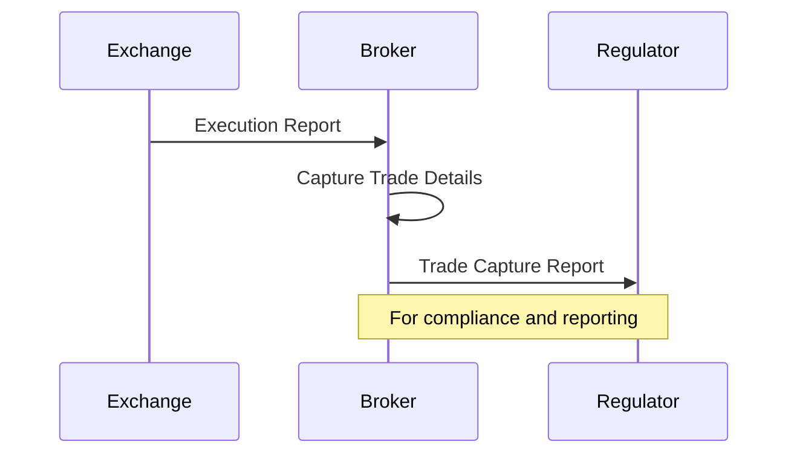

# Overview

The Trade Capture Report (FIX MsgType=AE) is used to report trade details for regulatory compliance, risk management, and operational purposes. It captures comprehensive trade information, including parties involved, instruments, quantities, prices, and timestamps. Unlike Execution Reports, which confirm individual executions, Trade Capture Reports provide a holistic view of trades, often sent post-execution to regulators or counterparties. This message is crucial for MiFID II compliance, trade surveillance, and reconciliation.

# STAR Summary

**S**ituation: Post-trade processes require standardized reporting for compliance and analytics.

**T**ask: Create a message format for capturing and disseminating trade details.

**A**ction: Extended FIX with TradeCaptureReport, incorporating fields for all trade aspects.

**R**esult: Enabled automated regulatory reporting, reduced manual errors, and improved market transparency.

# Detailed Explanation

Trade Capture Reports are generated after trade execution, often by the executing broker or a trade repository. They include:

- **Trade Identifiers**: Unique trade IDs, execution IDs, and linking to original orders.
- **Instrument Details**: Symbol, security type, and identifiers.
- **Execution Details**: Quantity, price, settlement terms.
- **Party Information**: Buyer, seller, intermediaries.
- **Regulatory Fields**: Flags for reporting requirements (e.g., MiFID II).

Reports can be sent in batches for efficiency or individually for real-time compliance. They support amendments and corrections.

# Real-world Examples & Use Cases

- **Regulatory Reporting**: Under MiFID II, trades must be reported within specified timeframes; Trade Capture Reports automate this.
- **OTC Derivatives**: Complex swaps require detailed capture for valuation and risk.
- **Trade Reconciliation**: Banks use reports to match internal records with counterparties.
- **Surveillance**: Regulators analyze reports for market abuse detection.

Case Study: Post-2008 crisis, Trade Capture Reports helped regulators monitor systemic risk.

# Message Formats / Data Models

Key FIX fields in TradeCaptureReport:

| Field | Tag | Description | Example |
|-------|-----|-------------|---------|
| MsgType | 35 | Message type (AE for TradeCaptureReport) | AE |
| TradeReportID | 571 | Unique trade report identifier | TR123456 |
| ExecID | 17 | Execution identifier | EXEC789 |
| Symbol | 55 | Instrument | EURUSD |
| Side | 54 | Trade side | 1 (Buy) |
| LastQty | 32 | Trade quantity | 1000000 |
| LastPx | 31 | Trade price | 1.0500 |
| TransactTime | 60 | Trade timestamp | 20230926-14:30:00 |
| SettlDate | 64 | Settlement date | 20230928 |
| Account | 1 | Account identifier | ACC001 |
| NoSides | 552 | Number of sides (repeating group) | 2 |

Sample TradeCaptureReport message:

```
8=FIX.4.4|9=245|35=AE|49=REPORTER|56=REGULATOR|34=3|52=20230926-14:30:00|571=TR123|17=EXEC789|55=EURUSD|54=1|32=1000000|31=1.0500|60=20230926-14:30:00|64=20230928|1=ACC001|552=2|10=124|
```

# Journey of a Trade



# Common Pitfalls & Edge Cases

- **Late Reporting**: Penalties for missing deadlines; automated systems prevent this.
- **Data Inconsistencies**: Mismatches between reports and executions; reconciliation processes mitigate.
- **Amendments**: Trades may be corrected post-report; amendment messages handle updates.
- **Cross-Border Trades**: Different jurisdictions have varying requirements.
- **High-Volume Reporting**: Scalability issues; batching and compression are used.

# Tools & Libraries

- **FIX Engines**: Libraries for generating and parsing Trade Capture Reports.
- **Regulatory Platforms**: Systems like DTCC for automated submission.
- **Analytics Tools**: For trade data analysis and compliance monitoring.

  ```python
  # Example: Parsing TradeCaptureReport with QuickFIX
  import quickfix as fix

  def on_message(self, message):
      if message.getHeader().getString(fix.MsgType()) == fix.MsgType_TradeCaptureReport:
          trade_id = fix.TradeReportID()
          message.getField(trade_id)
          qty = fix.LastQty()
          message.getField(qty)
          # Process trade
  ```

# Github-README Links & Related Topics

- [FIX Protocol](../../protocols/fix-protocol/README.md)
- [Execution Report](../execution-report/README.md)
- [Compliance](../../README.md)
- [Regulatory Reports](../../compliance/README.md)

# References

- [FIX Protocol Specification - TradeCaptureReport](https://www.fixtrading.org/online-specification/)
- [MiFID II Trade Reporting](https://www.esma.europa.eu/mifid-ii)