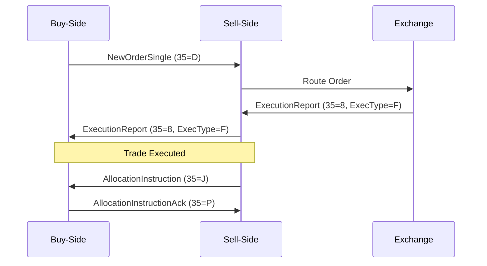

## Overview

The Financial Information eXchange (FIX) Protocol is an open standard for electronic communication in the financial industry, primarily used for trading equities, derivatives, fixed income, and foreign exchange. Developed in 1992 by a consortium of brokerages and exchanges, FIX standardizes the format and content of messages exchanged between trading partners, enabling seamless interoperability across global markets. It supports pre-trade, trade, and post-trade workflows, including order routing, execution reporting, market data dissemination, and regulatory compliance. FIX has evolved through extension packs to accommodate new asset classes and regulatory requirements, maintaining its non-proprietary nature to promote industry-wide adoption.

## STAR Summary

**S**ituation: In the early 1990s, financial markets relied on manual processes like phone calls and faxes for trade communications, leading to inefficiencies, errors, and high costs. The lack of standardized electronic messaging hindered automation and global trading.

**T**ask: Develop an open, vendor-neutral protocol to standardize electronic trade communications, enabling automated order routing, execution, and reporting across buy-side and sell-side firms.

**A**ction: FIX Trading Community, a non-profit organization, collaborated with industry participants to create and maintain the FIX specification. The protocol was designed with a tag-value pair format, supporting multiple encodings (e.g., FIXML, SBE) and session layers (e.g., FIXT, FIXP). Extension packs were introduced to add functionality without breaking backward compatibility.

**R**esult: FIX became the de facto standard for electronic trading, processing millions of transactions daily. It reduced trade costs, improved transparency, and facilitated global market integration, with adoption by over 300 member firms including major banks, exchanges, and vendors.

## Detailed Explanation

FIX operates as an application-layer protocol, defining message structures for financial transactions while remaining agnostic to underlying transport mechanisms. Messages are composed of fields identified by numeric tags (e.g., 35 for MsgType), with values separated by SOH (ASCII 1) in the classic tag=value format. The protocol supports synchronous and asynchronous communication, with session management handled by layers like FIXT for reliable sequencing and gap recovery.

Key components include:
- **Header/Trailer**: Standard fields for message identification, timestamps, and integrity (e.g., CheckSum).
- **Body**: Business-specific fields varying by message type (e.g., NewOrderSingle uses tags like 11 ClOrdID, 55 Symbol).
- **Repeating Groups**: For multi-leg instruments or multiple parties, using NoXXX fields to indicate count.

FIX supports multiple encodings: tag=value for simplicity, FIXML for XML-based interoperability, and binary formats like SBE for high-performance market data. Session protocols ensure ordered delivery, with heartbeat messages maintaining connections.

Extension Packs (EPs) incrementally add features, such as support for MiFID II compliance or digital assets, ensuring the protocol adapts to regulatory and technological changes without disrupting existing implementations.

## Real-world Examples & Use Cases

FIX is ubiquitous in electronic trading:
- **Order Routing**: A buy-side firm sends a NewOrderSingle (MsgType=D) to a broker, specifying instrument, quantity, and price.
- **Execution Reporting**: Brokers respond with ExecutionReport (MsgType=8) detailing fills, partial executions, or rejections.
- **Market Data**: Exchanges broadcast MarketDataSnapshot (MsgType=W) for quotes and trades.
- **Post-Trade**: Allocation messages (e.g., AllocationInstruction) handle trade settlement and reporting.

Sample NewOrderSingle message (tag=value format):
```
8=FIX.5.0|9=123|35=D|49=BUYSIDE|56=SELLSIDE|34=1|52=20230926-12:00:00|11=ORDER123|55=AAPL|54=1|38=100|44=150.00|10=123|
```
This represents a buy order for 100 shares of AAPL at $150.

In high-frequency trading, FIX over UDP with SBE encoding minimizes latency for market data feeds.

## Message Formats / Data Models

FIX messages are structured as key-value pairs. Core message types include:
- **Pre-Trade**: IndicationOfInterest (35=6), QuoteRequest (35=R).
- **Trade**: NewOrderSingle (35=D), OrderCancelRequest (35=F), ExecutionReport (35=8).
- **Post-Trade**: AllocationInstruction (35=J), TradeCaptureReport (35=AE).

Example ExecutionReport structure:
- Header: BeginString(8), MsgType(35), SenderCompID(49), etc.
- Body: OrderID(37), ExecType(150), LastQty(32), LastPx(31), CumQty(14), LeavesQty(151).
- Trailer: CheckSum(10).

Data types include int, float, String, UTCTimestamp. Repeating groups use NoXXX fields (e.g., NoPartyIDs for parties).

## Journey of a Trade



This diagram illustrates the lifecycle: order submission, routing, execution, and allocation.

## Common Pitfalls & Edge Cases

- **Sequence Number Gaps**: Network issues can cause missed messages; use ResendRequest (35=2) for recovery.
- **Session Management**: Logon (35=A) must include correct CompIDs; heartbeats prevent timeouts.
- **Repeating Groups**: Incorrect NoXXX counts lead to parsing errors; validate against business rules.
- **Regulatory Timestamps**: MiFID II requires precise timestamps; ensure UTC synchronization.
- **Race Conditions**: In HFT, concurrent order modifications can cause conflicts; use OrigClOrdID for chaining.
- **Encoding Mismatches**: Sender and receiver must agree on encoding; default to tag=value for compatibility.

## Tools & Libraries

Open-source libraries include:
- **QuickFIX**: C++, Java, Python implementations for FIX engines.
- **FIXimulator**: Testing tool for message simulation.
- **FIX Orchestra**: XML schema for FIX definitions.

Sample Python code with QuickFIX:
```python
import quickfix as fix

class Application(fix.Application):
    def onMessage(self, message, sessionID):
        msgType = fix.MsgType()
        message.getHeader().getField(msgType)
        if msgType.getValue() == fix.MsgType_NewOrderSingle:
            # Process order
            pass

# Initialize and run FIX engine
```

Java example:
```java
import quickfix.*;

public class FixApplication extends MessageCracker implements Application {
    public void onMessage(NewOrderSingle order, SessionID sessionID) throws FieldNotFound, UnsupportedMessageType, IncorrectTagValue {
        // Handle order
    }
}
```

Pseudocode for parsing:
```
parse_message(raw_msg):
    fields = split(raw_msg, SOH)
    for field in fields:
        tag, value = split(field, '=')
        if tag == '35':
            msg_type = value
        # Process based on msg_type
```

## Github-README Links & Related Topics

- [API Design Principles](../api-design-principles/)
- [Event-Driven Architecture](../event-driven-architecture/)
- [Distributed Systems](../cap-theorem-and-distributed-systems/)
- [High Scalability Patterns](../high-scalability-patterns/)
- [Database Design Patterns](../database-design-patterns/)

## References

- FIX Trading Community: https://www.fixtrading.org/
- FIX Protocol Specification: https://www.fixtrading.org/online-specification/
- QuickFIX Library: https://github.com/quickfix/quickfix
- FIX Orchestra: https://www.fixtrading.org/standards/fix-orchestra/