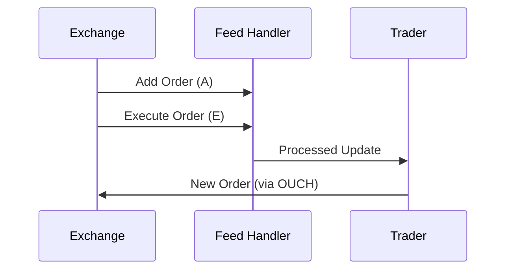

# Overview

The ITCH protocol is a binary message protocol developed by NASDAQ for the real-time dissemination of market data, including order book updates, trade executions, and quote information. It is designed for high-throughput, low-latency environments, providing a detailed view of market activity. ITCH feeds are used by traders, algorithms, and data vendors to monitor and react to market changes instantly.

# STAR Summary

**SITUATION:** In the early 2000s, NASDAQ needed a more efficient way to distribute market data beyond text-based feeds, to support growing electronic trading volumes.

**TASK:** Develop a protocol that minimizes bandwidth and latency while providing comprehensive market data.

**ACTION:** NASDAQ created ITCH, a binary protocol with fixed-length messages, eliminating the need for parsing delimiters. It includes messages for order additions, modifications, executions, and cancellations.

**RESULT:** ITCH became NASDAQ's primary market data protocol, enabling real-time order book reconstruction and supporting high-frequency trading strategies.

# Detailed Explanation

ITCH messages are binary-encoded for efficiency, with each message type having a fixed size. The protocol uses big-endian byte order and includes a message type byte followed by fields specific to the type.

Key message types:

- Add Order (A): Adds a new order to the book.

- Add Order with MPID (F): Adds order with market participant identifier.

- Execute Order (E): Reports a trade execution.

- Cancel Order (X): Removes quantity from an order.

- Delete Order (D): Removes an entire order.

- Replace Order (U): Modifies an existing order.

- System Event (S): Indicates market open/close.

- Stock Directory (R): Provides stock reference data.

ITCH supports multiple versions; ITCH 5.0 is current for equities.

The protocol ensures data integrity through sequencing and timestamps, allowing receivers to maintain accurate order books.

# Real-world Examples & Use Cases

In HFT, an algorithm subscribes to ITCH feeds to track the order book for AAPL. Upon receiving an 'Add Order' message, it updates its local book and may trigger a trade if conditions are met.

Case Study: During market volatility, ITCH feeds help detect anomalies like the 2010 Flash Crash precursors by monitoring order imbalances.

Use cases:

- Order book reconstruction for market making.

- Trade surveillance and compliance monitoring.

- Algorithmic trading strategies based on real-time data.

- Data aggregation for market analytics.

# Message Formats / Data Models

ITCH messages start with a 1-byte message type. Example: Add Order (A) - 36 bytes.

Binary format (hex example for Add Order):

| Offset | Length | Field | Description |
|--------|--------|-------|-------------|
| 0 | 1 | Message Type | 'A' |
| 1 | 2 | Stock Locate | Stock identifier |
| 3 | 2 | Tracking Number | Sequence |
| 5 | 6 | Timestamp | Nanoseconds since midnight |
| 11 | 8 | Order Reference Number | Unique order ID |
| 19 | 1 | Buy/Sell Indicator | 'B' or 'S' |
| 20 | 4 | Shares | Quantity |
| 24 | 8 | Stock | Symbol (padded) |
| 32 | 4 | Price | Price * 10000 |

Data models: Order book as a map of price levels with queues of orders.

# Journey of a Trade



This shows data dissemination; actual trading uses separate protocols like OUCH.

# Common Pitfalls & Edge Cases

- **Message Sequencing:** Out-of-order messages can corrupt order book state; receivers must buffer and sort.

- **Timestamp Precision:** Nanosecond timestamps require high-precision clocks.

- **High Volume:** During peaks, feeds can exceed 1M messages/sec; systems need optimized parsing.

- **Symbol Changes:** Handling stock splits or mergers via System Event messages.

- **Edge Case:** Orders with zero quantity or invalid prices must be filtered.

# Tools & Libraries

- **ITCH Parser Libraries:** Open-source parsers in C++ and Python for decoding binary messages.

  Example (Python with struct):

  ```python
  import struct

  def parse_add_order(data):
      msg_type, stock_locate, tracking, timestamp, order_ref, side, shares, stock, price = struct.unpack('>cHHQ QB 8s I', data)
      # Process
      return {
          'type': msg_type,
          'stock': stock.decode().strip(),
          'side': side,
          'shares': shares,
          'price': price / 10000
      }
  ```

- **NASDAQ ITCH Simulator:** For testing.

# Github-README Links & Related Topics

[FIX Protocol](../fix-protocol/README.md)
[OUCH Protocol](../ouch-protocol/README.md)
[Market Data (overview & dissemination)](../market-data-overview-and-dissemination/README.md)
[Order Entry Protocols](../order-entry-protocols/README.md)
[Journey of a Trade (end-to-end)](../journey-of-a-trade/README.md)
[Order Types (DAY, GTC, FOK, IOC)](../order-types/README.md)
[Quotes & RFQ workflows](../quotes-and-rfq-workflows/README.md)
[Execution Report](../lifecycle/execution-report/README.md)
[Trade Capture Report](../lifecycle/trade-capture-report/README.md)

# References

- NASDAQ ITCH Specification: https://www.nasdaqtrader.com/content/technicalsupport/specifications/dataproducts/itch5.0.pdf
- NASDAQ Market Data: https://www.nasdaq.com/solutions/nasdaq-market-data-platform
- Investopedia on ITCH: https://www.investopedia.com/terms/i/itch.asp