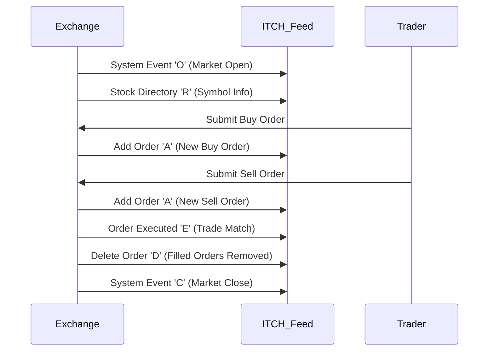

# Overview

The ITCH Protocol, officially known as NASDAQ TotalView-ITCH, is a binary protocol developed by NASDAQ for the real-time dissemination of market data. It provides comprehensive depth-of-book information for equities traded on NASDAQ, including all displayed orders at every price level. Version 5.0 is the current standard, offering low-latency, high-throughput data feeds essential for algorithmic trading, market analysis, and order routing systems.

# STAR Summary

**S**ituation: Traditional market data feeds were limited to top-of-book or aggregated data, insufficient for sophisticated trading strategies requiring full order book visibility.

**T**ask: Design a protocol to disseminate complete market depth with minimal latency and overhead.

**A**ction: Developed a binary message-based protocol with fixed-length headers and variable payloads, supporting various message types for market events, order updates, and system status.

**R**esult: ITCH became the standard for NASDAQ TotalView data, enabling traders to access 20x more liquidity data than Level 2 feeds, improving market transparency and efficiency.

# Detailed Explanation

ITCH is a binary protocol transmitted over UDP multicast, ensuring high-speed delivery. Messages are encoded in big-endian byte order and consist of:

- A 2-byte message length field
- A 1-byte message type identifier
- Variable-length payload specific to the message type

The protocol supports over 20 message types, categorized into system messages (e.g., market open/close), stock-specific messages (e.g., directory updates), and order book messages (e.g., add, delete, modify orders). Data fields include timestamps (nanosecond precision), stock symbols, order IDs, prices, and quantities.

Key technical aspects:
- **Latency**: Sub-millisecond delivery through optimized binary format
- **Throughput**: Handles millions of messages per second during peak trading
- **Reliability**: Sequence numbers and heartbeat messages ensure data integrity
- **Scalability**: Supports multiple multicast groups for different data streams

# Real-world Examples & Use Cases

- **Algorithmic Trading**: High-frequency trading firms use ITCH to monitor order book dynamics and execute strategies based on depth analysis.
- **Market Making**: Market makers analyze full depth to provide liquidity and hedge positions.
- **Risk Management**: Institutions track order imbalances via NOII (Net Order Imbalance Indicator) messages for pre-open and pre-close auctions.
- **Sample Message Exchange**: During market open, an 'S' System Event message signals the start, followed by 'R' Stock Directory messages for active symbols, then a stream of 'A' Add Order messages populating the order book.

# Message Formats / Data Models

ITCH messages are structured as follows (example for Add Order - 'A'):

| Field | Type | Length | Description |
|-------|------|--------|-------------|
| Message Type | char | 1 | 'A' |
| Stock Locate | uint16 | 2 | Stock symbol locator |
| Tracking Number | uint16 | 2 | Message tracking ID |
| Timestamp | uint48 | 6 | Nanosecond timestamp |
| Order Reference Number | uint64 | 8 | Unique order ID |
| Buy/Sell Indicator | char | 1 | 'B' or 'S' |
| Shares | uint32 | 4 | Order quantity |
| Stock | char[8] | 8 | Stock symbol (padded) |
| Price | uint32 | 4 | Price in cents |

Other common messages:
- 'S' System Event: Market status updates
- 'R' Stock Directory: Symbol trading information
- 'D' Delete Order: Order removal
- 'U' Replace Order: Order modification

# Journey of a Trade



# Common Pitfalls & Edge Cases

- **Sequence Gaps**: Missing sequence numbers indicate data loss; implement recovery mechanisms.
- **Out-of-Order Messages**: Timestamps may not guarantee order; use sequence numbers for sorting.
- **Symbol Padding**: Stock symbols are space-padded to 8 characters; trim appropriately.
- **Price Precision**: Prices are in cents; convert to dollars for display.
- **High Volume Spikes**: During earnings releases, message rates can exceed 10M/sec; ensure buffer sizing.
- **Multicast Jitter**: Network delays can cause message reordering; use timestamp-based ordering.

# Tools & Libraries

- **Java**: [paritytrading/itch](https://github.com/paritytrading/itch) - Parser and generator for ITCH messages.
- **Python**: Custom implementations using struct module for binary parsing.
  ```python
  import struct

  def parse_add_order(data):
      msg_type, locate, tracking, timestamp, ref_num, side, shares, stock, price = struct.unpack('>cHH6sQc8sI', data)
      return {
          'type': msg_type,
          'locate': locate,
          'timestamp': timestamp,
          'ref_num': ref_num,
          'side': side,
          'shares': shares,
          'stock': stock.decode().strip(),
          'price': price / 100.0  # Convert cents to dollars
      }
  ```
- **C++**: Boost.Asio for UDP multicast reception with custom parsers.

# Github-README Links & Related Topics

- [FIX Protocol](../fix-protocol/README.md) - Comparison with order routing protocols
- [Market Data Protocols](../market-data-protocols/README.md) - Overview of other data feeds
- [High-Frequency Trading](../high-frequency-trading/README.md) - Applications in HFT
- [Order Book Dynamics](../order-book-dynamics/README.md) - Analysis techniques

# References

- NASDAQ TotalView-ITCH Specification v5.0: https://www.nasdaqtrader.com/content/technicalsupport/specifications/dataproducts/itch-v5.0.pdf
- NASDAQ TotalView Overview: https://www.nasdaq.com/solutions/nasdaq-totalview
- Parity Trading ITCH Library: https://github.com/paritytrading/itch