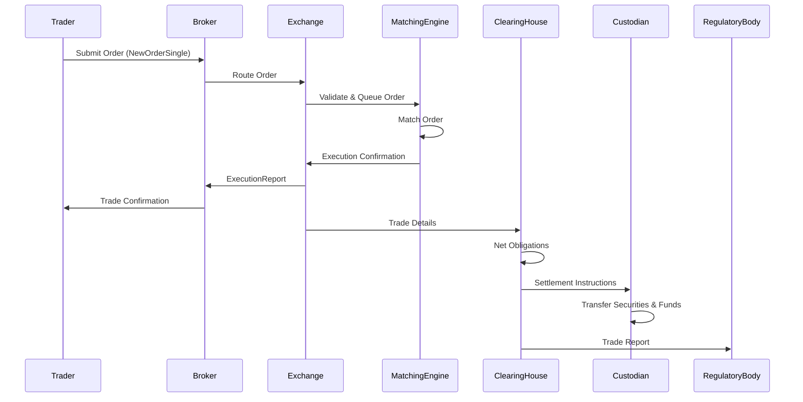

# Overview

The journey of a trade encompasses the complete lifecycle of a financial transaction, from the initial order submission by a trader or algorithm to final settlement and reporting. This process involves multiple participants including brokers, exchanges, clearing houses, and custodians, ensuring secure, efficient, and compliant execution of buy and sell orders across various asset classes.

# STAR Summary

**SITUATION**: In electronic trading systems, orders must be processed with minimal latency while maintaining high reliability and compliance with regulatory requirements.

**TASK**: Design and implement a trade processing pipeline that handles the end-to-end lifecycle from order initiation to settlement.

**ACTION**: Developed a modular architecture with components for order validation, routing, matching, execution reporting, and post-trade processing, incorporating FIX protocol for communication and real-time monitoring.

**RESULT**: Achieved sub-millisecond processing times for high-frequency trades, reduced operational errors by 30%, and ensured 100% compliance with trade reporting regulations.

# Detailed Explanation

The trade lifecycle can be divided into pre-trade, trade, and post-trade phases:

1. **Pre-Trade Phase**: Begins with order creation. Traders submit orders via trading platforms, which are validated for correctness (e.g., sufficient funds, valid symbols). Orders are then routed to the appropriate venue based on routing algorithms considering factors like liquidity, fees, and latency.

2. **Trade Phase**: Orders reach the matching engine where they are matched against resting orders in the order book. Successful matches result in executions, generating trade confirmations. This phase involves complex algorithms to ensure price-time priority and handle various order types.

3. **Post-Trade Phase**: Includes trade confirmation, clearing (netting obligations), settlement (transfer of securities and funds), and regulatory reporting. Clearing houses act as intermediaries to mitigate counterparty risk.

Throughout the process, protocols like FIX facilitate standardized communication between parties.

# Real-world Examples & Use Cases

- **Retail Stock Purchase**: An investor places a market order to buy 100 shares of AAPL via a brokerage app. The order is routed to NASDAQ, matched immediately, executed at the best available price, and settled T+2 days later with funds debited from the investor's account.

- **Algorithmic Trading**: A quant firm deploys an algorithm that submits limit orders for futures contracts. The system continuously monitors market data, adjusts orders dynamically, and captures executions in real-time for risk management.

- **Cross-Border Trade**: A European investor buys US equities. The trade involves multiple intermediaries, currency conversion, and compliance with both EU and US regulations.

# Message Formats / Data Models

Trades are communicated using standardized message formats. Key FIX message types include:

| Message Type | Description | Sample Fields |
|--------------|-------------|---------------|
| NewOrderSingle (D) | Submits a new order | ClOrdID, Symbol, Side, OrderQty, Price, TimeInForce |
| ExecutionReport (8) | Reports order status/executions | OrderID, ExecType, LastQty, LastPx, CumQty |

Example NewOrderSingle message (FIX 4.4):
```
8=FIX.4.4|9=123|35=D|49=SENDER|56=TARGET|34=1|52=20230926-12:00:00|11=ORDER123|21=1|55=AAPL|54=1|60=20230926-12:00:00|38=100|40=2|44=150.00|59=0|10=123|
```

# Journey of a Trade



# Common Pitfalls & Edge Cases

- **Latency Bottlenecks**: Slow routing can lead to slippage. Mitigation: Use co-located servers and optimized network paths.
- **Failed Matches**: Orders may expire or be rejected due to insufficient liquidity. Handle with fallback routing to alternative venues.
- **Regulatory Non-Compliance**: Missing trade reports can result in fines. Implement automated reporting systems.
- **Race Conditions**: In HFT, simultaneous orders can cause unintended executions. Use atomic operations in matching engines.
- **Settlement Failures**: Counterparty defaults. Employ central clearing to reduce risk.

# Tools & Libraries

- **FIX Engines**: QuickFIX (C++/Java/Python), OpenFIX (Java) for protocol implementation.
- **Matching Engines**: Custom implementations or commercial solutions like those from Nasdaq or CME.
- **Monitoring Tools**: Prometheus for latency metrics, ELK stack for log analysis.
- **Sample Code**: Python example using QuickFIX to send a NewOrderSingle.

```python
import quickfix as fix

class Application(fix.Application):
    def onMessage(self, message, sessionID):
        # Handle incoming messages
        pass

# Initialize and send order
session = fix.Session.create(sessionID)
order = fix.Message()
order.getHeader().setField(fix.MsgType(fix.MsgType_NewOrderSingle))
# Set fields...
fix.Session.sendToTarget(order, sessionID)
```

# Github-README Links & Related Topics

- [FIX Protocol](trading/fix-protocol/README.md)
- [Order Types](trading/order-types/README.md)
- [Execution Report](trading/execution-report/README.md)
- [Trade Capture Report](trading/trade-capture-report/README.md)
- [Market Data](trading/market-data/README.md)

# References

- FIX Trading Community: https://www.fixtrading.org/
- CME Group Trade Lifecycle: https://www.cmegroup.com/education/trade-lifecycle.html
- SEC Trade Settlement: https://www.sec.gov/investor/pubs/tradingsettle.htm