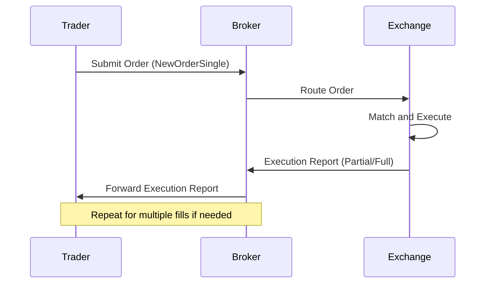

# Overview

The Execution Report (FIX MsgType=8) is a critical message in the FIX protocol sent by the executing party (typically a broker or exchange) to confirm the execution of an order. It provides detailed information about the trade, including executed quantity, price, timestamps, and order status. Execution Reports are sent for partial fills, full fills, cancellations, and rejections, ensuring all parties have accurate and timely trade confirmations. This message is essential for maintaining order state synchronization between trading systems.

# STAR Summary

**S**ituation: Trading systems require immediate confirmation of order executions to update positions, risk metrics, and downstream processing.

**T**ask: Design a standardized message format for execution confirmations that handles various execution scenarios.

**A**ction: Developed the FIX ExecutionReport message with comprehensive fields covering execution details, order status, and identifiers.

**R**esult: Enabled reliable, real-time trade confirmations across global markets, reducing settlement errors and improving operational efficiency.

# Detailed Explanation

The Execution Report is triggered whenever an order's state changes due to execution, cancellation, or rejection. Key components include:

- **Execution Types**: Indicate the nature of the report (e.g., New, Partial Fill, Fill, Canceled, Rejected).
- **Order Status**: Current state of the order (e.g., New, Partially Filled, Filled, Canceled).
- **Execution Details**: Quantity executed, price, and cumulative values.
- **Identifiers**: Links the report to the original order and specific execution instance.
- **Timestamps**: Precise timing for audit and sequencing.

Execution Reports must be sent in sequence for each order, with unique ExecID for each report. For high-volume trading, reports are often batched or streamed to manage bandwidth.

# Real-world Examples & Use Cases

- **Partial Fill Confirmation**: A limit order for 1000 shares executes 500 at $50.00; an Execution Report confirms the partial fill, updating the remaining quantity.
- **Full Execution**: An IOC order fills completely; the report marks the order as filled with final status.
- **Order Rejection**: Invalid order parameters trigger a rejection report with reason codes.
- **HFT Scenario**: Sub-millisecond executions generate reports that update algo strategies in real-time.

Case Study: During flash crashes, timely Execution Reports help algorithms detect anomalies and halt trading.

# Message Formats / Data Models

Key FIX fields in ExecutionReport:

| Field | Tag | Description | Example |
|-------|-----|-------------|---------|
| MsgType | 35 | Message type (8 for ExecutionReport) | 8 |
| OrderID | 37 | Unique order identifier | ORD12345 |
| ExecID | 17 | Unique execution identifier | EXEC67890 |
| ExecType | 150 | Type of execution (0=New, 1=Partial, 2=Fill, etc.) | 2 |
| OrdStatus | 39 | Order status (0=New, 1=Partial, 2=Filled, etc.) | 2 |
| Symbol | 55 | Instrument | AAPL |
| Side | 54 | Buy/Sell | 1 (Buy) |
| LastQty | 32 | Last executed quantity | 500 |
| LastPx | 31 | Last executed price | 150.00 |
| CumQty | 14 | Cumulative executed quantity | 1000 |
| AvgPx | 6 | Average price | 149.50 |
| LeavesQty | 151 | Remaining quantity | 0 |

Sample ExecutionReport message:

```
8=FIX.4.4|9=178|35=8|49=EXECUTOR|56=CLIENT|34=2|52=20230926-14:30:00|37=ORD123|17=EXEC456|150=2|39=2|55=AAPL|54=1|32=1000|31=150.00|14=1000|6=150.00|151=0|10=123|
```

# Journey of a Trade



# Common Pitfalls & Edge Cases

- **Out-of-Sequence Reports**: Network issues can cause reports to arrive out of order; systems must handle resequencing.
- **Duplicate ExecIDs**: Rare but possible; validation prevents double-processing.
- **Stale Reports**: Delays in high-latency environments; use timestamps for freshness checks.
- **Partial Fill Aggregation**: For large orders, multiple partial reports must be correctly aggregated.
- **Rejection Handling**: Incorrect rejection codes can lead to order resubmission loops.

# Tools & Libraries

- **QuickFIX/J**: Java library for parsing and generating Execution Reports.

  ```java
  import quickfix.Message;
  import quickfix.field.ExecType;
  import quickfix.field.LastQty;

  // Parse ExecutionReport
  if (message.getHeader().getString(35).equals("8")) {
      ExecType execType = new ExecType();
      message.getField(execType);
      if (execType.getValue() == ExecType.FILL) {
          LastQty qty = new LastQty();
          message.getField(qty);
          // Process fill
      }
  }
  ```

- **FIX Analyzers**: Tools like FIXLog for monitoring report flows.
- **Testing Frameworks**: Simulate execution scenarios with FIX simulators.

# Github-README Links & Related Topics

- [FIX Protocol](../../fix-protocol/README.md)
- [Order Types](../../order-types/README.md)
- [Trade Capture Report](../trade-capture-report/README.md)
- [Journey of a Trade](../../journey-of-a-trade/README.md)

# References

- [FIX Protocol Specification - ExecutionReport](https://www.fixtrading.org/online-specification/)
- [Investopedia - Execution Confirmation](https://www.investopedia.com/terms/e/execution.asp)