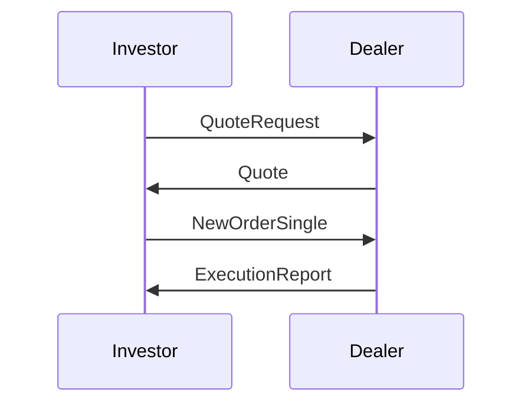

# Overview

Quotes and Request for Quote (RFQ) workflows involve the process where investors seek price quotes from dealers for securities, especially in OTC markets.

# STAR Summary

**SITUATION**: In over-the-counter (OTC) markets, prices are not publicly displayed, requiring direct quotes.

**TASK**: Describe the RFQ process and quote handling.

**ACTION**: Explain steps: investor requests quote, dealer responds, negotiation, execution.

**RESULT**: Efficient price discovery in illiquid markets.

# Detailed Explanation

RFQ: Investor sends request to multiple dealers. Dealers provide quotes. Investor selects best and executes.

# Real-world Examples

Bond trading, FX.

# Message Formats

FIX QuoteRequest and Quote messages.

# Journey of a Trade

# Common Pitfalls

Dealer collusion, stale quotes.

# Tools & Libraries

FIX for messaging.

# Github-README Links & Related Topics

[[fix-protocol]]

[[market-data]]

# References

- [Investopedia: Request for Quote](https://www.investopedia.com/terms/r/request-for-quote-rfq.asp)