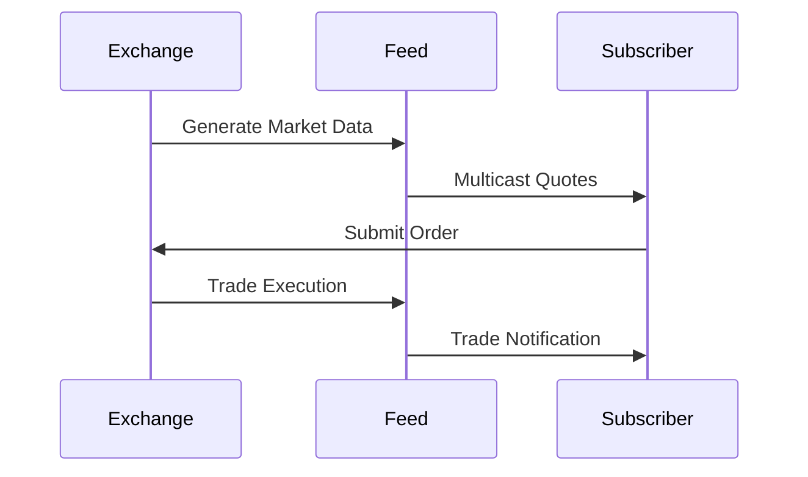

# Overview

Market data refers to the real-time and historical information about securities trading, including prices, volumes, and order book details. Dissemination involves distributing this data efficiently to market participants. Protocols like ITCH, FIX, and proprietary feeds ensure timely, accurate delivery of market information crucial for trading decisions.

# STAR Summary

**SITUATION:** In traditional markets, information asymmetry disadvantaged retail investors. Electronic trading required standardized, real-time data distribution.

**TASK:** Develop systems and protocols for equitable, efficient market data dissemination.

**ACTION:** Exchanges created protocols like ITCH for detailed order book data and FIX for trade reporting. Consolidated feeds aggregate data from multiple sources.

**RESULT:** Market data dissemination enables fair and efficient markets, supporting algorithmic trading and informed decision-making.

# Detailed Explanation

Market data encompasses:
- **Quotes:** Bid/ask prices and sizes
- **Trades:** Executed prices and volumes
- **Order Book:** Full depth of buy/sell orders
- **Reference Data:** Security identifiers, corporate actions
- **News and Analytics:** Fundamental and technical data

Dissemination methods:
- **Direct Feeds:** Real-time multicast from exchanges
- **Consolidated Tapes:** Aggregated data from multiple venues
- **Vendor Platforms:** Bloomberg, Reuters for processed data
- **APIs:** RESTful or streaming APIs for programmatic access

Key challenges: latency minimization, data integrity, regulatory compliance (e.g., Reg NMS in US).

# Real-world Examples & Use Cases

**HFT Strategy:** Firm uses direct ITCH feeds to detect arbitrage opportunities across venues.

**Portfolio Management:** Fund managers monitor real-time prices via Bloomberg Terminal for rebalancing.

**Retail Trading:** Apps like Robinhood display consolidated quotes from multiple exchanges.

**Surveillance:** Regulators analyze trade data for market manipulation detection.

# Message Formats / Data Models

Market data often uses standardized formats:

| Field | Type | Description |
|-------|------|-------------|
| Symbol | String | Security identifier |
| Bid Price | Decimal | Best bid price |
| Bid Size | Integer | Bid quantity |
| Ask Price | Decimal | Best ask price |
| Ask Size | Integer | Ask quantity |
| Last Price | Decimal | Last trade price |
| Volume | Integer | Trade volume |
| Timestamp | DateTime | Event time |

For order book depth:

```
{
  "symbol": "AAPL",
  "bids": [[150.00, 100], [149.95, 200]],
  "asks": [[150.05, 50], [150.10, 300]]
}
```

# Journey of a Trade



This shows the cycle of data dissemination and order generation.

# Common Pitfalls & Edge Cases

**Data Staleness:** Delayed feeds can lead to trading on outdated information.

**Feed Disruptions:** Redundant feeds prevent data gaps.

**Regulatory Changes:** Adapting to new reporting requirements.

**High Volume:** Handling peak message rates without drops.

# Tools & Libraries

**Market Data Libraries:** Python libraries like `ccxt` for crypto, `yfinance` for historical data.

```python
import yfinance as yf

data = yf.download("AAPL", start="2023-01-01", end="2023-12-31")
print(data.head())
```

**Feed Handlers:** Custom UDP multicast listeners for exchange feeds.

**Visualization:** Tools like TradingView for chart analysis.

# Github-README Links & Related Topics

[FIX Protocol](../fix-protocol/README.md)
[ITCH Protocol](../itch-protocol/README.md)
[OUCH Protocol](../ouch-protocol/README.md)
[Order Entry Protocols](../order-entry-protocols/README.md)
[Journey of a Trade (end-to-end)](../journey-of-a-trade/README.md)
[Execution Report](../lifecycle/execution-report/README.md)
[Trade Capture Report](../lifecycle/trade-capture-report/README.md)

# References

- [SEC Market Data](https://www.sec.gov/market-data)
- [NASDAQ Market Data](https://www.nasdaq.com/solutions/nasdaq-market-data-platform)
- [FIX Market Data Messages](https://www.fixtrading.org/online-specification/pre-trade/)
- [ITCH Specification](https://www.nasdaqtrader.com/content/technicalsupport/specifications/dataproducts/ITCHSpecification.pdf)