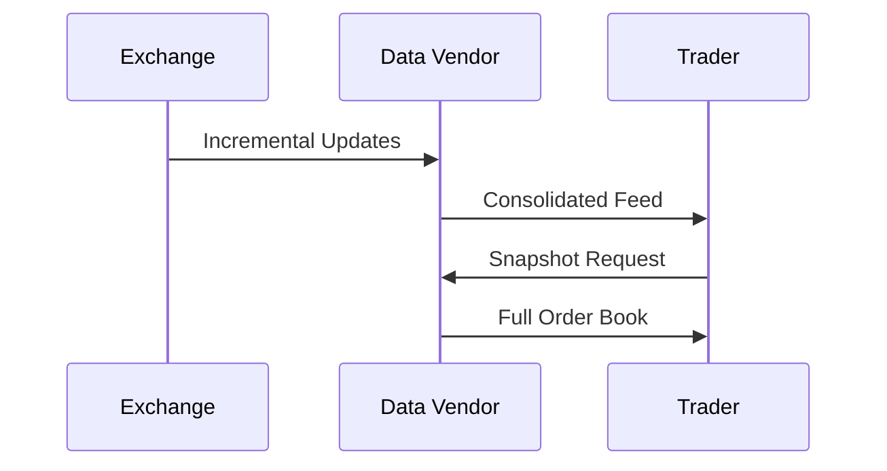

# Overview

Market data refers to real-time and historical information about financial instruments, including prices, volumes, and order book depth. Dissemination involves distributing this data efficiently to market participants via protocols like ITCH, FIX, and proprietary feeds.

# STAR Summary

**SITUATION**: Traders needed timely access to market information for informed decisions, but data was fragmented and delayed.

**TASK**: Establish standardized, high-speed market data distribution.

**ACTION**: Exchanges developed protocols like ITCH for incremental updates and FIX for snapshots.

**RESULT**: Enabled global trading with low-latency data, supporting algorithms and strategies.

# Detailed Explanation

Types of market data:
- **Quotes**: Bid/ask prices.
- **Trades**: Executed prices/volumes.
- **Order Book**: Full depth of buy/sell orders.

Dissemination methods:
- **Incremental**: Updates only changes (ITCH).
- **Snapshot**: Full state periodically (FIX MarketDataSnapshot).

Protocols: ITCH for NASDAQ, FIX for multi-asset.

Challenges: Latency, bandwidth, regulatory requirements (e.g., consolidated feeds).

# Real-world Examples & Use Cases

HFT uses incremental feeds for arbitrage; institutions use snapshots for analysis.

Sample FIX MarketDataRequest:
```
8=FIX.4.4|35=V|262=REQ123|263=1|264=10|265=1|146=1|55=AAPL|10=123|
```

# Message Formats / Data Models

| Field | Description |
|-------|-------------|
| Symbol | Instrument |
| Bid/Ask | Prices |
| Volume | Quantity |

Data models: Time-series for historical, real-time streams.

# Journey of a Trade



Data flow from exchange to trader.

# Common Pitfalls & Edge Cases

- **Data Staleness**: Ensure freshness; use timestamps.
- **Consolidation Errors**: Merging feeds can introduce inconsistencies.
- **Regulatory Feeds**: MiFID requires specific data; comply.

# Tools & Libraries

- **Market Data APIs**: Bloomberg, Refinitiv.
- Sample (Python for FIX):
  ```python
  import quickfix as fix

  msg = fix.Message()
  msg.getHeader().setField(fix.MsgType(fix.MsgType.MARKET_DATA_REQUEST))
  ```

# Github-README Links & Related Topics

- [[ITCH Protocol]]
- [[FIX Protocol]]
- [[Latency Measurement]]

## References

- [FIX Market Data](https://www.fixtrading.org/standards/)
- [NASDAQ Market Data](https://www.nasdaq.com/solutions/market-data)
