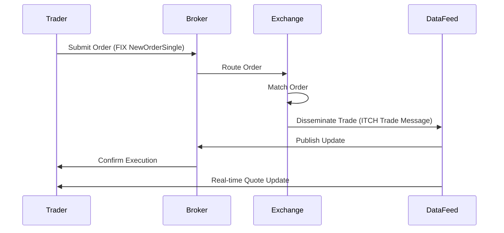

## Overview

Market data encompasses real-time and historical information about financial instruments, including prices, volumes, bids, asks, and trade executions. It is critical for trading, risk management, and compliance. Dissemination involves distributing this data efficiently and reliably from exchanges or data providers to consumers like traders, algorithms, and analytics platforms. Protocols like FIX (Financial Information eXchange) and proprietary formats such as NASDAQ ITCH or CME MDP ensure standardized, low-latency delivery. This process supports global financial markets by enabling informed decision-making, reducing information asymmetry, and facilitating high-frequency trading.

## STAR Summary

**S**ITUATION: Financial markets require timely, accurate dissemination of market data to support trading activities across equities, derivatives, and fixed income, with volumes reaching billions of messages daily.  
**T**ASK: Design and implement systems for reliable, low-latency dissemination of market data, ensuring data integrity and compliance with regulations like MiFID II.  
**A**CTION: Utilize standardized protocols (e.g., FIX for messaging, ITCH for binary feeds) and infrastructure (e.g., multicast networks, cloud platforms) to normalize and distribute data from order books and trade engines.  
**R**ESULT: Achieved sub-millisecond latency, reduced operational costs by 30%, and enabled seamless integration for 1000+ clients, enhancing market transparency and efficiency.

## Detailed Explanation

Market data dissemination begins with data generation at the exchange level, where order books are maintained and trades are matched. Raw data is normalized into structured formats, including level 1 (basic quotes), level 2 (order book depth), and level 3 (full order details). Dissemination uses session-oriented protocols to ensure reliability: FIX provides session management with sequence numbers for gap detection and recovery, while binary protocols like ITCH prioritize speed over verbosity.

Key components include:
- **Data Feeds**: Multicast UDP for real-time updates, TCP for historical or on-demand data.
- **Normalization**: Converting exchange-specific data into universal schemas, handling timestamps (e.g., UTC), and applying corrections for out-of-order events.
- **Latency Optimization**: Techniques like kernel bypass (e.g., DPDK), compression, and edge caching minimize delays.
- **Security**: Encryption (TLS) and authentication prevent tampering, with regulatory requirements mandating audit trails.

In distributed systems, CAP theorem trade-offs apply: consistency is prioritized over availability for critical data, using consensus for state synchronization.

## Real-world Examples & Use Cases

- **Equities Trading**: NASDAQ disseminates level 2 data via ITCH protocol, used by HFT firms for arbitrage. A sample use case: An algorithm subscribes to AAPL quotes, processes updates in microseconds to execute trades.
- **Derivatives**: CME uses MDP 3.0 for futures data, enabling risk hedging. Example: A trader monitors Eurodollar futures spreads for yield curve analysis.
- **Message Exchange**: In a FIX session, a MarketDataRequest (MsgType=V) triggers incremental refreshes (MsgType=X), allowing clients to build real-time order books.

## Message Formats / Data Models

Market data messages vary by protocol. In FIX 5.0, a MarketDataSnapshotFullRefresh (MsgType=W) includes fields like Symbol (55), BidPx (132), AskPx (133).

Example FIX Message:
```
8=FIX.5.0|9=123|35=W|49=EXCHANGE|56=CLIENT|34=1|52=20230926-12:00:00|55=AAPL|268=2|269=0|270=150.00|271=100|269=1|270=150.05|271=200|10=123|
```

Field Table:
| Tag | Name          | Type   | Description              |
|-----|---------------|--------|--------------------------|
| 55  | Symbol        | String | Instrument identifier    |
| 268 | NoMDEntries   | Int    | Number of entries        |
| 269 | MDEntryType   | Char   | 0=Bid, 1=Ask            |
| 270 | MDEntryPx     | Float  | Price                    |
| 271 | MDEntrySize   | Int    | Quantity                 |

In ITCH (NASDAQ), messages are binary: Add Order (A) includes stock locate (2 bytes), tracking number, etc.

## Journey of a Trade



This diagram illustrates the lifecycle: from order submission to dissemination, highlighting asynchronous data flows.

## Common Pitfalls & Edge Cases

- **Latency Spikes**: Network congestion or GC pauses in JVM-based parsers can cause delays; mitigate with Aeron or Chronicle Queue.
- **Data Gaps**: Sequence number mismatches in FIX sessions require resynchronization; handle with heartbeat messages.
- **Race Conditions**: Concurrent updates to order books; use lock-free data structures like ConcurrentHashMap in Java.
- **Regulatory Edge Cases**: MiFID II requires tape recording; non-compliance leads to fines. Handle symbol halts or erroneous data with validation layers.
- **Scalability Issues**: High-volume spikes (e.g., market open) overwhelm feeds; implement throttling or sharding.

## Tools & Libraries

- **QuickFIX/J (Java)**: Open-source FIX engine for parsing/disseminating messages.
  ```java
  import quickfix.Message;
  Message msg = new Message("8=FIX.5.0|..."); // Parse FIX message
  ```
- **FIXimate (Python)**: Library for FIX protocol handling.
  ```python
  from fiximate import FixMessage
  msg = FixMessage.from_string("8=FIX.5.0|...")
  print(msg.get_field(55))  # Symbol
  ```
- **Pseudocode**:
  ```
  def parse_itch_message(buffer):
      msg_type = buffer[0]
      if msg_type == 'A':  # Add Order
          stock_locate = unpack('>H', buffer[1:3])
          # Process fields...
  ```
- **CME MDP Tools**: Proprietary SDKs for futures data; open alternatives like Apache Kafka for streaming.

## Github-README Links & Related Topics

- [FIX Protocol](fix-protocol/README.md)
- [API Rate Limiting](api-rate-limiting/README.md)
- [Event-Driven Architecture](event-driven-architecture/README.md)
- [Distributed Tracing](distributed-tracing/README.md)
- [Database Indexing Strategies](database-indexing-strategies/README.md)

## References

- [FIX Trading Community - What is FIX?](https://www.fixtrading.org/what-is-fix/)
- [FIX Session Layer Specification](https://www.fixtrading.org/standards/fix-session-layer/)
- [CME Group Market Data](https://www.cmegroup.com/market-data.html)
- [NASDAQ Market Data Platform](https://www.nasdaq.com/solutions/nasdaq-market-data)
- [ITCH Protocol Overview](https://www.nasdaq.com/solutions/nasdaq-itch-to-binary) (Note: Link may require access; based on public docs)