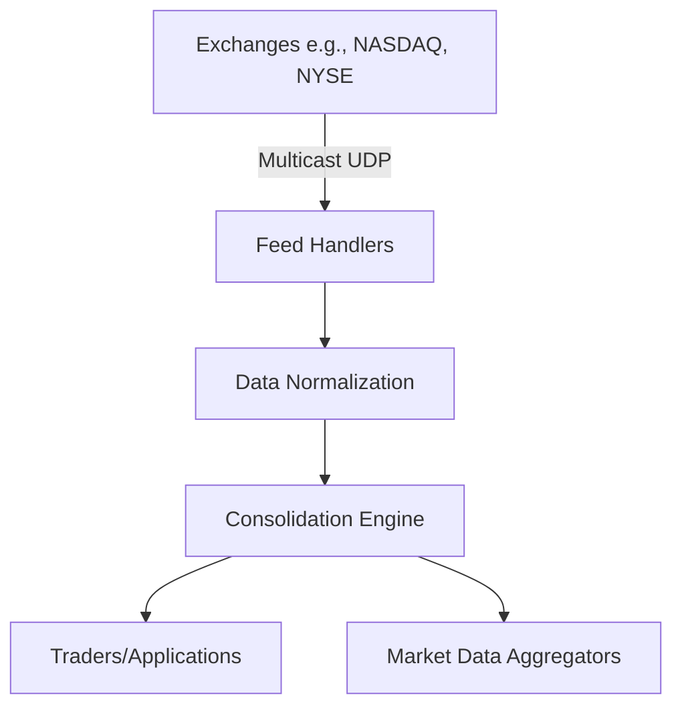

# Market Data (overview & dissemination)

aliases: [Market Data]
tags: [trading,marketdata,protocol]
created/updated: 2025-09-26

## Overview

Market data in trading systems encompasses real-time information essential for decision-making, including:

- **Real-time quotes**: Bid and ask prices for securities.
- **Trade reports**: Details of executed trades, such as price, volume, and timestamp.
- **Order book updates**: Changes in the limit order book, showing pending buy/sell orders at various price levels.

This data is critical for high-frequency trading, algorithmic strategies, and market analysis, requiring low-latency processing to maintain competitiveness.

## Dissemination

Market data is disseminated from exchanges to subscribers using efficient protocols to minimize latency:

- **Multicast UDP**: Preferred for low-latency broadcasting. Unlike TCP, UDP allows one-to-many transmission without acknowledgments, reducing overhead. Exchanges like NASDAQ use multicast groups for real-time feeds.
- **Consolidation from multiple feeds**: Traders often aggregate data from various exchanges (e.g., NYSE, NASDAQ) into a unified order book to get a complete market view, handling discrepancies and ensuring data freshness.

## Protocols

### FIX Market Data
The FIX (Financial Information eXchange) protocol includes specifications for market data. It uses tag-value encoding for messages.

- **Key messages**: MarketDataSnapshotFullRefresh (MsgType=W) provides a full snapshot of the order book.

### ITCH Protocol
Developed by NASDAQ, ITCH is a binary protocol for high-speed market data dissemination. It supports messages for order additions, modifications, deletions, and trade executions, optimized for low latency.

## Data Flow Diagram



## Sample FIX Market Data Message

MarketDataSnapshotFullRefresh (35=W):

```
8=FIX.4.4|9=122|35=W|34=2|49=MDProvider|52=20230926-10:00:00.000|56=Client|55=AAPL|262=12345|268=2|269=0|270=150.00|271=100|269=1|270=150.05|271=200|10=123|
```

- 55: Symbol (AAPL)
- 268: Number of MDEntries (2)
- 269: MDEntryType (0=Bid, 1=Ask)
- 270: MDEntryPx (Price)
- 271: MDEntrySize (Quantity)

## Pitfalls

- **Stale data**: Network delays or processing lags can lead to outdated quotes, causing incorrect trading decisions.
- **Data loss in UDP**: Unreliable nature of UDP may result in missed packets; requires sequence number checks and retransmission mechanisms.
- **Synchronization issues**: Consolidating feeds from multiple sources can introduce timing discrepancies.
- **High volume**: Handling millions of messages per second requires optimized infrastructure to avoid bottlenecks.

## Tools

- **Market data aggregators**: Commercial tools like Bloomberg Terminal or Reuters provide consolidated feeds. Open-source alternatives include libraries like QuickFIX for FIX parsing or custom implementations using Kafka for streaming.
- **Engineering considerations**: Blogs from LinkedIn Engineering discuss architectures for handling high-throughput market data, emphasizing distributed systems and low-latency processing.

Related: [[ITCH Protocol]], [[FIX Protocol]]