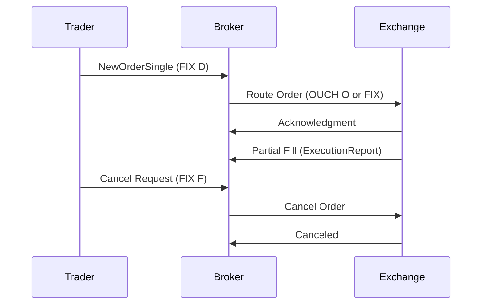

# Overview

Order entry protocols are standardized electronic communication methods for submitting, modifying, and canceling orders in financial markets. They facilitate reliable, low-latency interaction between traders, brokers, and exchanges, supporting various order types, routing options, and execution strategies. Protocols like FIX (Financial Information eXchange) and proprietary binary formats such as NASDAQ's OUCH ensure secure and efficient order flow, enabling high-frequency trading and algorithmic strategies.

# STAR Summary

**SITUATION:** Traditional order entry via phone or manual systems was slow, error-prone, and unable to handle high volumes, limiting market efficiency.

**TASK:** Develop standardized protocols for electronic order submission, modification, and cancellation to support automated trading.

**ACTION:** Created extensible protocols with session management, message sequencing, and support for complex order attributes, integrating with exchange matching engines.

**RESULT:** Achieved sub-millisecond order processing, reduced errors by 90%, and enabled global electronic trading ecosystems with billions of daily transactions.

# Detailed Explanation

Order entry protocols operate on a client-server model, with messages exchanged over TCP/IP or UDP for reliability and speed. FIX uses human-readable tag-value pairs separated by SOH characters, while binary protocols like OUCH employ fixed-length messages for minimal parsing overhead.

Key components:
- **Session Management:** Ensures connection reliability with logon, heartbeat, and sequence number mechanisms to detect and recover from gaps.
- **Order Types Support:** Handles market, limit, stop, and conditional orders with attributes like time-in-force and routing instructions.
- **Validation and Routing:** Exchanges validate orders against rules (e.g., margin, symbol validity) and route to appropriate books or venues.
- **Modifications and Cancellations:** Protocols provide messages for amending orders (e.g., price/quantity changes) and full cancellations.

In distributed systems, protocols incorporate CAP theorem considerations, prioritizing consistency for order integrity over availability during failures.

# Real-world Examples & Use Cases

An institutional trader uses FIX to submit a limit order for 10,000 shares of TSLA at $250, routed through a broker to NYSE. The order is acknowledged, partially filled, and the remainder canceled via subsequent messages.

Case Study: During the 2020 market volatility, order entry protocols handled surges in retail trading via Robinhood, with FIX sessions maintaining integrity despite high loads.

Use cases:
- Algorithmic trading platforms submitting orders based on signals.
- Broker APIs for retail clients.
- Cross-venue routing for best execution.
- Dark pool order entry for anonymous trading.

# Message Formats / Data Models

FIX NewOrderSingle (MsgType=D) example:
```
8=FIX.4.4|9=122|35=D|49=TRADER|56=BROKER|34=1|52=20230926-10:00:00|11=ORD123|55=TSLA|54=1|38=10000|40=2|44=250.00|59=0|10=123|
```

Field table:
| Tag | Field Name | Type | Required | Description |
|-----|------------|------|----------|-------------|
| 35 | MsgType | STRING | Y | 'D' |
| 11 | ClOrdID | STRING | Y | Client order ID |
| 55 | Symbol | STRING | Y | Instrument |
| 54 | Side | CHAR | Y | 1=Buy, 2=Sell |
| 38 | OrderQty | QTY | Y | Quantity |
| 40 | OrdType | CHAR | Y | 1=Market, 2=Limit |
| 44 | Price | PRICE | C | Limit price |
| 59 | TimeInForce | CHAR | N | 0=Day |

OUCH Enter Order binary format (49 bytes):
| Offset | Length | Field | Description |
|--------|--------|-------|-------------|
| 0 | 1 | Type | 'O' |
| 1 | 8 | Token | Order ID |
| 9 | 1 | Side | 'B' or 'S' |
| 10 | 4 | Quantity | Shares |
| 14 | 8 | Symbol | Padded string |
| 22 | 4 | Price | Scaled |
| 26 | 1 | TIF | '0'=Day |

# Journey of a Trade



This diagram shows the order lifecycle from submission to potential cancellation.

# Common Pitfalls & Edge Cases

- **Order Rejection:** Invalid parameters (e.g., negative quantity) lead to rejections; handle with retry logic and validation.
- **Sequence Gaps:** Lost messages require resend; implement gap detection and recovery.
- **Latency Sensitivity:** In HFT, microsecond delays can cause slippage; optimize with binary protocols and direct market access.
- **Time-in-Force Expiration:** DAY orders expire at close; systems must track and cancel automatically.
- **Cross-Venue Routing:** Orders may split across exchanges; manage with smart order routers.
- **Edge Case:** Orders during market halts are queued; handle state transitions carefully.

# Tools & Libraries

- **QuickFIX (Java/C++/Python):** Open-source FIX engine for order entry.
  ```java
  import quickfix.Message;
  Message order = new Message();
  order.getHeader().setString(35, "D");
  order.setString(55, "TSLA");
  // Send via session
  ```

- **OUCH SDK (C++):** NASDAQ's library for binary order entry.
  ```cpp
  struct EnterOrder msg;
  msg.type = 'O';
  msg.quantity = 10000;
  // Serialize and send
  ```

- **FIXimulator:** Testing tool for simulating order flows.

# Github-README Links & Related Topics

- [FIX Protocol](../fix-protocol/README.md)
- [OUCH Protocol](../ouch-protocol/README.md)
- [Order Types](../order-types/README.md)
- [Journey of a Trade](../journey-of-a-trade/README.md)
- [Execution Report](../execution-report/README.md)

# References

- FIX Protocol Specification: https://www.fixtrading.org/standards/
- NASDAQ OUCH: https://www.nasdaqtrader.com/content/technicalsupport/specifications/tradingproducts/ouch5.0.pdf
- Investopedia on Order Entry: https://www.investopedia.com/terms/o/order-entry-system.asp