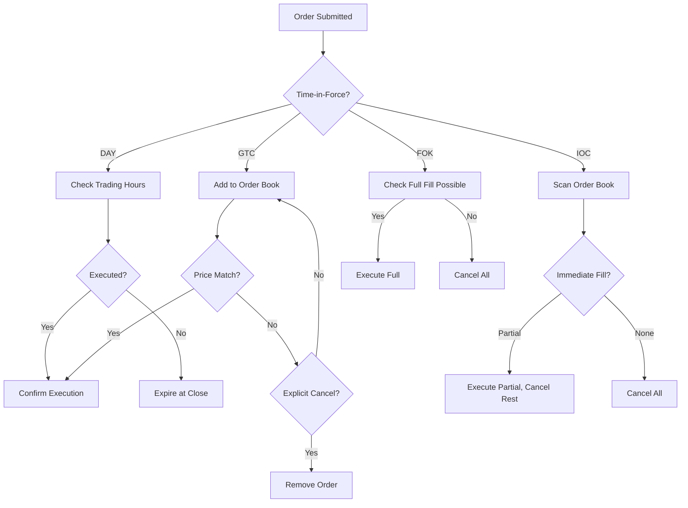

## Overview

Order types specify the conditions under which a trade order should be executed, including time constraints and execution requirements. Common types include DAY, GTC, FOK, and IOC, each with specific behaviors that affect how orders interact with the market and order book. Understanding these types is crucial for implementing correct order matching algorithms and ensuring trader expectations are met.

## STAR Summary

**SITUATION:** Trading systems must handle various order types to accommodate different trading strategies and risk profiles.

**TASK:** Define and explain major order types, their behaviors, and implementation considerations.

**ACTION:** Analyzed FIX protocol specifications, exchange rulebooks, and real-world trading scenarios.

**RESULT:** Created a reference guide that helps developers implement order type logic accurately in trading engines.

## Detailed Explanation

Order types are primarily defined by their Time-in-Force (TIF) attribute, which determines how long an order remains active. Here's a breakdown of common types:

- **DAY:** The order is valid only for the current trading day. If not executed by market close, it expires. Used for intraday trading.

- **GTC (Good Till Canceled):** The order remains active until explicitly canceled or executed. May span multiple days. Requires careful risk management.

- **FOK (Fill or Kill):** The order must be executed immediately in full or not at all. Partial fills are not accepted. Useful for large orders where partial execution is undesirable.

- **IOC (Immediate or Cancel):** The order executes any available quantity immediately, with the remainder canceled. Allows partial fills but prioritizes speed.

These types affect order book placement, matching priority, and execution guarantees. Exchanges may have slight variations in implementation.

## Real-world Examples & Use Cases

**DAY Order Example:** A day trader places a DAY limit order to buy AAPL at $150. If the price doesn't reach $150 by market close, the order expires.

**GTC Order Example:** An investor places a GTC limit sell order for TSLA at $200, expecting to hold until the price target is met, potentially over weeks.

**FOK Use Case:** An institutional trader submits a FOK order for 1 million shares to avoid market impact from partial executions.

**IOC Use Case:** In high-frequency trading, an IOC order buys available liquidity at the best bid without waiting.

## Message Formats / Data Models

**FIX TimeInForce Field (Tag 59):**
- 0 = DAY
- 1 = GTC
- 3 = IOC
- 4 = FOK

**Example FIX NewOrderSingle with TIF:**
```
8=FIX.4.4|...|59=1|...  # GTC
```

| Order Type | FIX Tag 59 | Behavior |
|------------|------------|----------|
| DAY | 0 | Expires at end of trading day |
| GTC | 1 | Remains until canceled or filled |
| IOC | 3 | Execute immediately, cancel remainder |
| FOK | 4 | Fill completely or cancel all |

## Journey of a Trade



## Common Pitfalls & Edge Cases

- **Overnight Risk with GTC:** Orders may execute at unfavorable prices if markets gap.
- **Partial Fills with IOC:** May lead to unwanted position accumulation if not monitored.
- **Market Closure with DAY:** Orders expiring at close can cause last-minute volatility.
- **Exchange Variations:** Different venues may interpret FOK/IOC slightly differently (e.g., minimum fill requirements).
- **Hidden Orders:** Iceberg orders combined with TIF can complicate matching.

## Tools & Libraries

- **Order Management Systems:** Interactive Brokers API, Alpaca for retail trading.
- **FIX Libraries:** Implement TIF handling in custom engines.
- **Simulators:** Test order type behaviors in sandbox environments.

```java
// Example: Order type validation (Java)
public enum TimeInForce {
    DAY(0), GTC(1), IOC(3), FOK(4);
    
    private int fixTag;
    
    TimeInForce(int tag) { this.fixTag = tag; }
    
    public static TimeInForce fromFixTag(int tag) {
        for (TimeInForce tif : values()) {
            if (tif.fixTag == tag) return tif;
        }
        throw new IllegalArgumentException("Invalid TIF tag: " + tag);
    }
}
```

## Github-README Links & Related Topics

- [Journey of a Trade](/journey-of-a-trade)
- [FIX Protocol](/fix-protocol)
- [Order Entry Protocols](/order-entry-protocols)
- [Execution Report](/execution-report)

## References

- [FIX Protocol - TimeInForce Field](https://www.fixtrading.org/documents/fix-protocol-specification/)
- [Order Types - Investopedia](https://www.investopedia.com/terms/o/ordertype.asp)
- [NYSE Order Types](https://www.nyse.com/markets/nyse/trading-info)