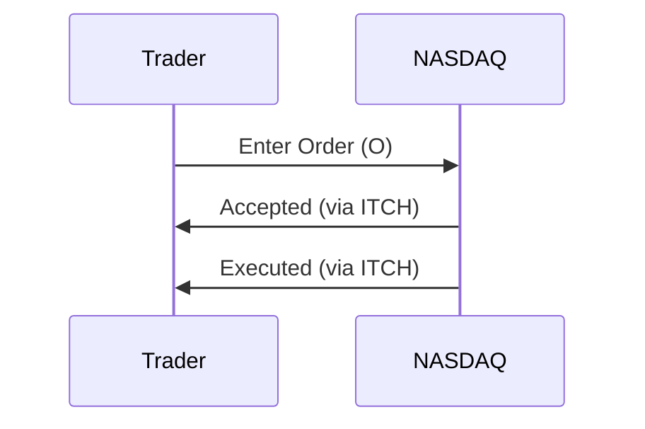

# Overview

The OUCH protocol is a binary message protocol developed by NASDAQ for order entry, allowing market participants to submit, modify, and cancel orders electronically. It is designed for low-latency order routing, complementing ITCH for market data. OUCH supports various order types and is used in NASDAQ's matching engine for equities and options.

# STAR Summary

**SITUATION:** NASDAQ required a fast, reliable protocol for order submission to handle increasing electronic trading volumes.

**TASK:** Develop a binary protocol for order entry that minimizes latency and supports complex order types.

**ACTION:** OUCH was created with fixed-length binary messages for orders, cancellations, and modifications, integrated with NASDAQ's systems.

**RESULT:** OUCH enables sub-millisecond order processing, supporting HFT and institutional trading on NASDAQ.

# Detailed Explanation

OUCH messages are binary, with each type having a fixed size for efficient parsing. The protocol uses big-endian encoding.

Key message types:

- Enter Order (O): Submits a new order.

- Replace Order (U): Modifies an existing order.

- Cancel Order (X): Cancels an order.

- Modify Order (M): Changes order parameters.

- System Event (S): Market status.

Orders include fields like symbol, side, quantity, price, and time-in-force.

OUCH integrates with ITCH for confirmations and executions.

# Real-world Examples & Use Cases

An HFT firm sends an Enter Order message for 500 shares of GOOGL at $2800. NASDAQ acknowledges via ITCH ExecutionReport.

Use cases: Algorithmic order placement, market making, arbitrage strategies.

# Message Formats / Data Models

Enter Order (O) - 49 bytes.

| Offset | Length | Field | Description |
|--------|--------|-------|-------------|
| 0 | 1 | Message Type | 'O' |
| 1 | 8 | Order Token | Unique ID |
| 9 | 14 | Buy/Sell | 'B' or 'S' |
| 23 | 8 | Shares | Quantity |
| 31 | 8 | Stock | Symbol |
| 39 | 4 | Price | Price * 10000 |
| 43 | 1 | Time-in-Force | '0'=Day |
| 44 | 1 | Firm | Firm ID |
| 45 | 1 | Display | 'Y' or 'N' |
| 46 | 1 | Capacity | Trading capacity |
| 47 | 1 | Intermarket Sweep | 'Y' or 'N' |
| 48 | 1 | Cross Type | For crosses |

# Journey of a Trade



# Common Pitfalls & Edge Cases

- Order rejections due to market halts.

- Handling order modifications during execution.

- Latency in binary parsing.

# Tools & Libraries

- NASDAQ OUCH SDK: Official tools.

- Custom parsers in C++ for low-latency.

Example code snippet (C++):

```cpp
struct EnterOrder {
    char type;
    uint64_t token;
    char side[14];
    uint64_t shares;
    char stock[8];
    uint32_t price;
    // etc.
};
```

# Github-README Links & Related Topics

[[FIX Protocol]]
[[ITCH Protocol]]
[[Market Data (overview & dissemination)]]
[[Order Entry Protocols]]
[[Journey of a Trade (end-to-end)]]
[[Order Types (DAY, GTC, FOK, IOC)]]
[[Quotes & RFQ workflows]]
[[Execution Report]]
[[Trade Capture Report]]

# References

- NASDAQ OUCH Specification: https://www.nasdaqtrader.com/content/technicalsupport/specifications/tradingproducts/ouch5.0.pdf
- NASDAQ Trading: https://www.nasdaq.com/solutions/nasdaq-trading-platform