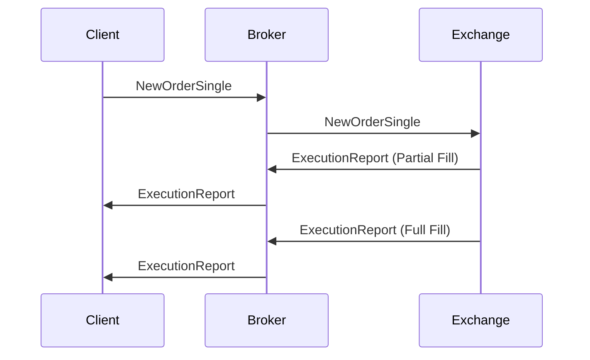

# Overview

The Financial Information eXchange (FIX) Protocol is a series of messaging specifications for the electronic communication of trade-related messages. It has become the language of the global financial markets used extensively by buy and sell-side firms, trading platforms and even regulators to communicate trade information. FIX is a non-proprietary, free and open standard that is constantly being developed to support evolving business and regulatory needs.

# STAR Summary

**SITUATION**: In the early 1990s, electronic trading was growing, but there was no standardized way for different systems to communicate trade information, leading to inefficiencies and high costs.

**TASK**: Develop a standardized protocol for electronic trading communications that could be adopted industry-wide.

**ACTION**: The FIX Trading Community, consisting of major financial institutions, developed and maintained the FIX protocol through collaborative efforts.

**RESULT**: FIX is now used by thousands of firms daily for millions of transactions, reducing trade costs, minimizing switching costs, and increasing market transparency.

# Detailed Explanation

FIX is a tag-value based protocol where each message consists of fields identified by numeric tags. It supports the entire trade lifecycle from pre-trade (quotes, indications of interest) through trade execution to post-trade (confirmations, allocations). The protocol is extensible, allowing for custom fields and new message types.

Key components:
- **Application Layer**: Defines message types and fields (e.g., NewOrderSingle, ExecutionReport).
- **Session Layer**: Handles connection management, sequence numbers, heartbeats.
- **Transport Layer**: Typically TCP/IP, with optional TLS encryption.

Versions range from FIX 4.0 (1997) to FIX 5.0 (2010), with ongoing extensions.

# Real-world Examples & Use Cases

- **Order Placement**: A buy-side firm sends a NewOrderSingle message to an exchange or broker.
- **Market Data**: Brokers disseminate quotes using MarketDataSnapshot messages.
- **Trade Confirmation**: ExecutionReport messages confirm fills and provide trade details.

In high-frequency trading, FIX is used for low-latency order routing and execution.

# Message Formats / Data Models

Messages are delimited by SOH (ASCII 1) characters. Example NewOrderSingle:

```
8=FIX.4.4|9=122|35=D|34=215|49=CLIENT12|52=20100225-19:41:57.316|56=B|1=Marcel|11=13346|21=1|40=2|44=5|54=1|59=0|60=20100225-19:39:52.020|10=072|
```

Field breakdown:
- 8: BeginString (FIX version)
- 35: MsgType (D = NewOrderSingle)
- 11: ClOrdID
- 54: Side (1 = Buy)
- 40: OrdType (2 = Limit)
- 44: Price

# Journey of a Trade



# Common Pitfalls & Edge Cases

- **Sequence Number Gaps**: Can cause session resets; requires careful handling of resend requests.
- **Version Compatibility**: Older versions may not support new fields; always negotiate versions.
- **Latency**: Tag-value encoding is verbose; use binary encodings like SBE for high-performance needs.
- **Regulatory Changes**: MiFID II requires additional fields; ensure compliance.

# Tools & Libraries

- **QuickFIX**: Open-source libraries in C++, Java, Python, .NET. Example Java snippet:

```java
import quickfix.Application;
import quickfix.Message;
import quickfix.SessionID;

public class MyApp implements Application {
    public void onMessage(Message message, SessionID sessionID) {
        // Handle incoming message
    }
}
```

- **FIXimate**: Online tool for parsing FIX messages.
- **Orchestra**: Machine-readable FIX specifications.

# Github-README Links & Related Topics

- [ITCH Protocol](../itch-protocol/README.md)
- [OUCH Protocol](../ouch-protocol/README.md)
- [Order Entry Protocols](../order-entry-protocols/README.md)
- [Execution Report](../execution-report/README.md)

# References

- [FIX Trading Community - What is FIX?](https://www.fixtrading.org/what-is-fix/)
- [FIX Protocol Specification](https://www.fixtrading.org/online-specification/)