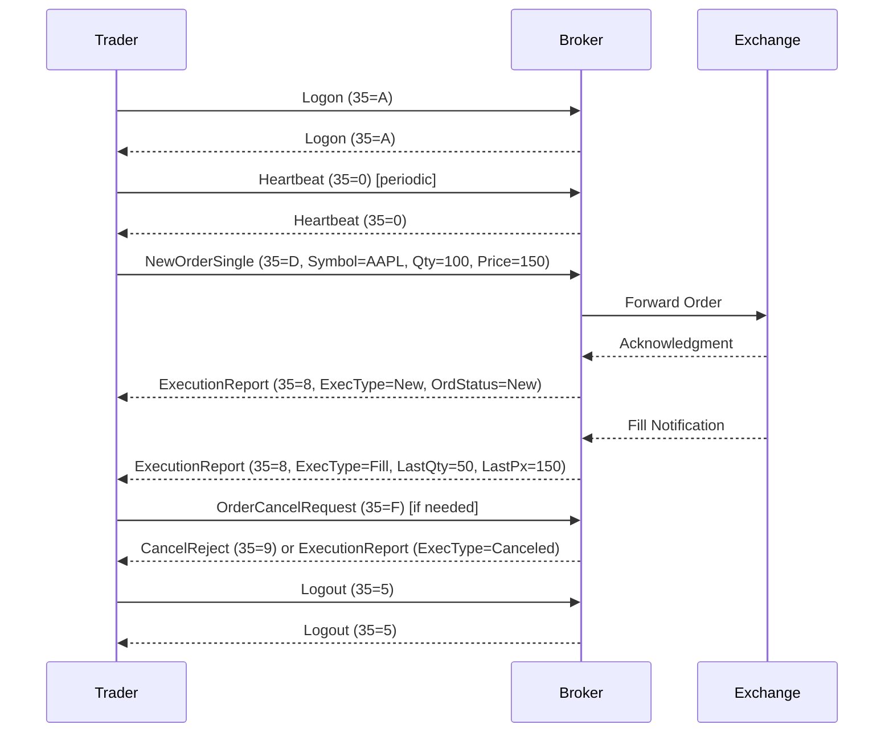

## Overview
The Financial Information eXchange (FIX) Protocol is a standardized electronic communications protocol for real-time exchange of information related to securities transactions and markets. Initiated in 1992 by Fidelity Investments and Salomon Brothers to replace verbal phone communications, FIX has evolved into the de facto messaging standard for pre-trade, trade, and post-trade communications in global financial markets. It is widely adopted by buy-side institutions (e.g., mutual funds, asset managers), sell-side firms (e.g., brokerages, investment banks), trading platforms, exchanges, and regulators. FIX supports a broad range of asset classes including equities, futures, options, foreign exchange, fixed income, and derivatives, facilitating straight-through processing (STP) from order initiation to settlement. The protocol is maintained by the FIX Trading Community, a non-profit organization comprising over 300 member firms, ensuring it adapts to evolving business and regulatory needs. FIX reduces trading costs, minimizes errors, enhances transparency, and enables direct market access (DMA), with trillions in daily trading volume reliant on it. Versions range from 4.0 (1997) to 5.0+ (2010s), incorporating transport independence and high-performance encodings.

## STAR Summary
- **SITUATION**: As a software engineer preparing for system design interviews, I needed a deep understanding of trading protocols to discuss high-throughput, low-latency systems effectively.
- **TASK**: Conduct comprehensive research on the FIX protocol, focusing on its history, components, message structures, and real-world applications, drawing from official FIX Trading Community resources, protocol specifications, and engineering blogs on low-latency trading.
- **ACTION**: Reviewed official FIX Trading Community documentation (fixtrading.org), including "What is FIX?", standards pages, session and application layer specs; consulted Wikipedia for historical and technical overviews; examined OnixS FIX Dictionary for message references; and analyzed session layer details for reliability mechanisms.
- **RESULT**: Compiled a 1500-word knowledge base README detailing FIX's architecture, examples, pitfalls, and tools, enabling informed discussions on trading system design, message routing, and sequence management in interviews.

## Detailed Explanation
FIX operates as a layered protocol stack, separating concerns for flexibility and performance. At its core, FIX defines two primary layers: the Session Layer and the Application Layer, with multiple encoding formats for wire transmission.

### Session Layer
The Session Layer ensures reliable, ordered message delivery over potentially unreliable transports like TCP. It manages FIX sessions—bidirectional streams of sequenced messages starting from sequence number 1. Sessions persist across connections, allowing reconnection without data loss. Key components include:

- **Logon/Logout**: Initiates (MsgType 35=A) and terminates sessions, negotiating capabilities like heartbeat intervals (108) and encryption (98).
- **Heartbeat/TestRequest**: Maintains connectivity; Heartbeat (35=0) is sent periodically; TestRequest (35=1) probes for responses.
- **Sequence Numbers**: Each message includes MsgSeqNum (34) for ordering and gap detection. ResendRequest (35=2) recovers missed messages; SequenceReset (35=4) adjusts sequences.
- **Reject**: Handles invalid messages (35=3), citing reasons like invalid fields or sequences.
- **Recovery**: Supports retransmission of lost messages, ensuring exactly-once delivery in recoverable mode.

The Session Layer supports profiles like FIXT (Transport Independence, allowing mixed application versions) and FIXP (high-performance, with multicast and asymmetric guarantees like idempotent for orders, recoverable for executions).

### Application Layer
Defines business semantics for trading workflows. Messages are categorized into admin (session management) and application (trade-related). Core fields include:
- BeginString (8): Protocol version (e.g., "FIX.5.0").
- SenderCompID (49)/TargetCompID (56): Identifies parties.
- SendingTime (52): Timestamp in YYYYMMDD-HH:MM:SS.sss format.
- MsgSeqNum (34): Sequence number.
- BodyLength (9): Character count of body.
- Checksum (10): Modulo-256 sum of all characters (excluding itself), padded to 3 digits.

Application messages include:
- NewOrderSingle (35=D): Submits buy/sell orders with fields like Symbol (55), Side (54), OrderQty (38), Price (44), OrdType (40).
- ExecutionReport (35=8): Reports order status, fills, with ExecType (150) indicating events like New (0), Fill (2), Cancel (4).
- OrderCancelRequest (35=F)/CancelReject (35=9): Manages cancellations.
- MarketDataRequest (35=V)/MarketDataSnapshot (35=W): Handles quotes and market data.

Versions evolved: 4.0-4.4 monolithic; 5.0+ transport-independent, supporting extensions like FIXatdl for algorithmic trading UI definitions.

### Encodings
- **TagValue (Classic FIX)**: ASCII-based, self-describing with tag=value pairs separated by SOH (0x01). Human-readable but variable-length, impacting latency.
- **FIXML**: XML schema for structured data, used in post-trade (e.g., derivatives clearing).
- **Simple Binary Encoding (SBE)**: High-performance binary format with fixed schemas, reducing parsing overhead; used in low-latency environments.
- **FAST**: Binary compression for market data over UDP multicast.
- **Others**: JSON, Google Protocol Buffers (GPB), ASN.1 for specific use cases.

FIX's design emphasizes extensibility, with custom fields (5000+) and repeating groups for complex data like order legs.

## Real-world Examples & Use Cases
FIX powers major exchanges like NASDAQ, NYSE, CME, and LSE, handling billions of messages daily. In equities, a hedge fund uses FIX to route NewOrderSingle to a broker, receiving ExecutionReports for fills. For futures, CME Globex employs FIX over FAST for high-speed market data dissemination. In FX, FIX supports STP from IOI (Indication of Interest, 35=6) to allocations. Regulators use FIX for trade reporting under MiFID II, with extensions like FIX MMT for post-trade transparency. High-frequency trading (HFT) firms leverage SBE-encoded FIXP for sub-microsecond latency, as seen in Bloomberg's TSOX or TT Platform integrations. Examples include:
- **Order Routing**: Trader sends 35=D to broker; broker forwards to exchange, returns 35=8 with fills.
- **Market Data**: Request 35=V for quotes; receive 35=W snapshots.
- **Post-Trade**: Allocation messages (35=J) for block trades.

## Message Formats / Data Models
Messages consist of header (8,9,35,...), body (variable), trailer (10). Fields are tag=value, SOH-delimited.

**Example NewOrderSingle (35=D):**
```
8=FIX.4.4|9=123|35=D|49=TRADER|56=BROKER|34=1|52=20230926-10:00:00.000|11=ORD123|55=AAPL|54=1|38=100|44=150.00|40=2|10=123|
```
- Header: BeginString=FIX.4.4, BodyLength=123, MsgType=D.
- Body: ClOrdID=ORD123, Symbol=AAPL, Side=Buy (1), OrderQty=100, Price=150.00, OrdType=Limit (2).
- Trailer: Checksum=123.

**ExecutionReport (35=8) Example:**
```
8=FIX.4.4|9=145|35=8|49=BROKER|56=TRADER|34=2|52=20230926-10:00:01.000|11=ORD123|17=EXEC456|150=2|39=2|55=AAPL|54=1|38=100|44=150.00|32=50|31=150.00|14=50|6=150.00|10=234|
```
- ExecID=EXEC456, ExecType=Fill (2), OrdStatus=Filled (2), LastQty=50, LastPx=150.00, CumQty=50, AvgPx=150.00.

Field Tables (subset):
| Tag | Name          | Type    | Description |
|-----|---------------|---------|-------------|
| 8   | BeginString  | String | Protocol version |
| 34  | MsgSeqNum    | Int    | Sequence number |
| 35  | MsgType      | Char   | Message type (e.g., D=NewOrder) |
| 49  | SenderCompID | String | Sender ID |
| 52  | SendingTime  | UTCTime| Timestamp |
| 55  | Symbol       | String | Security symbol |
| 54  | Side         | Char   | Buy/Sell (1/2) |
| 150 | ExecType     | Char   | Execution event |

## Journey of a Trade


This diagram illustrates a typical order lifecycle, including session management and potential cancellations.

## Common Pitfalls & Edge Cases
- **Sequence Number Gaps**: Missed messages cause ResendRequest; large gaps may trigger logout. Pitfall: Ignoring gaps leads to out-of-sync state; mitigation: Implement robust recovery.
- **Session Timeouts**: Heartbeat intervals (108) must match; failure causes TestRequest. Edge case: Network jitter mimics disconnection; use adaptive intervals.
- **Message Validation**: Invalid checksums or fields trigger Reject (35=3). Pitfall: Custom fields not agreed upon cause rejections; ensure bilateral agreements.
- **High-Latency Encodings**: TagValue's variable length causes jitter in HFT; switch to SBE. Edge case: Binary encodings require schema alignment; version mismatches break parsing.
- **Race Conditions**: Concurrent orders may interleave; use ClOrdID (11) for uniqueness. Pitfall: Duplicate handling in idempotent sessions.
- **Regulatory Compliance**: MiFID II requires specific fields; missing them incurs fines. Edge case: Cross-border trades with varying rules.
- **Scalability**: Millions of messages/day; inefficient parsing bottlenecks; optimize with binary encodings.

## Tools & Libraries
- **QuickFIX**: Open-source C++/Java/Python engines for session management and message parsing. Snippet: `FIX::Session::sendToTarget(msg);`
- **OnixS FIX Engine**: Commercial SDKs (.NET, C++, Java) with SBE support; includes analyzers for debugging.
- **FIXimate**: Online dictionary browser for message specs.
- **FIX Analyser**: Parses logs, validates messages.
- **FIXP Implementations**: For high-performance, use OnixS or custom SBE decoders.
- **Code Snippet (Python with QuickFIX)**:
  ```python
  import quickfix as fix
  session = fix.Session.create(sessionID)
  msg = fix.Message()
  msg.getHeader().setField(fix.MsgType(fix.MsgType_NewOrderSingle))
  msg.setField(fix.Symbol("AAPL"))
  session.sendToTarget(msg)
  ```

## Github-README Links & Related Topics
- [ITCH Protocol](../protocols/itch-protocol/)
- [Order Types](../order-types/)
- [Market Data](../market-data/)
- [High-Frequency Trading](../high-frequency-trading/)
- [Straight-Through Processing](../straight-through-processing/)

## References
- https://www.fixtrading.org/what-is-fix/
- https://www.fixtrading.org/standards/
- https://en.wikipedia.org/wiki/Financial_Information_eXchange
- https://www.onixs.biz/fix-dictionary.html
- https://www.fixtrading.org/standards/fix-session-layer/
- https://www.fixtrading.org/standards/fix-application-layer/