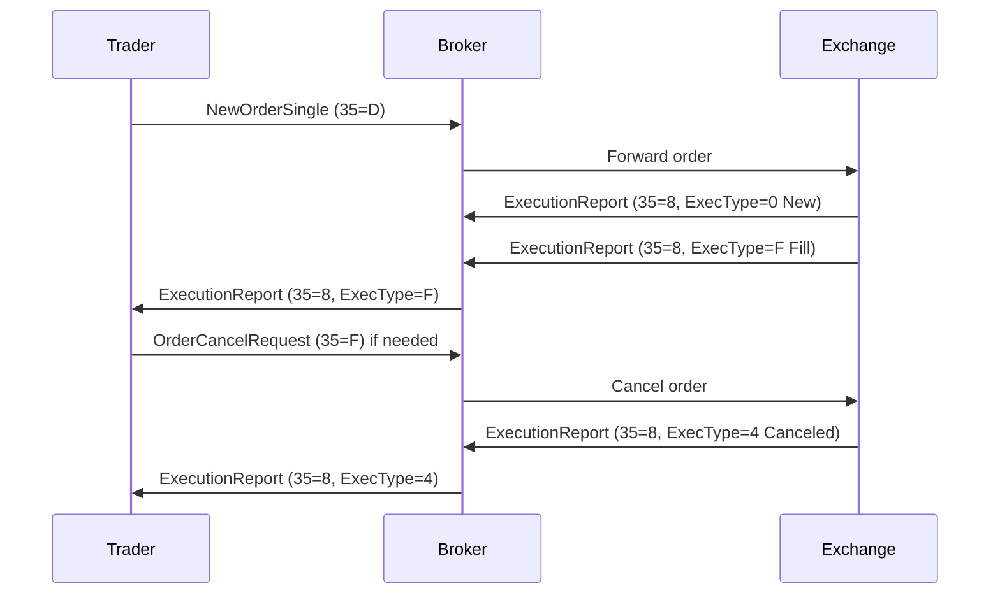

# Overview

The Financial Information eXchange (FIX) protocol is a standardized electronic communication protocol used in the financial industry for trading equities, derivatives, foreign exchange, and other financial instruments. Developed by the FIX Trading Community, it enables reliable, real-time communication between buy-side firms (e.g., asset managers), sell-side firms (e.g., brokers), and trading venues (e.g., exchanges). FIX ensures interoperability across diverse trading systems, reducing integration costs and errors.

# STAR Summary

**SITUATION**: In the early 1990s, electronic trading was expanding rapidly, but proprietary protocols led to fragmentation, high integration costs, and communication errors between trading parties.

**TASK**: Create a universal, standardized protocol for electronic trading communications to facilitate seamless order flow, execution reporting, and market data exchange.

**ACTION**: The FIX Trading Community, founded in 1992, developed the FIX protocol. Starting with version 2.7, it evolved through collaborative efforts of industry participants, incorporating feedback from real-world implementations.

**RESULT**: FIX became the de facto standard, handling over 70% of global trading volume, with implementations in high-frequency trading (HFT), institutional trading, and retail platforms, enabling efficient global markets.

# Detailed Explanation

FIX is a message-oriented protocol layered over TCP/IP, separating application-level business logic from session-level connection management. It uses a tag=value encoding (e.g., 35=D for NewOrderSingle), with support for multiple encodings like FIXML (XML) and SBE (Simple Binary Encoding) for performance.

Key components:
- **Application Layer**: Defines business messages for orders, executions, quotes, and market data.
- **Session Layer**: Handles connection establishment, logon, heartbeats, sequence numbers for message ordering, and error recovery.
- **Transport Layer**: Typically TCP/IP, with optional TLS for security.

Versions: FIX 4.4 (widely used), FIX 5.0 (major overhaul with improved extensibility).

Common message types:
- NewOrderSingle (35=D): Submits a new order.
- ExecutionReport (35=8): Reports order execution status.
- MarketDataRequest (35=V): Requests market data snapshots or updates.

Fields are identified by tags (numbers), e.g., Tag 55 for Symbol, Tag 54 for Side (1=Buy, 2=Sell).

Session management includes logon (35=A), heartbeat (35=0), and resend requests for lost messages.

# Real-world Examples & Use Cases

FIX is used in:
- High-frequency trading: Algorithms send thousands of orders per second.
- Institutional order management: Large orders routed through brokers to exchanges.
- Cross-border trading: Ensures consistent communication across jurisdictions.

Sample NewOrderSingle message (tag=value format):
```
8=FIX.4.4|9=122|35=D|49=SENDER|56=TARGET|34=1|52=20230926-12:00:00|11=ORDER123|55=AAPL|54=1|38=100|40=2|44=150.00|10=123|
```
This submits a buy order for 100 shares of AAPL at $150 limit.

# Message Formats / Data Models

FIX messages consist of header, body, and trailer.

| Component | Fields | Example |
|-----------|--------|---------|
| Header | MsgType (35), SenderCompID (49), TargetCompID (56), MsgSeqNum (34), SendingTime (52) | 35=D|49=BROKER|56=EXCHANGE |
| Body | Order-specific fields like Symbol (55), Side (54), OrderQty (38), Price (44) | 55=MSFT|54=1|38=500 |
| Trailer | Checksum (10) | 10=123 |

Data models: Orders have states (New, Partially Filled, Filled, Canceled), tracked via ExecutionReport messages.

# Journey of a Trade



This diagram shows the end-to-end flow from order submission to execution or cancellation.

# Common Pitfalls & Edge Cases

- **Sequence Number Mismatches**: If a message is lost, resend requests can cause duplicates; implement idempotency.
- **Session Timeouts**: Heartbeat intervals must be configured; missed heartbeats trigger disconnects.
- **Field Validation Errors**: Invalid tags/values lead to rejects; always validate before sending.
- **High-Latency Scenarios**: In HFT, microsecond delays can cause race conditions; use optimized encodings like SBE.
- **Regulatory Changes**: MiFID II requires additional fields; ensure compliance.

# Tools & Libraries

- **QuickFIX**: Open-source FIX engine in C++, Java, Python. Example:
  ```java
  import quickfix.Message;
  import quickfix.field.*;

  Message order = new Message();
  order.getHeader().setField(new MsgType(MsgType.NEW_ORDER_SINGLE));
  order.setField(new Symbol("AAPL"));
  order.setField(new Side(Side.BUY));
  order.setField(new OrderQty(100));
  // Send via session
  ```
- **FIXimulator**: Testing tool for FIX messages.
- **OnixS**: Commercial libraries for high-performance FIX.

# Github-README Links & Related Topics

- [[ITCH Protocol]]
- [OUCH Protocol](../ouch-protocol/README.md)
- [Order Types](../../order-types/order-types/README.md)
- [[Market Data]]
- [Execution Report](../../compliance/execution-report/README.md)

## References

- [FIX Trading Community Standards](https://www.fixtrading.org/standards/)
- [FIX Protocol Specification](https://www.fixtrading.org/online-specification/)
- [FIX Session Layer](https://www.fixtrading.org/standards/fix-session-layer/)
