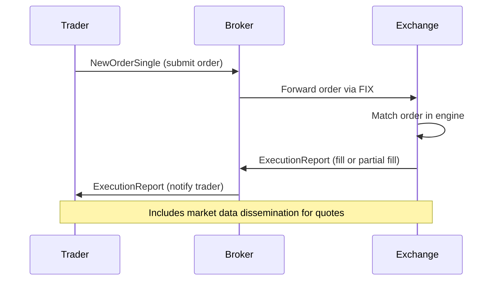

# Overview

The Financial Information eXchange (FIX) protocol is a series of messaging specifications for the electronic communication of trade-related messages. It is widely used in financial markets for order routing, execution, and market data dissemination.

# STAR Summary

**SITUATION:** In the 1990s, financial institutions faced challenges with proprietary protocols for electronic trading, leading to interoperability issues.

**TASK:** Create a standardized protocol for real-time exchange of trade messages between brokers, exchanges, and other market participants.

**ACTION:** Developed FIX as a tag-value pair format over TCP/IP, with session and application layers.

**RESULT:** FIX became the de facto standard, supporting trillions in daily trade volume across equities, derivatives, and FX markets.

# Detailed Explanation

FIX operates on two layers: the session layer handles connection management, including logon, heartbeat, and sequence numbers, while the application layer defines business messages for trading.

Common message types include:

- NewOrderSingle (MsgType=35=D): Submits a new order to the market.

- ExecutionReport (MsgType=35=8): Reports the status of an order execution, including fills, cancellations, and rejections.

- MarketDataRequest (MsgType=35=V): Requests real-time market data snapshots or incremental updates.

Messages are composed of fields identified by tags, such as ClOrdID (11) for client order ID, Symbol (55) for the instrument, Side (54) for buy/sell, and Quantity (38).

Versions range from FIX 4.0 (1997) to FIX 5.0 (2006), with ongoing extensions for new asset classes.

# Real-world Examples & Use Cases

In high-frequency trading firms, FIX is used for direct market access to exchanges like NYSE Euronext or CME Group. For instance, a hedge fund submits a limit order for 1000 shares of TSLA at $250 via FIX to their broker, who routes it to the exchange.

Another use case is in OTC derivatives trading, where FIX facilitates negotiation and confirmation between counterparties.

# Message Formats / Data Models

FIX messages are delimited by SOH (ASCII 1) and use tag=value pairs.

Example fields for NewOrderSingle:

| Tag | Field Name       | Type   | Required | Description                          |
|-----|------------------|--------|----------|--------------------------------------|
| 35  | MsgType          | String | Y        | D for NewOrderSingle                 |
| 49  | SenderCompID     | String | Y        | Sender's company identifier          |
| 56  | TargetCompID     | String | Y        | Target's company identifier          |
| 34  | MsgSeqNum        | Int    | Y        | Incremental sequence number          |
| 52  | SendingTime      | UTCTime| Y        | Time message was sent                |
| 11  | ClOrdID          | String | Y        | Unique client order ID               |
| 55  | Symbol           | String | Y        | Instrument symbol                    |
| 54  | Side             | Char   | Y        | 1=Buy, 2=Sell                       |
| 38  | OrderQty         | Qty    | Y        | Quantity to trade                    |
| 40  | OrdType          | Char   | Y        | 1=Market, 2=Limit, etc.             |
| 44  | Price            | Price  | C        | Limit price (if OrdType=2)           |

Sample trimmed message: 8=FIX.4.2|9=123|35=D|49=BUYER|56=EXCHANGE|34=1|52=20230926-12:00:00.000|11=ORD123|55=AAPL|54=1|38=100|40=1|10=123|

# Journey of a Trade



# Common Pitfalls & Edge Cases

- **Sequence Number Gaps:** If a message is lost, the session may require resend, but gaps can indicate network issues or attacks.

- **Session Management:** Logon messages must include correct credentials; failures lead to disconnection.

- **Race Conditions:** In fast markets, orders may be modified or cancelled before execution, requiring careful handling of pending states.

- **Version Compatibility:** Older FIX versions lack fields for modern instruments like crypto; always negotiate versions.

- **Latency Sensitivity:** FIX over TCP can have head-of-line blocking; some use FIX over UDP for low-latency needs.

# Tools & Libraries

- **QuickFIX/J (Java):** Open-source engine for parsing and generating FIX messages.

  ```java
  import quickfix.*;

  // Example: Create a NewOrderSingle message
  Message message = new Message();
  message.getHeader().setField(new MsgType("D"));
  message.setField(new ClOrdID("12345"));
  message.setField(new Symbol("AAPL"));
  message.setField(new Side(Side.BUY));
  message.setField(new OrderQty(100));
  message.setField(new OrdType(OrdType.MARKET));
  ```

- **FIXimulator:** Testing tool for FIX sessions.

- **Python FIX Library:** For scripting and analysis.

# Github-README Links & Related Topics

[ITCH Protocol](../itch-protocol/)

[OUCH Protocol](../ouch-protocol/)

[Market Data (overview & dissemination)](../../market-data/market-data-overview-and-dissemination/)

[Order Entry Protocols](../order-entry-protocols/)

[Execution Report](../../compliance/execution-report/)

[Trade Capture Report](../../compliance/trade-capture-report/)

# References

- [FIX Trading Community Standards](https://www.fixtrading.org/standards/)
- [FIX Protocol Specification PDF](https://www.fixtrading.org/documents/fix-protocol-specification/)
- [Investopedia: FIX Protocol](https://www.investopedia.com/terms/f/fix.asp)