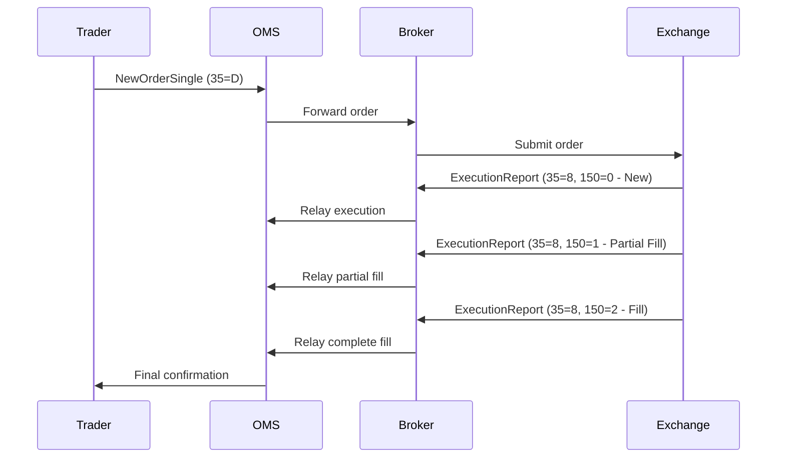

# Overview

The Financial Information eXchange (FIX) protocol is an electronic communications protocol for international real-time exchange of information related to securities transactions and markets. Initiated in 1992, FIX enables standardized messaging between financial entities, replacing verbal communications over telephones with machine-readable data. It has become the de facto standard for pre-trade and trade communication in global equity markets, expanding into foreign exchange, fixed income, and derivatives.

# STAR Summary

**SITUATION**: In the early 1990s, securities trading relied on verbal communications between broker-dealers and institutional clients, leading to errors, lost information, and inefficiencies in high-volume trading environments.

**TASK**: Develop a standardized electronic protocol for real-time exchange of trading-related information to improve accuracy, speed, and automation in financial markets.

**ACTION**: Created the FIX protocol with tagvalue encoding, session layer management, and extensible message formats. Established the FIX Trading Community to maintain and evolve the standard.

**RESULT**: FIX became the industry standard, enabling trillions in annual trading volume with reduced latency, improved straight-through processing, and expanded to multiple asset classes.

# Detailed Explanation

FIX is a family of related technical standards that evolved from a monolithic specification to separate layers for message encoding, session protocols, and application semantics. The protocol supports various encodings including classic tagvalue (ASCII-based), FIXML (XML), and Simple Binary Encoding (SBE) for high-performance scenarios.

Key components include:

- **Message Encodings**: Define wire formats for messages
- **Session Protocols**: Handle message exchange, recovery, and sequencing
- **Application Messages**: Define business semantics for trading operations

FIX messages are self-describing in tagvalue format, using numeric tags paired with values separated by SOH (0x01) characters. Messages consist of header, body, and trailer sections with mandatory checksum for integrity.

The protocol supports admin messages (Logon, Heartbeat, Logout) and application messages (NewOrderSingle, ExecutionReport, etc.). Session management ensures reliable delivery with sequence numbers and retransmission capabilities.

# Real-world Examples & Use Cases

FIX is used extensively in:
- Equity trading between buy-side institutions and sell-side brokers
- Algorithmic trading systems requiring low-latency order routing
- Market data dissemination (though often paired with FAST for multicast)
- Cross-asset trading including FX and derivatives
- Regulatory reporting and post-trade processing

A typical use case involves a portfolio manager sending a NewOrderSingle message to execute a trade, receiving ExecutionReport messages confirming fills, and using the session layer for reliable communication.

# Message Formats / Data Models

## Tagvalue Message Structure

Messages use format: `8=BeginString|9=BodyLength|35=MsgType|...|10=Checksum`

Example ExecutionReport (35=8):

```
8=FIX.4.2|9=178|35=8|49=PHLX|56=PERS|52=20071123-05:30:00.000|11=ATOMNOCCC9990900|20=3|150=E|39=E|55=MSFT|167=CS|54=1|38=15|40=2|44=15|58=PHLX EQUITY TESTING|59=0|47=C|32=0|31=0|151=15|14=0|6=0|10=128|
```

## Key Fields

| Tag | Name | Description |
|-----|------|-------------|
| 8 | BeginString | FIX version (e.g., FIX.4.2) |
| 35 | MsgType | Message type (D=NewOrderSingle, 8=ExecutionReport) |
| 49 | SenderCompID | Sender identifier |
| 56 | TargetCompID | Receiver identifier |
| 34 | MsgSeqNum | Sequence number |
| 52 | SendingTime | Timestamp |
| 10 | CheckSum | Integrity check |

# Journey of a Trade



This diagram shows the typical flow from order initiation through execution confirmation.

# Common Pitfalls & Edge Cases

- **Sequence Number Gaps**: Missed messages require ResendRequest, causing latency spikes
- **Checksum Errors**: Corrupted messages must be rejected, potentially disrupting sessions
- **Session Timeouts**: Heartbeat intervals must be carefully tuned to avoid false disconnects
- **Repeating Groups**: Complex nested structures can cause parsing errors if counts mismatch
- **Version Mismatches**: Incompatible FIX versions between peers lead to communication failures
- **High-Frequency Trading**: Tagvalue encoding's variable length causes non-deterministic performance

# Tools & Libraries

- **QuickFIX**: Open-source FIX engine in C++, Java, Python, .NET
- **FIX Antenna**: Commercial high-performance FIX implementation
- **OnixS FIX Engine**: Cross-platform FIX connectivity solution
- **FIX Parser Online**: Web-based tools for message validation and parsing

Sample Python code using QuickFIX:

```python
import quickfix as fix

class Application(fix.Application):
    def onMessage(self, message, sessionID):
        msgType = fix.MsgType()
        message.getHeader().getField(msgType)
        if msgType.getValue() == fix.MsgType_NewOrderSingle:
            # Process new order
            symbol = fix.Symbol()
            message.getField(symbol)
            print(f"Received order for {symbol.getValue()}")

# Initialize and start FIX session
```

# References

- [FIX Trading Community](https://www.fixtrading.org/)
- [Wikipedia: Financial Information eXchange](https://en.wikipedia.org/wiki/Financial_Information_eXchange)
- [FIX 5.0 Specification](https://www.fixtrading.org/standards/fix-5-0/)

# Github-README Links & Related Topics

- [ITCH Protocol](../itch-protocol/)
- [OUCH Protocol](../ouch-protocol/)
- [Market Data (overview & dissemination)](../market-data/market-data-overview-dissemination/)
- [Order Entry Protocols](../order-entry-protocols/)
- [Execution Report](../../compliance/execution-report/)
- [Trade Capture Report](../../compliance/trade-capture-report/)