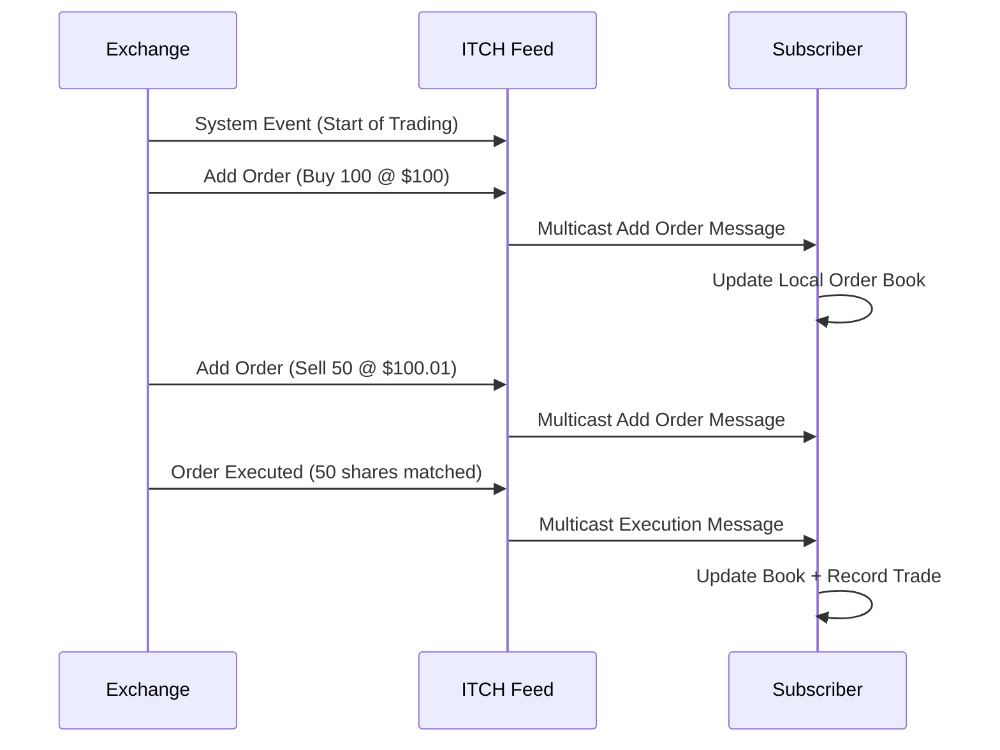

# Overview

The ITCH protocol is NASDAQ's proprietary binary protocol for real-time dissemination of market data. Developed for high-performance trading environments, ITCH provides low-latency access to order book updates, trades, and market statistics. It replaced earlier text-based protocols with a compact binary format optimized for speed and bandwidth efficiency.

# STAR Summary

**SITUATION**: Traditional text-based market data protocols were inefficient for high-frequency trading, causing latency and bandwidth issues in fast-moving markets.

**TASK**: Create a binary protocol for real-time market data dissemination that minimizes latency and maximizes throughput.

**ACTION**: Developed ITCH protocol with fixed-length binary messages, multicast UDP delivery, and comprehensive market data coverage including order book depth.

**RESULT**: ITCH became NASDAQ's standard for market data distribution, enabling sub-millisecond data delivery and supporting algorithmic trading at scale.

# Detailed Explanation

ITCH uses a binary message format with fixed-length fields for deterministic parsing performance. Messages are delivered via UDP multicast for efficient distribution to multiple recipients. The protocol includes comprehensive market data types:

- System events and trading status
- Stock directory information
- Order book updates (add, modify, delete orders)
- Trade reports
- Market statistics and imbalance information

Key features include:
- Binary encoding for minimal bandwidth
- Multicast delivery for scalability
- Sequence numbers for message ordering
- Heartbeat messages for session monitoring

ITCH versions (4.1, 5.0) have evolved to support additional asset classes and enhanced data fields.

# Real-world Examples & Use Cases

ITCH is used by:
- High-frequency trading firms for order book analysis
- Market data vendors for redistribution
- Broker-dealers for real-time quoting
- Risk management systems for position monitoring
- Algorithmic trading platforms for signal generation

A typical use case involves a trading algorithm subscribing to ITCH feeds to maintain a local order book replica, processing add order messages to update bid/ask levels in real-time.

# Message Formats / Data Models

## Message Structure

Each ITCH message starts with a 1-byte message type identifier, followed by fixed-length binary fields.

Example Add Order Message (Type 'A'):

```
Message Type: 'A' (1 byte)
Stock Locate: uint16 (2 bytes)
Tracking Number: uint16 (2 bytes)
Timestamp: uint48 (6 bytes)
Order Reference Number: uint64 (8 bytes)
Buy/Sell Indicator: char (1 byte)
Shares: uint32 (4 bytes)
Stock: char[8] (8 bytes)
Price: uint32 (4 bytes)
```

## Key Message Types

| Type | Name | Description |
|------|------|-------------|
| S | System Event | Trading session status |
| R | Stock Directory | Stock reference data |
| H | Stock Trading Action | Trading halt/resume |
| Y | Reg SHO Restriction | Short sale restrictions |
| L | Market Participant Position | MM position disclosure |
| A | Add Order | New order added to book |
| F | Add Order with MPID | Order with market participant ID |
| E | Order Executed | Partial fill |
| C | Order Executed with Price | Full execution |
| X | Order Cancel | Order cancellation |
| D | Order Delete | Order removal |
| U | Order Replace | Order modification |

# Journey of a Trade



This diagram shows how ITCH disseminates order book changes and executions in real-time.

# Common Pitfalls & Edge Cases

- **Message Sequencing**: Out-of-order UDP packets require sequence number validation
- **Packet Loss**: Multicast unreliability necessitates gap detection and recovery
- **Binary Parsing**: Fixed-length fields must be parsed correctly to avoid data corruption
- **High Volume**: During market volatility, message rates can overwhelm processing capacity
- **Version Compatibility**: Different ITCH versions have incompatible message formats
- **Timestamp Precision**: Nanosecond timestamps require careful handling for latency calculations

# Tools & Libraries

- **ITCH Parser Libraries**: Open-source parsers in Python, C++, Java
- **NASDAQ ITCH Feed**: Direct access to production feeds
- **ITCH Simulators**: Testing tools for development
- **Market Data Platforms**: Commercial solutions with ITCH integration

Sample Python code for parsing ITCH messages:

```python
import struct

def parse_add_order(data):
    msg_type, stock_locate, tracking_num, timestamp, order_ref, side, shares, stock, price = struct.unpack('>HHHQcLQ8sL', data)
    return {
        'type': msg_type,
        'stock_locate': stock_locate,
        'order_ref': order_ref,
        'side': side.decode(),
        'shares': shares,
        'stock': stock.decode().strip(),
        'price': price / 10000  # Price in dollars
    }

# Usage
message_data = b'A\x00\x01\x00\x02\x00\x00\x00\x00\x00\x00\x00\x01B\x00\x00\x00dAAPL    \x00\x03\xD0\x90'
parsed = parse_add_order(message_data)
```

# References

- [NASDAQ ITCH Protocol Specification](https://www.nasdaqtrader.com/content/technicalsupport/specifications/dataproducts/itch4.1.pdf)
- [ITCH Wikipedia](https://en.wikipedia.org/wiki/ITCH_protocol)
- [NASDAQ Market Data Platform](https://www.nasdaq.com/solutions/technology-innovation/nasdaq-market-data-platform)

# Github-README Links & Related Topics

- [[FIX Protocol]]
- [[OUCH Protocol]]
- [[Market Data (overview & dissemination)]]
- [[Order Entry Protocols]]
- [[Execution Report]]
- [[Trade Capture Report]]