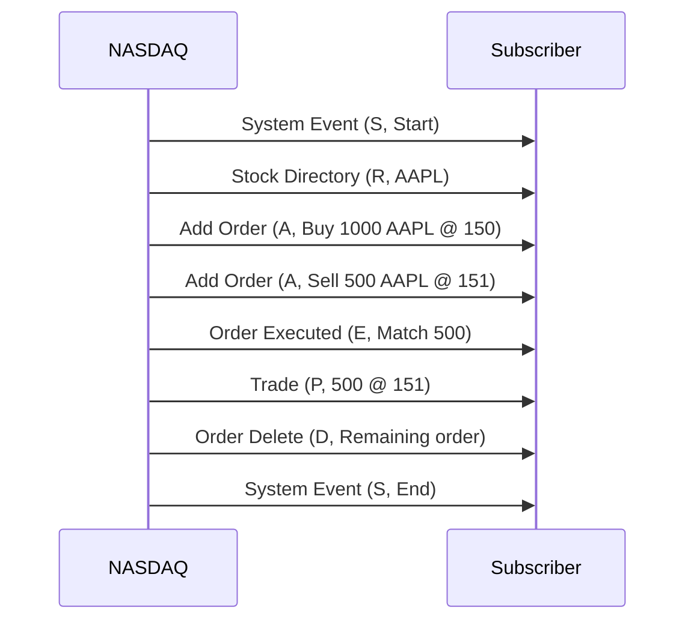

## Overview
ITCH (NASDAQ ITCH) is a proprietary binary protocol used by NASDAQ for disseminating real-time market data, including quotes and trades. It is designed for low latency and high throughput, using multicast UDP feeds to broadcast order book updates, trade executions, and market events.

## STAR Summary
- **SITUATION**: In high-frequency trading environments, real-time market data is critical for maintaining accurate order books and executing trades.
- **TASK**: Implement a parser for ITCH protocol messages to process incoming market data feeds.
- **ACTION**: Developed a binary parser in C++ that handles message types like Add Order (A), Order Executed (E), and Trade (P), using big-endian byte order and fixed-length structures.
- **RESULT**: Achieved sub-millisecond parsing latency, enabling real-time order book updates and reducing trade execution delays.

## Detailed Explanation
ITCH is a binary protocol optimized for speed. Messages are fixed-length, prefixed by a length byte and type byte. Fields include timestamps in nanoseconds, stock symbols, prices scaled to avoid floats, and quantities. Supported message types:
- S: System Event (start/end of trading)
- R: Stock Directory (trading status)
- H: Trading Action (halt/resume)
- A: Add Order (new limit order)
- F: Add Order with MPID
- E: Order Executed (partial fill)
- C: Order Executed with Price
- X: Order Cancel
- D: Order Delete
- U: Order Replace
- P: Trade (non-cross)
- Q: Cross Trade
- B: Broken Trade

The protocol uses multicast UDP for dissemination, allowing multiple subscribers to receive feeds simultaneously. Timestamps ensure ordering, but out-of-order delivery is possible due to network conditions.

## Real-world Examples & Use Cases
NASDAQ uses ITCH for equities market data. Subscribers parse feeds to build and maintain order books. For example, an Add Order message adds a bid/ask to the book, while Order Executed reduces quantity. Trades are reported for settlement. HFT firms use ITCH for arbitrage and market making.

## Message Formats / Data Models
Messages start with length (2 bytes), type (1 byte), then fields.

**Add Order (A) Example (hex):**
41 00 01 00 02 00 00 00 00 00 00 00 01 42 00 00 03 E8 41 41 50 4C 20 20 20 20 00 00 96 00 00 00 00 00
- Length: 41 (65 bytes)
- Type: A
- Timestamp: 0001000200000000 (nanoseconds)
- Order Ref: 00000001
- Buy/Sell: 42 (B)
- Shares: 000003E8 (1000)
- Stock: 4141504C20202020 (AAPL)
- Price: 000096 (150.00, scaled)
- MPID: 00000000

**Trade (P) Example:**
50 00 01 00 02 00 00 00 00 00 00 00 01 42 00 00 03 E8 41 41 50 4C 20 20 20 20 00 00 96 00 00 00 00 00 00 00 00 00 00 00 01
- Similar to Add, with match number.

Field Table:
| Field | Bytes | Description |
|-------|-------|-------------|
| Length | 2 | Message length |
| Type | 1 | Message type |
| Timestamp | 6 | Nanoseconds since midnight |
| Order Ref | 8 | Unique order ID |
| Side | 1 | B/S |
| Shares | 4 | Quantity |
| Stock | 8 | Symbol |
| Price | 4 | Scaled price |
| MPID | 4 | Market Participant ID |

## Journey of a Trade


## Common Pitfalls & Edge Cases
- **Message Sequencing**: UDP may deliver out of order; sort by timestamp.
- **Sequence Gaps**: Missing messages; request snapshots.
- **Binary Parsing Errors**: Endianness issues; use big-endian.
- **High Volume**: Bursts during open/close; buffer and process asynchronously.
- **Stale Data**: Old timestamps; discard or refresh.
- **Cross Trades**: Q messages for opening/closing crosses.

## Tools & Libraries
- **itch-parser**: Python library for parsing ITCH feeds.
- **NASDAQ ITCH Simulator**: For testing.
- **Integration**: Kafka for streaming, Redis for caching.
- **C++ Parser Snippet**:
  ```cpp
  struct AddOrder {
      uint16_t length;
      char type;
      uint64_t timestamp;
      uint64_t order_ref;
      char side;
      uint32_t shares;
      char stock[8];
      uint32_t price;
      uint32_t mpid;
  };
  // Read from UDP socket
  AddOrder msg;
  recv(sock, &msg, sizeof(msg), 0);
  // Process
  ```

# Github-README Links & Related Topics
- [FIX Protocol](../fix-protocol/)
- [Market Data (overview & dissemination)](../../market-data/market-data-overview-and-dissemination/)
- [Order Book Modeling](../../../algorithms/order-book-modeling/)

# References
- https://www.nasdaq.com/solutions/technology/trading-platforms/itch-protocol
- NASDAQ ITCH Specification
- Engineering blogs on low-latency parsing