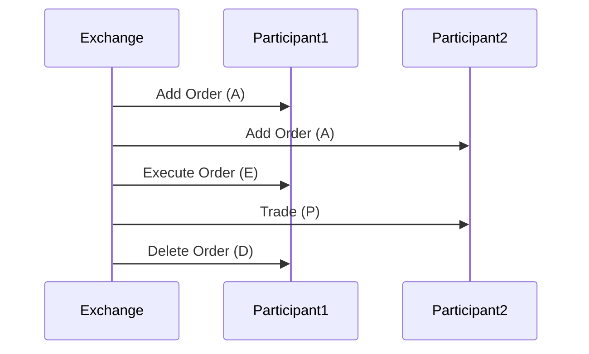

# Overview

The NASDAQ ITCH protocol is a binary protocol designed for the efficient dissemination of real-time market data. Developed by NASDAQ, it provides detailed, low-latency updates on order book changes, trades, and other market events. ITCH feeds are used by market participants to maintain accurate order books and execute informed trading strategies.

# STAR Summary

**SITUATION**: In the late 1990s, market data dissemination was inefficient, with high latency and bandwidth usage due to text-based protocols.

**TASK**: Develop a high-performance protocol for real-time market data distribution to support growing electronic trading volumes.

**ACTION**: NASDAQ engineered ITCH as a binary protocol, focusing on compact message formats and multicast delivery for scalability.

**RESULT**: ITCH enables sub-millisecond data delivery, handling billions of messages daily, and is a cornerstone of modern market data infrastructure.

# Detailed Explanation

ITCH uses a binary format for efficiency, with fixed-length messages to minimize parsing overhead. It supports multicast UDP for high-throughput distribution, reducing latency compared to TCP-based protocols.

Key features:
- **Message Types**: Add Order (A), Execute Order (E), Delete Order (D), etc.
- **Fields**: Stock symbol, order ID, price, quantity, timestamp.
- **Versions**: ITCH 4.1, 5.0; version 5.0 added support for complex orders.

Unlike FIX, ITCH is unidirectional (exchange to participants) and focuses solely on market data, not order entry.

Session management is implicit; connections are maintained via multicast groups.

# Real-world Examples & Use Cases

Used by HFT firms for order book reconstruction, arbitrage strategies, and market making.

Sample Add Order message (binary, represented in hex for illustration):
```
41 00 00 00 01 41 41 50 4C 00 00 00 00 00 00 00 01 00 00 00 64 00 00 00 00 00 00 00 96
```
(Add order for AAPL, buy, 100 shares at $150).

# Message Formats / Data Models

ITCH messages are 20-50 bytes, with a 2-byte message type.

| Message Type | Description | Key Fields |
|--------------|-------------|------------|
| A | Add Order | Stock, Order Ref, Side, Qty, Price |
| E | Execute Order | Order Ref, Executed Qty, Match ID |
| D | Delete Order | Order Ref |
| U | Replace Order | Order Ref, New Qty/Price |

Data models: Order book as a collection of orders, updated incrementally.

# Journey of a Trade



This shows incremental updates building the order book and reporting executions.

# Common Pitfalls & Edge Cases

- **Packet Loss**: Multicast can lose packets; use sequence numbers for gap detection.
- **Out-of-Order Delivery**: UDP doesn't guarantee order; buffer and reorder messages.
- **High Volume**: During market open, message rates can exceed 1M/sec; optimize parsing.
- **Symbol Mapping**: Ensure correct stock symbol lookups to avoid misattribution.

# Tools & Libraries

- **ITCH Parser Libraries**: Open-source in Python, C++ for decoding messages.
- Sample code (Python with struct):
  ```python
  import struct

  def parse_add_order(data):
      msg_type, stock, order_ref, side, qty, price = struct.unpack('>H6sQHHI', data)
      return {'stock': stock.decode().strip(), 'qty': qty, 'price': price / 10000}
  ```
- **NASDAQ ITCH Feed Simulators**: For testing.

# Github-README Links & Related Topics

- [FIX Protocol](../fix-protocol/README.md)
- [[Market Data]]
- [Order Book Modeling](../../../algorithms/order-book-modeling/README.md)

## References

- [NASDAQ ITCH Overview](https://www.nasdaq.com/solutions/nasdaq-itch)
- [ITCH Protocol Specification](https://www.nasdaqtrader.com/content/technicalsupport/specifications/datacollection/itch-v5_0.pdf)
