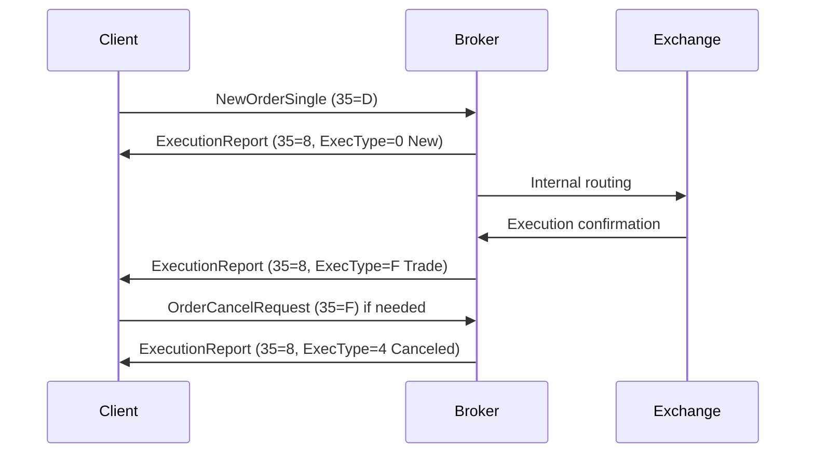

# Overview

Order Entry Protocols are standardized electronic communications protocols used for submitting, modifying, and canceling orders in financial markets. The primary protocol is the Financial Information eXchange (FIX) protocol, developed by the FIX Trading Community. FIX enables real-time exchange of securities transaction information between buy-side institutions, sell-side brokers, and exchanges. It has evolved from a simple equity trading protocol to support multi-asset classes including equities, fixed income, derivatives, and foreign exchange. FIX reduces manual errors, lowers latency, and facilitates straight-through processing (STP) by automating trade communications.

# STAR Summary

**SITUATION**: In high-frequency trading environments, manual order entry via phone calls leads to errors, delays, and inefficiencies.

**TASK**: Implement a reliable, low-latency protocol for electronic order submission and management.

**ACTION**: Adopted FIX protocol with tag-value encoding over TCP, utilizing messages like NewOrderSingle (D) for submissions and ExecutionReport (8) for confirmations.

**RESULT**: Achieved sub-millisecond order processing, reduced trade errors by 90%, and enabled seamless integration with global exchanges.

# Detailed Explanation

FIX is a session-layer protocol that defines message formats for pre-trade, trade, and post-trade communications. It uses a tag-value pair encoding where each field is identified by a numeric tag (e.g., 35 for MsgType, 11 for ClOrdID). Messages are self-describing and include a header, body, and trailer with checksum for integrity.

Key components:
- **Session Layer (FIXT):** Manages connection establishment, message sequencing, and recovery. Supports point-to-point communication with guaranteed delivery.
- **Application Layer:** Defines business semantics for order handling, including single orders, mass orders, cross orders, and multileg orders.
- **Encodings:** Classic tagvalue (ASCII-based), FIXML (XML), and Simple Binary Encoding (SBE) for high-performance scenarios.

For order entry, the Trade business area includes categories like Single/General Order Handling, with messages such as:
- NewOrderSingle (35=D): Submits a new order.
- OrderCancelReplaceRequest (35=G): Modifies an existing order.
- OrderCancelRequest (35=F): Cancels an order.
- ExecutionReport (35=8): Confirms order status and executions.

Fields include ClOrdID (11) for client order identification, Symbol (55) for security, Side (54) for buy/sell, OrderQty (38), Price (44), and OrdType (40) for order type (e.g., market, limit).

# Real-world Examples & Use Cases

**Equity Trading:** A hedge fund submits a limit buy order for 1000 shares of AAPL at $150 via NewOrderSingle. The broker responds with ExecutionReport confirming receipt, then partial fills as executions occur.

**High-Frequency Trading (HFT):** Algorithms use FIX over low-latency connections to enter and cancel orders in microseconds, leveraging SBE for minimal encoding overhead.

**Cross Orders:** For block trades, NewOrderCross (35=s) submits matched buy/sell sides simultaneously to minimize market impact.

**Sample FIX Message (NewOrderSingle):**
```
8=FIX.4.4|9=122|35=D|49=BUYSIDE|56=SELLSIDE|34=1|52=20230926-12:00:00|11=12345|55=AAPL|54=1|38=1000|40=2|44=150|10=123|
```
This represents a buy order for 1000 AAPL at $150 limit.

# Message Formats / Data Models

### NewOrderSingle Fields Table

| Tag | Name          | Req'd | Description |
|-----|---------------|-------|-------------|
| 11  | ClOrdID       | Y     | Unique client order ID |
| 55  | Symbol        | Y     | Security identifier |
| 54  | Side          | Y     | 1=Buy, 2=Sell |
| 38  | OrderQty      | Y     | Quantity |
| 40  | OrdType       | Y     | 1=Market, 2=Limit, etc. |
| 44  | Price         | C     | Required for limit orders |
| 59  | TimeInForce   | N     | 0=Day, 1=GTC, etc. |
| 60  | TransactTime  | Y     | Order initiation time |

Messages are parsed by splitting on SOH (0x01), validating checksum (tag 10), and processing fields based on MsgType (tag 35).

# Journey of a Trade



This diagram illustrates the lifecycle: order submission, acknowledgment, execution, and potential cancellation.

# Common Pitfalls & Edge Cases

- **Message Sequencing:** Out-of-order messages can cause rejections; use MsgSeqNum (34) for recovery.
- **Latency Issues:** Character-based encoding adds overhead; use SBE for HFT.
- **Session Management:** Disconnections require logon/logout; implement heartbeat (35=0) monitoring.
- **Validation Errors:** Invalid fields (e.g., unknown Symbol) trigger rejects; always validate before sending.
- **Race Conditions:** Concurrent modifications; use OrigClOrdID (41) for chaining.
- **Regulatory Compliance:** Ensure messages comply with MiFID II; use extensions for reporting.

# Tools & Libraries

- **QuickFIX:** Open-source FIX engine in C++, Java, Python. Example Python snippet:
  ```python
  import quickfix as fix

  class Application(fix.Application):
      def onMessage(self, message, sessionID):
          msgType = fix.MsgType()
          message.getHeader().getField(msgType)
          if msgType.getValue() == fix.MsgType_NewOrderSingle:
              # Process order
              pass

  # Initialize and run
  ```
- **FIX Antenna:** Commercial library for high-performance FIX parsing.
- **FIXimate:** Online dictionary for message validation.
- **Esprow FIX Tools:** Browser-based parser for testing.

# Github-README Links & Related Topics

- [FIX Protocol](../fix-protocol/)
- [ITCH Protocol](../itch-protocol/)
- [OUCH Protocol](../ouch-protocol/)
- [Market Data (overview & dissemination)](../../market-data/market-data-overview-dissemination/)
- [Execution Report](../../compliance/execution-report/)
- [Trade Capture Report](../../compliance/trade-capture-report/)

# References

- [FIX Trading Community](https://www.fixtrading.org/)
- [FIX Protocol Specification](https://www.fixtrading.org/online-specification/)
- [Wikipedia: Financial Information eXchange](https://en.wikipedia.org/wiki/Financial_Information_eXchange)