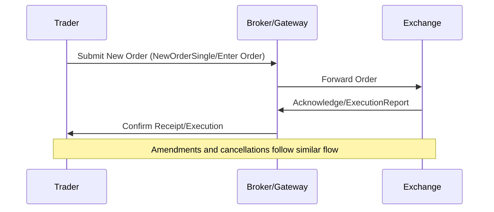

# Overview

Order entry protocols enable the submission, modification, and cancellation of orders to electronic exchanges. Key protocols include FIX (Financial Information eXchange) for versatile messaging and OUCH for high-performance binary order entry. These protocols handle message types like New Order, Amend, and Cancel, with fields such as symbol, side, type, quantity, and price. Session management ensures reliable connections through logons, heartbeats, and sequence numbers.

# STAR Summary

**SITUATION:** Early electronic trading relied on proprietary systems, causing interoperability issues and high latency in order entry.

**TASK:** Standardize protocols for efficient, low-latency order submission across exchanges and brokers.

**ACTION:** Developed FIX as a text-based, extensible protocol and OUCH as a binary protocol optimized for speed, both supporting core order operations and session handling.

**RESULT:** Enabled global electronic trading with reduced costs, improved speed, and standardized communication, supporting trillions in daily trade volume.

# Detailed Explanation

Order entry protocols facilitate real-time communication between traders, brokers, and exchanges. FIX, a tag-value pair format, is widely used for equities, derivatives, and FX. OUCH, NASDAQ's binary protocol, minimizes parsing overhead for high-frequency trading.

**Message Types:**
- **New Order:** Submits a new trade order (e.g., FIX NewOrderSingle, OUCH Enter Order).
- **Amend:** Modifies an existing order (e.g., FIX OrderCancelReplaceRequest, OUCH Replace Order).
- **Cancel:** Removes a pending order (e.g., FIX OrderCancelRequest, OUCH Cancel Order).

**Key Fields:**
- Symbol: Instrument identifier (e.g., AAPL).
- Side: Buy (1) or Sell (2) in FIX; B or S in OUCH.
- Type: Order type (e.g., Market, Limit).
- Quantity: Number of shares or contracts.
- Price: Limit price for limit orders.

**Session Management:** Protocols maintain persistent TCP connections with logon messages, heartbeats for keep-alive, and sequence numbers to detect gaps or duplicates. FIX uses session layers for reliability; OUCH relies on connection-oriented design with acknowledgments.

# Real-world Examples & Use Cases

- **HFT Firms:** Use OUCH for co-located order entry to minimize latency in NASDAQ trading.
- **Retail Brokers:** Employ FIX to route client orders to multiple exchanges.
- **Algorithmic Traders:** Submit and amend orders via FIX in automated strategies for equities or futures.

Example: A trader submits a limit buy order for 1000 AAPL shares at $150 via FIX to their broker, who forwards it to NYSE.

# Message Formats / Data Models

## FIX NewOrderSingle

FIX messages use tag=value pairs delimited by SOH (ASCII 1).

| Tag | Field Name    | Type   | Required | Description                          |
|-----|---------------|--------|----------|--------------------------------------|
| 35  | MsgType       | String | Y        | D for NewOrderSingle                 |
| 11  | ClOrdID       | String | Y        | Unique client order ID               |
| 55  | Symbol        | String | Y        | Instrument symbol                    |
| 54  | Side          | Char   | Y        | 1=Buy, 2=Sell                       |
| 38  | OrderQty      | Qty    | Y        | Quantity to trade                    |
| 40  | OrdType       | Char   | Y        | 1=Market, 2=Limit                   |
| 44  | Price         | Price  | C        | Limit price (if OrdType=2)           |

Sample: 8=FIX.4.2|9=123|35=D|49=BUYER|56=EXCHANGE|34=1|52=20230926-12:00:00.000|11=ORD123|55=AAPL|54=1|38=100|40=2|44=150.00|10=123|

## OUCH Enter Order

OUCH uses fixed binary fields.

| Field          | Size | Description                  |
|----------------|------|------------------------------|
| Message Type   | 1    | 'O'                          |
| Order Token    | 14   | Unique order ID              |
| Side           | 1    | 'B' or 'S'                   |
| Quantity       | 4    | Order quantity               |
| Symbol         | 8    | Stock symbol                 |
| Price          | 4    | Price * 100                  |
| Time-in-Force  | 1    | '0'=Day                      |

Sample hex: 4F [14-byte token] 42 00 00 03 E8 41 41 50 4C 20 20 20 20 00 00 96 00 30 [firm] 59 50 4E 00 00 00 00 00 00

# Journey of a Trade



# Common Pitfalls & Edge Cases

- **Validation Failures:** Invalid symbol, price outside tick size, or insufficient quantity lead to rejections; always validate inputs.
- **Session Disconnects:** Network issues cause gaps in sequence numbers; implement reconnection logic.
- **Rate Limiting:** Exchanges enforce order frequency limits; monitor and throttle submissions.
- **Order Routing Errors:** Incorrect firm IDs or destinations result in failed executions.
- **Concurrency Issues:** Simultaneous amends/cancels can cause race conditions; use order tokens for tracking.

# Tools & Libraries

- **QuickFIX (C++, Java, Python):** Open-source for FIX message handling.
  ```java
  import quickfix.*;
  Message msg = new Message();
  msg.getHeader().setField(new MsgType("D"));
  msg.setField(new ClOrdID("123"));
  msg.setField(new Symbol("AAPL"));
  msg.setField(new Side(Side.BUY));
  msg.setField(new OrderQty(100));
  msg.setField(new OrdType(OrdType.LIMIT));
  msg.setField(new Price(150.0));
  ```
- **OUCH SDK:** NASDAQ-provided libraries for binary message encoding/decoding.
- **FIXimulator:** Testing tool for FIX sessions.

# Github-README Links & Related Topics

[[OUCH Protocol]]

[[FIX Protocol]]

[[Order Types]]

# References

- [FIX Protocol Standards](https://www.fixtrading.org/standards/)
- [NASDAQ OUCH Specification](https://www.nasdaqtrader.com/content/technicalsupport/specifications/TradingProducts/OUCH4.2.pdf)
- [Order Routing Protocols Blog](https://www.tradingtechnologies.com/blog/order-routing-protocols/)