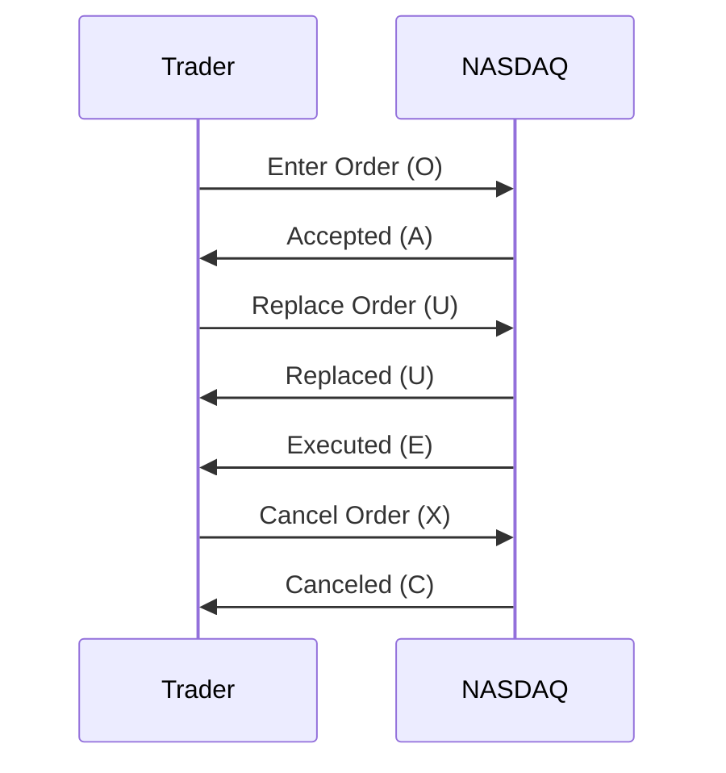

# Overview

NASDAQ OUCH is a binary protocol for order entry, allowing market participants to submit, modify, and cancel orders directly to NASDAQ's matching engine. It emphasizes low latency and high throughput, making it suitable for high-frequency trading environments.

# STAR Summary

**SITUATION**: Traditional text-based order entry protocols were slow and bandwidth-intensive for high-volume trading.

**TASK**: Design a protocol for efficient order submission to support rapid electronic trading.

**ACTION**: NASDAQ developed OUCH with binary encoding and TCP connections for reliable, sequenced order flow.

**RESULT**: OUCH handles millions of orders daily with sub-millisecond processing, integral to NASDAQ's order routing.

# Detailed Explanation

OUCH uses binary messages over TCP for guaranteed delivery. Messages are compact, with fixed formats for speed.

Key message types:
- Enter Order (O): Submit new order.
- Replace Order (U): Modify existing order.
- Cancel Order (X): Cancel order.

Fields: Token (order ID), Side, Qty, Price, etc.

Session: Persistent TCP connection with logon.

Unlike FIX, OUCH is NASDAQ-specific and optimized for their engine.

# Real-world Examples & Use Cases

Used by brokers and HFT for direct market access.

Sample Enter Order (hex):
```
4F 00 00 00 01 41 41 50 4C 01 00 00 00 64 00 00 00 00 00 00 00 96
```
(Buy 100 AAPL at $150).

# Message Formats / Data Models

| Message Type | Length | Fields |
|--------------|--------|--------|
| O (Enter) | 48 bytes | Token, Side, Qty, Price, etc. |
| U (Replace) | 32 bytes | Token, New Qty/Price |
| X (Cancel) | 16 bytes | Token |

Data models: Orders with states managed by NASDAQ.

# Journey of a Trade



Flow from submission to execution.

# Common Pitfalls & Edge Cases

- **Connection Drops**: TCP ensures delivery, but reconnections require resubmission.
- **Rate Limits**: NASDAQ enforces throttling; monitor for rejects.
- **Invalid Orders**: Price/quantity checks; handle rejects promptly.

# Tools & Libraries

- **OUCH Libraries**: Proprietary or open-source parsers.
- Sample (C++):
  ```cpp
  struct EnterOrder {
      char type = 'O';
      uint32_t token;
      char side;
      uint32_t qty;
      uint32_t price;
  };
  ```

# Github-README Links & Related Topics

- [FIX Protocol](../fix-protocol/README.md)
- [Order Entry Protocols](../order-entry-protocols/README.md)
- [Execution Report](../../compliance/execution-report/README.md)

## References

- [NASDAQ OUCH Overview](https://www.nasdaq.com/solutions/nasdaq-ouch)
