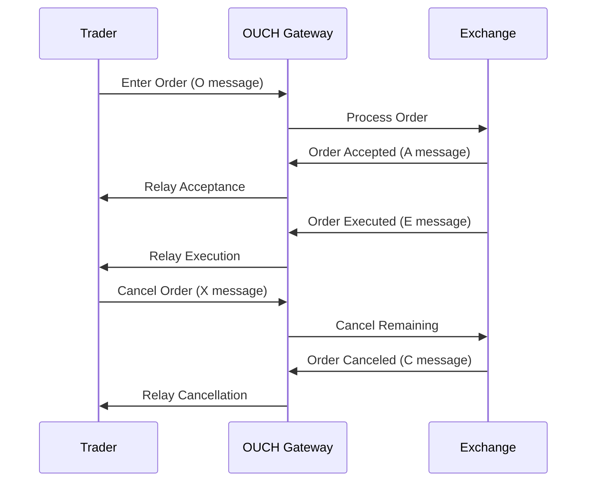

# Overview

The OUCH protocol is NASDAQ's binary protocol for high-performance order entry and management. Designed for low-latency trading, OUCH enables direct market access with minimal message overhead. It supports order submission, cancellation, and modification with sub-millisecond execution capabilities.

# STAR Summary

**SITUATION**: Traditional order entry protocols like FIX were too verbose for high-frequency trading, introducing unnecessary latency in order routing.

**TASK**: Develop a streamlined binary protocol for order entry that minimizes message size and parsing overhead.

**ACTION**: Created OUCH protocol with compact binary messages, fixed-length fields, and essential order management functionality.

**RESULT**: OUCH became NASDAQ's primary order entry protocol, enabling microsecond-level order processing and supporting high-frequency trading strategies.

# Detailed Explanation

OUCH uses a binary message format with fixed-length fields for deterministic performance. Messages are sent over TCP for reliable delivery. The protocol focuses on core order operations:

- Order entry (market and limit orders)
- Order cancellation
- Order modification
- Order status queries

Key features include:
- Binary encoding for minimal latency
- Fixed-length messages for fast parsing
- Sequence numbers for message tracking
- Support for various order types and time-in-force conditions

OUCH versions have evolved to support additional order types and enhanced functionality.

# Real-world Examples & Use Cases

OUCH is used by:
- High-frequency trading firms for rapid order execution
- Algorithmic trading systems requiring low-latency access
- Market makers for quote management
- Broker-dealers for direct market access
- Proprietary trading desks for order flow management

A typical use case involves an HFT algorithm submitting limit orders via OUCH, then rapidly canceling and replacing orders based on market conditions.

# Message Formats / Data Models

## Message Structure

OUCH messages start with a 1-byte message type, followed by fixed-length binary fields.

Example Enter Order Message (Type 'O'):

```
Message Type: 'O' (1 byte)
Order Token: char[14] (14 bytes)
Buy/Sell Indicator: char (1 byte)
Shares: uint32 (4 bytes)
Stock: char[8] (8 bytes)
Price: uint32 (4 bytes)
Time-in-Force: uint32 (4 bytes)
Firm: char[4] (4 bytes)
Display: char (1 byte)
Capacity: char (1 byte)
Intermarket Sweep Eligibility: char (1 byte)
Minimum Quantity: uint32 (4 bytes)
Cross Type: char (1 byte)
Customer Type: char (1 byte)
```

## Key Message Types

| Type | Name | Description |
|------|------|-------------|
| O | Enter Order | Submit new order |
| U | Replace Order | Modify existing order |
| X | Cancel Order | Cancel order by token |
| C | Cancel By Order ID | Cancel by order ID |
| S | System Event | System status messages |
| A | Accepted | Order acceptance confirmation |
| U | Replaced | Order replacement confirmation |
| C | Canceled | Order cancellation confirmation |
| E | Executed | Order execution notification |
| J | Rejected | Order rejection |

# Journey of a Trade



This diagram illustrates the order lifecycle from submission through execution and cancellation.

# Common Pitfalls & Edge Cases

- **Token Management**: Order tokens must be unique and tracked for modifications/cancellations
- **Sequence Handling**: Message sequencing is critical for order state consistency
- **Rejection Handling**: Various rejection codes require appropriate error handling
- **Rate Limiting**: High-frequency order entry may trigger exchange rate limits
- **Session Management**: Connection drops require order state reconciliation
- **Time-in-Force**: Complex TIF conditions can lead to unexpected order behavior

# Tools & Libraries

- **OUCH Libraries**: Open-source implementations in C++, Python, Java
- **NASDAQ OUCH Gateway**: Direct connectivity for approved firms
- **OUCH Simulators**: Development and testing tools
- **Trading Platforms**: Commercial systems with OUCH integration

Sample Python code for OUCH message creation:

```python
import struct

def create_enter_order(order_token, side, shares, stock, price):
    msg_type = b'O'
    token = order_token.ljust(14).encode()[:14]
    buy_sell = side.encode()
    shares_bytes = struct.pack('>I', shares)
    stock_bytes = stock.ljust(8).encode()[:8]
    price_bytes = struct.pack('>I', int(price * 10000))  # Price in 1/10000 dollars
    tif = struct.pack('>I', 0)  # Day order
    firm = b'FIRM'
    display = b'Y'
    capacity = b'A'  # Agency
    sweep = b'N'
    min_qty = struct.pack('>I', 0)
    cross = b'N'
    customer = b'R'  # Retail
    
    message = msg_type + token + buy_sell + shares_bytes + stock_bytes + price_bytes + tif + firm + display + capacity + sweep + min_qty + cross + customer
    return message

# Usage
order_msg = create_enter_order('TOKEN12345678', 'B', 100, 'AAPL', 150.25)
```

# References

- [NASDAQ OUCH Protocol Specification](https://www.nasdaqtrader.com/content/technicalsupport/specifications/tradingengines/ouch4.2.pdf)
- [OUCH Wikipedia](https://en.wikipedia.org/wiki/OUCH_(protocol))
- [NASDAQ Trading Protocols](https://www.nasdaq.com/solutions/technology-innovation/trading-protocols)

# Github-README Links & Related Topics

- [[FIX Protocol]]
- [[ITCH Protocol]]
- [[Order Entry Protocols]]
- [[Market Data (overview & dissemination)]]
- [[Execution Report]]
- [[Trade Capture Report]]