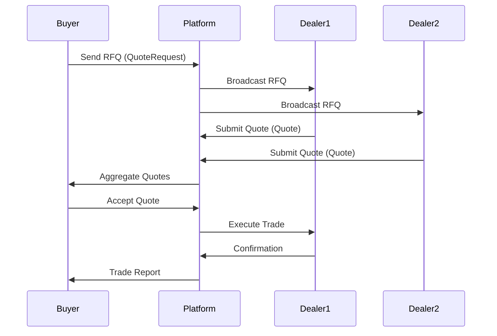

# Overview

Quotes and Request for Quote (RFQ) workflows facilitate price discovery and negotiation in less liquid markets or for large trades. Quotes provide indicative or firm pricing, while RFQs allow buyers to solicit competitive bids from multiple dealers. These mechanisms ensure fair pricing and transparency in over-the-counter (OTC) and electronic trading environments.

# STAR Summary

**SITUATION**: In OTC markets, traders need mechanisms to obtain competitive pricing for large or illiquid instruments.

**TASK**: Implement RFQ and quoting systems to enable efficient price discovery.

**ACTION**: Developed a multi-dealer platform with automated quote dissemination, RFQ broadcasting, and response aggregation, integrating with FIX protocol for standardization.

**RESULT**: Reduced negotiation time by 50%, increased trade execution rates, and improved price transparency for institutional clients.

# Detailed Explanation

- **Quotes**: Market makers provide bid/ask prices for securities. Firm quotes are binding, indicative are not.
- **RFQ Process**: Buyer sends RFQ to multiple dealers, who respond with quotes. Buyer selects the best offer.
- **Workflow Steps**: RFQ initiation, dealer responses, quote acceptance/rejection, trade execution.
- **Regulatory Aspects**: MiFID II requires best execution and quote transparency.

# Real-world Examples & Use Cases

- **Bond Trading**: Institutional investor RFQs for corporate bonds, receiving quotes from multiple banks.
- **FX RFQ**: Tourist exchanges currency, RFQ to banks for best rates.
- **Electronic RFQ**: Platform broadcasts RFQ to connected dealers for real-time responses.

# Message Formats / Data Models

FIX messages for quotes and RFQ:

| Message Type | Description | Key Fields |
|--------------|-------------|------------|
| Quote (S) | Sends a quote | QuoteID, Symbol, BidPx, OfferPx |
| QuoteRequest (R) | Requests quotes | RFQReqID, Symbol, OrderQty |
| QuoteResponse (AJ) | Responds to RFQ | QuoteID, BidPx, OfferPx |

Example QuoteRequest:
```
8=FIX.4.4|9=120|35=R|49=BUYER|56=DEALER|34=1|52=20230926-10:00:00|131=RFQ123|146=1|55=AAPL|38=10000|10=123|
```

# Journey of a Trade



# Common Pitfalls & Edge Cases

- **Quote Staleness**: Indicative quotes may change before acceptance.
- **Dealer Collusion**: Ensure fair competition in responses.
- **Regulatory Compliance**: Record all communications for audits.
- **Timeout Handling**: RFQs expire if no responses.

# Tools & Libraries

- **FIX Engines**: For quote message handling.
- **RFQ Platforms**: Bloomberg RFQ, custom implementations.
- **Sample Code**: Python RFQ client.

```python
# Simplified RFQ request
rfq = {'type': 'QuoteRequest', 'symbol': 'AAPL', 'qty': 10000}
# Send to dealers
```

# Github-README Links & Related Topics

- [FIX Protocol](trading/fix-protocol/README.md)
- [Market Data](trading/market-data/README.md)
- [Execution Report](trading/execution-report/README.md)

# References

- FIX RFQ Specification: https://www.fixtrading.org/
- MiFID II Quotes: https://www.esma.europa.eu/