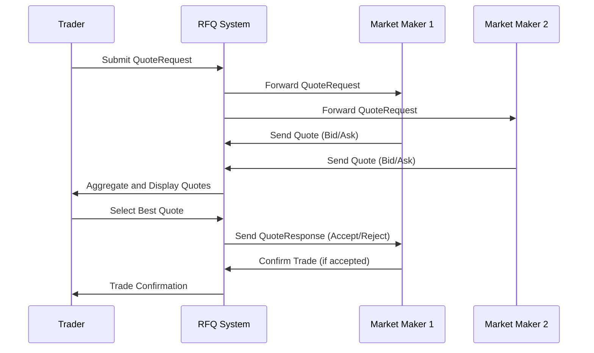

## Overview

Request for Quote (RFQ) workflows enable traders to request competitive pricing from multiple market participants for specific securities, particularly useful for large, illiquid, or complex instruments. This process facilitates price discovery and ensures best execution by allowing market makers to provide quotes based on current market conditions and inventory.

## STAR Summary

**SITUATION:** Institutional traders need to obtain competitive prices for large block trades without revealing their full intentions to the market.

**TASK:** Design and implement an RFQ system that solicits quotes from multiple counterparties efficiently.

**ACTION:** Developed a workflow using FIX protocol messages to broadcast quote requests, collect responses within a time window, and enable traders to select the best offer.

**RESULT:** Improved price discovery for large trades, reduced market impact, and increased execution quality for institutional clients.

## Detailed Explanation

RFQ workflows typically involve the following steps:

1. **Quote Request Initiation:** A trader or automated system sends a QuoteRequest message specifying the instrument, quantity, and any special conditions.

2. **Quote Solicitation:** The request is broadcast to eligible market makers or counterparties who can provide liquidity for the instrument.

3. **Quote Submission:** Market makers respond with Quote messages containing bid/ask prices, quantities, and validity periods.

4. **Quote Evaluation:** The system aggregates responses, allowing the trader to compare offers and select the most favorable terms.

5. **Quote Acceptance/Rejection:** The trader sends a QuoteResponse accepting a specific quote or rejecting all offers.

6. **Trade Execution:** Upon acceptance, the trade is executed at the agreed terms, potentially through a separate order flow.

RFQ systems often include features like quote timers, minimum quote requirements, and automated routing based on instrument characteristics.

## Real-world Examples & Use Cases

**OTC Derivatives RFQ:** In swap trading, dealers use RFQ platforms like Bloomberg's RFQ or eSpeed to quote interest rate swaps. A pension fund requests quotes for a $100M 10-year swap, receiving competitive offers from multiple banks.

**Block Trading:** For large equity blocks, platforms like Liquidnet facilitate RFQ processes where institutional investors can anonymously request quotes from potential counterparties.

**FX RFQ:** In foreign exchange markets, electronic RFQ systems allow corporations to get quotes for large currency transactions from multiple banks simultaneously.

**Bond Trading:** Municipal bond traders use RFQ for new issue pricing, where underwriters provide competitive bids for bond issuance.

## Message Formats / Data Models

**FIX QuoteRequest (MsgType=R):**
```
8=FIX.4.4|35=R|49=TRADER|56=MAKER|34=1|52=20230926-12:00:00|131=RFQ123|146=1|55=AAPL|54=1|38=10000|...
```

**FIX Quote (MsgType=S):**
```
8=FIX.4.4|35=S|49=MAKER|56=TRADER|34=2|52=20230926-12:00:01|131=RFQ123|117=QUOTE456|55=AAPL|132=150.25|133=150.30|134=5000|135=5000|...
```

| Field | Tag | Description |
|-------|-----|-------------|
| QuoteReqID | 131 | Unique identifier for the quote request |
| QuoteID | 117 | Unique identifier for the quote response |
| Symbol | 55 | Instrument identifier |
| BidPx | 132 | Bid price |
| OfferPx | 133 | Ask price |
| BidSize | 134 | Bid quantity |
| OfferSize | 135 | Ask quantity |
| ValidUntilTime | 62 | Quote expiration time |

## Journey of a Trade



## Common Pitfalls & Edge Cases

- **Quote Timing:** Quotes may arrive after the validity period expires, requiring careful timestamp handling.
- **Partial Responses:** Not all solicited parties may respond; the system must handle incomplete quote sets.
- **Quote Staleness:** Market conditions can change rapidly; quotes should have short validity windows.
- **Regulatory Compliance:** RFQ processes must comply with regulations like MiFID II for transparency and best execution.
- **Anonymity vs. Relationship:** Balancing trader anonymity with the need for established counterparty relationships.
- **High-Frequency Interference:** HFT firms may attempt to front-run RFQ processes by monitoring quote traffic.

## Tools & Libraries

- **FIX Engines:** QuickFIX/J, QuickFIX/Python for implementing RFQ message handling.
- **RFQ Platforms:** Bloomberg RFQ, eSpeed, Liquidnet for production use.
- **Trading APIs:** Interactive Brokers, Alpaca for retail RFQ access.

```python
# Example: Simple RFQ handler using QuickFIX
import quickfix as fix

class RFQApplication(fix.Application):
    def onMessage(self, message, sessionID):
        msgType = fix.MsgType()
        message.getHeader().getField(msgType)
        
        if msgType.getValue() == fix.MsgType_QuoteRequest:
            # Process quote request
            symbol = fix.Symbol()
            qty = fix.OrderQty()
            message.getField(symbol)
            message.getField(qty)
            
            # Generate and send quote response
            quote = fix.Message()
            quote.getHeader().setField(fix.MsgType(fix.MsgType_Quote))
            quote.setField(fix.QuoteID("Q123"))
            quote.setField(fix.Symbol(symbol.getValue()))
            quote.setField(fix.BidPx(100.50))
            quote.setField(fix.OfferPx(100.55))
            fix.Session.sendToTarget(quote, sessionID)
```

## Github-README Links & Related Topics

- [FIX Protocol](../fix-protocol/README.md)
- [Market Data](../market-data/README.md)
- [Order Entry Protocols](../order-entry-protocols/README.md)
- [Execution Report](../execution-report/README.md)

## References

- [FIX Protocol - Quote Messages](https://www.fixtrading.org/documents/fix-protocol-specification/)
- [MiFID II RFQ Requirements](https://www.esma.europa.eu/sites/default/files/library/mifid_ii_-_qas_on_rfq.pdf)
- [Bloomberg RFQ Overview](https://www.bloomberg.com/professional/solution/request-for-quote/)
- [Liquidnet Block Trading](https://www.liquidnet.com/solutions/block-trading)