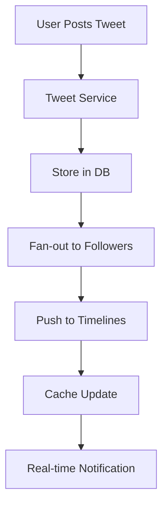

# Overview

Twitter (now X) handles billions of tweets daily, requiring a system for real-time posting, timeline generation, and global distribution with high availability.

# Detailed Explanation

## Components
- **Timeline Service**: Fan-out on write for home timelines.
- **Tweet Service**: Store tweets in databases.
- **Push Service**: Real-time delivery via WebSockets.
- **Search**: Elasticsearch for querying tweets.

## Scalability
- **Sharding**: Distribute users/tweets across shards.
- **Caching**: Redis for timelines.
- **Queues**: Kafka for event processing.



# Real-world Examples & Use Cases
- **Social Networking**: Real-time updates.
- **News Dissemination**: Breaking news tweets.
- **Hashtag Trends**: Aggregate popular topics.

# Code Examples

```java
// Simplified tweet posting
public class TweetService {
    public void postTweet(String userId, String content) {
        Tweet tweet = new Tweet(userId, content);
        // Store and fan-out
        System.out.println("Tweet posted: " + content);
    }
}
```

# Data Models / Message Formats

```json
{
  "tweetId": "12345",
  "userId": "user1",
  "content": "Hello World!",
  "timestamp": "2023-09-25T00:00:00Z",
  "likes": 100
}
```

# Common Pitfalls & Edge Cases
- **Duplicate Tweets**: Prevent spam.
- **Timeline Consistency**: Handle delays in fan-out.
- **Rate Limiting**: Control posting frequency.

# Tools & Libraries
- **Databases**: MySQL, Cassandra.
- **Messaging**: Kafka.
- **Frameworks**: Finagle for RPC.

# References
- [Twitter Engineering Blog](https://blog.twitter.com/engineering)
- [System Design: Twitter](https://github.com/donnemartin/system-design-primer#twitter)

# Github-README Links & Related Topics
- [Real-time Data Processing](../system-design/real-time-data-processing/README.md)
- [Distributed Systems](../system-design/consistency-and-availability/README.md)
- [Message Queues and Kafka](../system-design/message-queues-and-kafka/README.md)