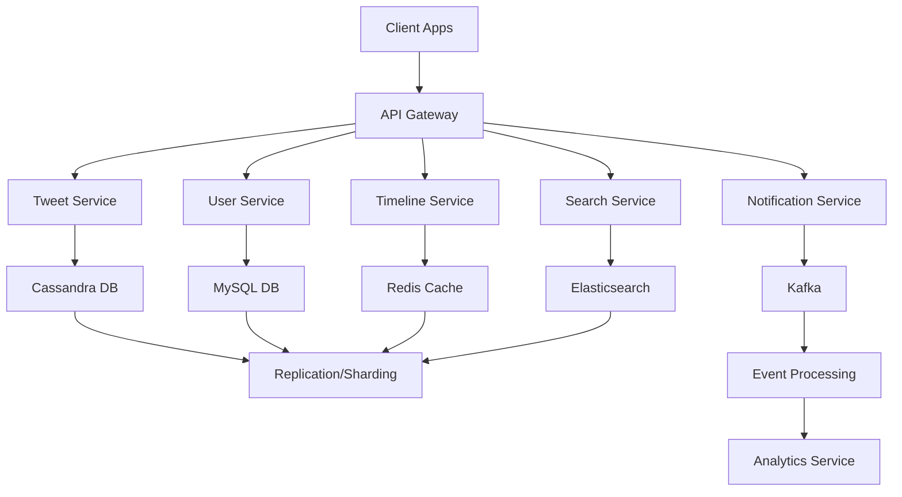

## Overview

Twitter (now X) is a real-time social media platform handling billions of tweets daily, with over 500 million users. The system supports posting tweets, following users, viewing timelines, searching, and real-time notifications. Key challenges include high write throughput (up to 15,000 tweets/second), low-latency reads, and massive scale.

### Key Requirements
- **Functional**: Tweet posting, user following, timeline generation, search, notifications.
- **Non-Functional**: High availability (99.9% uptime), low latency (<200ms for timelines), scalability to billions of users, data consistency for timelines.
- **Constraints**: Real-time updates, global distribution, compliance with regulations.

### High-Level Architecture
The architecture uses microservices, event-driven design, and distributed storage. Components include:
- **Client Layer**: Web/mobile apps.
- **API Gateway**: Load balancing, authentication.
- **Services**: Tweet Service, User Service, Timeline Service, Search Service, Notification Service.
- **Storage**: Cassandra for tweets, Redis for caching timelines, MySQL for user data.
- **Infrastructure**: Kubernetes for orchestration, CDN for static assets, Kafka for event streaming.

## Detailed Explanation

### Architecture Diagram


### Key Components
- **API Gateway**: Handles routing, rate limiting, authentication using OAuth. Uses NGINX or similar for load balancing.
- **Tweet Service**: Manages tweet creation, validation, and storage. Uses Cassandra for high-write scalability.
- **User Service**: Handles user profiles, follows/unfollows. Stored in MySQL with sharding.
- **Timeline Service**: Generates personalized timelines using fan-out-on-write (for high-follower users) and fan-out-on-read (for low-follower users). Cached in Redis.
- **Search Service**: Powered by Elasticsearch for real-time indexing and querying.
- **Notification Service**: Uses Kafka for event-driven notifications (e.g., new followers, likes).
- **Storage Layer**:
  - **Cassandra**: NoSQL for tweets; handles high writes via partitioning.
  - **Redis**: In-memory cache for timelines; supports sorted sets for ordering.
  - **MySQL**: Relational for user data; sharded by user ID.
  - **Kafka**: Message queue for decoupling services and real-time processing.

### Scalability Considerations
- **Horizontal Scaling**: Services run on Kubernetes pods, auto-scaled based on CPU/memory.
- **Data Partitioning**: Cassandra shards by tweet ID; Redis clusters for cache distribution.
- **Caching**: Multi-layer caching (CDN for images, Redis for timelines) reduces DB load.
- **Event Streaming**: Kafka enables asynchronous processing, handling spikes in traffic.
- **Global Distribution**: Data centers worldwide with geo-replication; users routed to nearest DC.
- **Rate Limiting**: Prevents abuse; implemented at API Gateway using token buckets.
- **Fault Tolerance**: Circuit breakers, retries, and failover to secondary regions.

### Data Models
- **Tweet**:
  ```json
  {
    "tweet_id": "string (UUID)",
    "user_id": "string",
    "text": "string (max 280 chars)",
    "timestamp": "datetime",
    "media_urls": ["string"],
    "hashtags": ["string"],
    "likes_count": "int",
    "retweets_count": "int"
  }
  ```
- **User**:
  ```json
  {
    "user_id": "string",
    "username": "string",
    "display_name": "string",
    "bio": "string",
    "followers": ["user_id"],
    "following": ["user_id"],
    "profile_pic_url": "string"
  }
  ```
- **Timeline** (Cached in Redis):
  - Sorted set: key = "timeline:{user_id}", members = tweet_ids, scores = timestamps.

## Real-world Examples & Use Cases
- **High-Traffic Events**: During events like Super Bowl, Twitter handles 10x normal load via auto-scaling and caching.
- **Timeline Generation**: For a user with 1M followers (e.g., Elon Musk), fan-out-on-write pushes tweets to follower timelines asynchronously.
- **Search**: Querying "#COVID19" returns indexed tweets in <100ms using Elasticsearch.
- **Notifications**: Liking a tweet triggers a Kafka event, processed by Notification Service to send push notifications.
- **Global Scale**: Tweets from US users are replicated to EU DCs for low-latency access.

## Code Examples
### Tweet Posting (Simplified Java with Spring Boot)
```java
@RestController
public class TweetController {
    @Autowired
    private TweetService tweetService;

    @PostMapping("/tweet")
    public ResponseEntity<Tweet> postTweet(@RequestBody TweetRequest request) {
        Tweet tweet = tweetService.createTweet(request.getUserId(), request.getText());
        return ResponseEntity.ok(tweet);
    }
}

@Service
public class TweetService {
    @Autowired
    private CassandraTemplate cassandraTemplate;

    public Tweet createTweet(String userId, String text) {
        Tweet tweet = new Tweet(UUID.randomUUID().toString(), userId, text, Instant.now());
        cassandraTemplate.insert(tweet);
        // Publish to Kafka for timeline updates
        kafkaTemplate.send("tweet-events", tweet);
        return tweet;
    }
}
```

### Timeline Fetch (Redis Example)
```python
import redis

r = redis.Redis(host='localhost', port=6379, db=0)

def get_timeline(user_id):
    tweet_ids = r.zrevrange(f"timeline:{user_id}", 0, 19)  # Top 20 tweets
    return [fetch_tweet(tweet_id) for tweet_id in tweet_ids]
```

## References
- High Scalability Blog: "The Architecture Twitter Uses to Deal with 15,000 Writes Per Second" (highscalability.com)
- Twitter Engineering Blog: "Twitter Timeline Service" (blog.twitter.com)
- InfoQ: "Twitter's Architecture" (infoq.com)
- Educative: "Twitter System Design" (educative.io)

## Github-README Links & Related Topics
- [YouTube System Design](./youtube-system-design/README.md)
- [Facebook System Design](./facebook-system-design/README.md)
- [Uber System Design](./uber-system-design/README.md)
- [Airbnb System Design](./airbnb-system-design/README.md)
- [Popular System Designs LLD and HLD](./popular-system-designs-lld-and-hld/README.md)