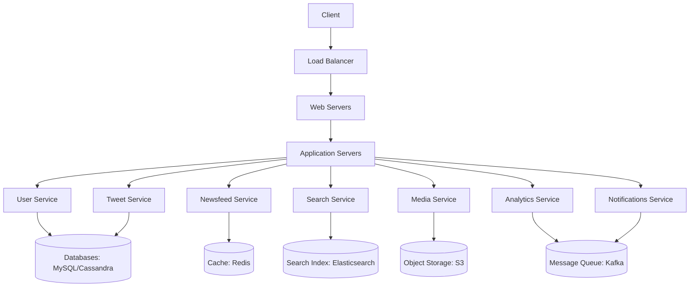

# Twitter System Design

## Overview

Twitter (now X) is a social media platform that allows users to post short messages called tweets, follow other users, and view a personalized newsfeed. Designing Twitter involves handling massive scale, real-time updates, and complex features like timelines, search, and notifications. Key challenges include high availability, low latency, scalability, and managing billions of tweets daily.

This document outlines the system design for Twitter, covering functional and non-functional requirements, capacity estimation, architecture, data models, and more.

## Detailed Explanation

### Requirements

#### Functional Requirements
- Post tweets (text, images, videos).
- Follow/unfollow users.
- View personalized newsfeed (tweets from followed users).
- Search tweets by keywords or hashtags.
- Extended: Retweets, favorites, notifications, analytics.

#### Non-Functional Requirements
- High availability and minimal latency.
- Scalability to handle billions of users and tweets.
- Fault tolerance and consistency.

### Capacity Estimation

Assuming 1 billion total users, 200 million daily active users (DAU), each tweeting 5 times/day:
- **Tweets/day**: 1 billion.
- **Media/day**: 100 million (10% of tweets).
- **RPS**: ~12,000 requests/second.
- **Storage/day**: 100 GB for tweets + 5 TB for media.
- **Bandwidth**: ~60 MB/second.

### Architecture

Twitter uses a microservices architecture for scalability. High-level components:



#### Key Services
- **User Service**: Handles authentication, profiles.
- **Newsfeed Service**: Generates timelines using pull/push/hybrid models.
  - Pull: Fetch on load (saves writes, increases reads).
  - Push: Fan-out on write (real-time, increases writes).
  - Hybrid: Push for small followers, pull for large.
- **Tweet Service**: Manages posting, retweets, favorites.
- **Search Service**: Uses Elasticsearch for indexing and querying.
- **Media Service**: Handles uploads to S3/CDN.
- **Notifications Service**: Sends push notifications via Kafka and FCM/APNS.
- **Analytics Service**: Processes metrics with Spark.

#### Data Partitioning and Sharding
- Use consistent hashing for sharding databases.
- Replicate data for fault tolerance.

#### Caching and CDN
- Cache timelines in Redis.
- Serve media via CDN (CloudFront).

### Data Model

| Table      | Fields                          |
|------------|---------------------------------|
| Users     | ID, Name, Email, DOB, CreatedAt |
| Tweets    | ID, UserID, Type, Content, CreatedAt |
| Followers | ID, FollowerID, FolloweeID      |
| Favorites | ID, UserID, TweetID, CreatedAt  |
| Feeds     | ID, UserID, UpdatedAt           |
| Feeds_Tweets | ID, FeedID, TweetID             |

- Databases: Relational (PostgreSQL) for users/tweets, NoSQL (Cassandra) for scalability.

### API Design

- **POST /tweet**: `{userID, content, mediaURL?}` → Boolean
- **POST /follow**: `{followerID, followeeID}` → Boolean
- **GET /newsfeed**: `{userID}` → Tweet[]

## Real-world Examples & Use Cases

- **Newsfeed Generation**: For a user with 1,000 followers, hybrid model ensures real-time updates without overwhelming the system.
- **Search**: Query "#AI" returns ranked tweets using Elasticsearch.
- **Scalability**: During events like elections, push model handles spikes.
- **Notifications**: Retweet triggers push to followers via Kafka.

## Code Examples

### Simple Tweet Posting (Python with Flask)

```python
from flask import Flask, request, jsonify
import uuid

app = Flask(__name__)

# Mock database
tweets = []

@app.route('/tweet', methods=['POST'])
def post_tweet():
    data = request.json
    user_id = data['userID']
    content = data['content']
    tweet_id = str(uuid.uuid4())
    tweet = {
        'id': tweet_id,
        'userID': user_id,
        'content': content,
        'createdAt': '2025-09-25T00:00:00Z'
    }
    tweets.append(tweet)
    return jsonify({'success': True, 'tweetID': tweet_id})

if __name__ == '__main__':
    app.run()
```

### Newsfeed Fetch (Simplified)

```python
def get_newsfeed(user_id):
    # Mock: Get followed users
    followed = ['user1', 'user2']
    feed = []
    for tweet in tweets:
        if tweet['userID'] in followed:
            feed.append(tweet)
    return sorted(feed, key=lambda x: x['createdAt'], reverse=True)
```

## References

- [Designing Twitter - GeeksforGeeks](https://www.geeksforgeeks.org/design-twitter-a-system-design-interview-question/)
- [Twitter System Design - Educative](https://www.educative.io/blog/twitter-system-design) (Note: Link may be outdated)
- [Life of a Tweet - High Scalability](https://highscalability.com/blog/2016/7/25/life-of-a-tweet-how-twitter-scales.html)

## Github-README Links & Related Topics

- [Facebook News Feed](../system-design/facebook-news-feed/README.md)
- [WhatsApp Messaging System](../system-design/whatsapp-messaging-system/README.md)
- [Instagram System Design](../instagram-system-design/README.md)
- [Microservices Architecture](../system-design/microservices-architecture/README.md)