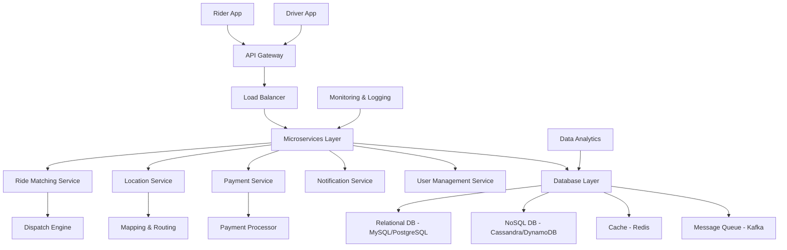

## Overview

Uber is a ride-sharing platform that connects riders with drivers for on-demand transportation. The system handles millions of requests daily, requiring high availability, low latency, and scalability. Key features include real-time matching, dynamic pricing (surge), GPS tracking, payments, and notifications. The architecture evolved from monolithic to microservices-based, using cloud infrastructure (AWS) for elasticity.

## Detailed Explanation

### Architecture Diagram



### Key Components

- **Mobile Apps**: Native iOS/Android apps for riders and drivers, handling UI, GPS, and real-time updates.
- **API Gateway**: Entry point for requests, handles authentication, rate limiting, and routing to microservices.
- **Microservices**: Modular services like Ride Matching (uses algorithms for optimal pairing), Location (tracks positions via GPS), Payment (integrates with Stripe/PayPal), Notification (push notifications via FCM/APNs), User Management (profiles, ratings).
- **Dispatch Engine**: Core algorithm for matching riders to drivers, considering distance, ETA, surge pricing.
- **Database Layer**: Hybrid storage – relational for transactions (trips, users), NoSQL for scalability (locations, events), Redis for caching (frequent queries), Kafka for event streaming (ride events).
- **Scalability Considerations**:
  - **Horizontal Scaling**: Auto-scaling groups in AWS, load balancers (ELB) distribute traffic.
  - **Data Sharding**: Partition databases by region or user ID to handle global load.
  - **Caching**: Redis for hot data (driver locations, surge prices) to reduce DB load.
  - **Asynchronous Processing**: Queues (Kafka) decouple services, handle spikes.
  - **CDN**: For static assets, maps.
  - **Fault Tolerance**: Multi-region deployment, circuit breakers, retries.
  - **Performance**: Geohashing for location queries, quadtrees for spatial indexing.

### Data Models

- **User**: {id, name, email, phone, role (rider/driver), location, rating}
- **Trip**: {id, rider_id, driver_id, start_location, end_location, status (requested/matched/ongoing/completed), fare, timestamp}
- **Location**: {user_id, lat, lng, timestamp} – stored in time-series DB or NoSQL.
- **Payment**: {trip_id, amount, method, status}
- **Event**: {type (ride_request, location_update), data, timestamp} – for analytics.

## Real-world Examples & Use Cases

- **Surge Pricing**: Algorithm increases fares during high demand (e.g., New Year's Eve in NYC), using historical data and real-time supply/demand.
- **Matching Algorithm**: Uses Hungarian algorithm or greedy approach for optimal assignment; example: Rider in Manhattan requests ride, system finds nearest driver within 2-5 min ETA.
- **Global Expansion**: Sharded by regions (US-West, Europe), with localized services for regulations (e.g., GDPR in EU).
- **Incident Handling**: During outages (e.g., 2016 surge pricing bug), fallback to manual dispatch or cached data.
- **Analytics**: Processes billions of events for insights, like peak hours or driver earnings.

## Code Examples

### Pseudocode for Ride Matching (Simplified)

```python
def match_ride(rider_request):
    rider_loc = rider_request.location
    available_drivers = query_nearby_drivers(rider_loc, radius=5km)
    best_driver = None
    min_eta = float('inf')
    for driver in available_drivers:
        eta = calculate_eta(driver.location, rider_loc)
        if eta < min_eta:
            min_eta = eta
            best_driver = driver
    if best_driver:
        assign_trip(rider_request, best_driver)
        notify_driver(best_driver)
    else:
        queue_request()  # For later matching
```

### API Endpoint Example (Node.js/Express)

```javascript
app.post('/api/rides/request', (req, res) => {
    const { userId, startLat, startLng, endLat, endLng } = req.body;
    // Authenticate user
    // Create trip in DB
    // Publish to Kafka for matching
    kafka.produce('ride-requests', { userId, startLat, startLng, endLat, endLng });
    res.status(200).json({ message: 'Ride requested' });
});
```

## References

- High Scalability: Uber Architecture (https://highscalability.com/blog/2016/10/12/how-uber-scales-their-real-time-market-platform.html)
- InfoQ: Uber's System Architecture (https://www.infoq.com/articles/uber-system-architecture/)
- GeeksforGeeks: System Design of Uber (https://www.geeksforgeeks.org/system-design-of-uber-app/)
- Educative: Uber System Design (https://www.educative.io/blog/uber-system-design)

## Github-README Links & Related Topics
- [Twitter System Design](./twitter-system-design/README.md)
- [YouTube System Design](./youtube-system-design/README.md)
- [Facebook System Design](./facebook-system-design/README.md)
- [Airbnb System Design](./airbnb-system-design/README.md)
- [Popular System Designs LLD and HLD](./popular-system-designs-lld-and-hld/README.md)