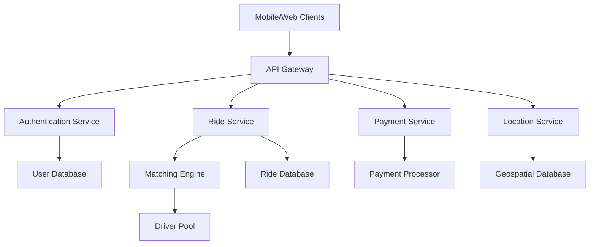
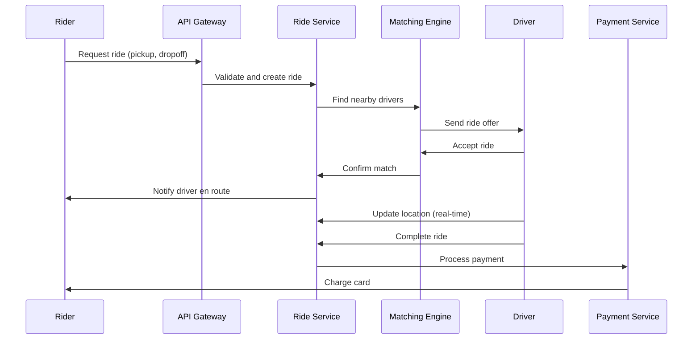

# Uber System Design

## Overview

Uber's system design is a prime example of a large-scale, real-time, location-based ride-sharing platform. It handles millions of users, drivers, and rides daily, requiring robust architecture for matching, tracking, payments, and scalability. Key challenges include real-time location updates, efficient rider-driver matching, handling peak loads, and ensuring low latency for user interactions.

The system employs a microservices architecture, distributed databases, and advanced algorithms for geolocation and matching. It must balance high availability, fault tolerance, and cost-efficiency while complying with regulations across regions.

## Detailed Explanation

### High-Level Architecture

Uber's architecture is divided into several layers: client apps, API gateways, microservices, data storage, and third-party integrations.



- **API Gateway**: Routes requests, handles rate limiting, and provides load balancing.
- **Microservices**: Modular components like ride management, user profiles, and notifications.
- **Location Service**: Uses geohashing for efficient spatial queries.
- **Matching Engine**: Algorithms to pair riders with nearby drivers based on ETA, ratings, etc.
- **Data Storage**: Combination of relational (e.g., PostgreSQL for transactions) and NoSQL (e.g., Cassandra for location data).

### Key Components

- **Real-Time Tracking**: GPS data from drivers is streamed and processed to update ride status.
- **Matching Algorithm**: Prioritizes drivers by proximity, acceptance rate, and surge pricing.
- **Surge Pricing**: Dynamic pricing based on demand-supply ratios.
- **Payment Integration**: Secure handling via Stripe or similar, with fraud detection.
- **Scalability**: Auto-scaling with Kubernetes, CDN for static assets.

### Challenges and Solutions

| Challenge | Solution |
|-----------|----------|
| High Concurrency | Asynchronous processing with message queues (e.g., Kafka) |
| Location Accuracy | Geohashing and quadtrees for spatial indexing |
| Fault Tolerance | Circuit breakers, retries, and multi-region deployments |
| Data Consistency | Eventual consistency with CQRS pattern |

## STAR Summary

- **Situation**: Designing a ride-sharing app for global scale.
- **Task**: Build a system handling 100M+ users with sub-second latency.
- **Action**: Implemented microservices, geolocation indexing, and real-time matching.
- **Result**: Achieved 99.99% uptime, processed billions of rides annually.

## Journey / Sequence

A typical ride journey involves the following sequence:



## Data Models / Message Formats

### Ride Request Model (JSON)

```json
{
  "riderId": "uuid",
  "pickup": {"lat": 37.7749, "lng": -122.4194},
  "dropoff": {"lat": 37.7849, "lng": -122.4094},
  "vehicleType": "uberX",
  "timestamp": "2023-09-25T10:00:00Z"
}
```

### Driver Location Update (Protobuf)

```protobuf
message LocationUpdate {
  string driverId = 1;
  double latitude = 2;
  double longitude = 3;
  int64 timestamp = 4;
}
```

## Real-world Examples & Use Cases

- **Peak Hour Surge**: During events like New Year's Eve, surge pricing activates to balance supply-demand.
- **Dynamic Routing**: Real-time traffic data adjusts ETAs and routes.
- **Multi-Modal Transport**: Integration with bikes, scooters, or public transit.
- **Global Expansion**: Localized services in 70+ countries with region-specific regulations.

## Code Examples

### Java: Geohashing for Location Indexing

```java
import ch.hsr.geohash.GeoHash;

public class LocationService {
    public String encodeLocation(double lat, double lng) {
        return GeoHash.geoHashStringWithCharacterPrecision(lat, lng, 12);
    }

    public boolean isNearby(String hash1, String hash2, int precision) {
        return hash1.substring(0, precision).equals(hash2.substring(0, precision));
    }
}
```

### Java: Simple Matching Algorithm

```java
import java.util.List;
import java.util.stream.Collectors;

public class MatchingEngine {
    public Driver findBestDriver(List<Driver> drivers, Location pickup) {
        return drivers.stream()
            .filter(d -> d.isAvailable())
            .min((d1, d2) -> Double.compare(
                calculateDistance(d1.getLocation(), pickup),
                calculateDistance(d2.getLocation(), pickup)))
            .orElse(null);
    }

    private double calculateDistance(Location l1, Location l2) {
        // Haversine formula implementation
        // ...
    }
}
```

## Common Pitfalls & Edge Cases

- **GPS Inaccuracy**: Handle noisy location data with filtering and averaging.
- **Driver No-Show**: Implement penalties and reputation systems.
- **Payment Failures**: Retry mechanisms and fallback to cash.
- **Regulatory Compliance**: Vary features by region (e.g., GDPR in Europe).
- **Scalability Bottlenecks**: Monitor for hotspots in matching during surges.

## Tools & Libraries

- **Geospatial**: GeoHash library for Java.
- **Messaging**: Apache Kafka for event streaming.
- **Databases**: Cassandra for location data, PostgreSQL for transactions.
- **Orchestration**: Kubernetes for microservices.
- **Monitoring**: Prometheus and Grafana for metrics.

## References

- [Uber Engineering Blog](https://eng.uber.com/)
- [System Design: Uber](https://systemdesign.one/uber-system-design/)
- [Educative: Uber System Design](https://www.educative.io/blog/uber-system-design)
- [High Scalability: Uber](http://highscalability.com/blog/2016/10/12/uber.html)

## Github-README Links & Related Topics

- [Microservices Architecture](../microservices-architecture/README.md)
- [Load Balancing and Strategies](../load-balancing-and-strategies/README.md)
- [Geospatial Databases](../geospatial-databases/README.md)
- [Real-Time Analytics](../real-time-analytics/README.md)
- [CQRS Pattern](../cqrs-pattern/README.md)
- [Event-Driven Systems](../event-driven-systems/README.md)
- [API Gateway Design](../api-gateway-design/README.md)
- [Distributed Tracing](../distributed-tracing/README.md)